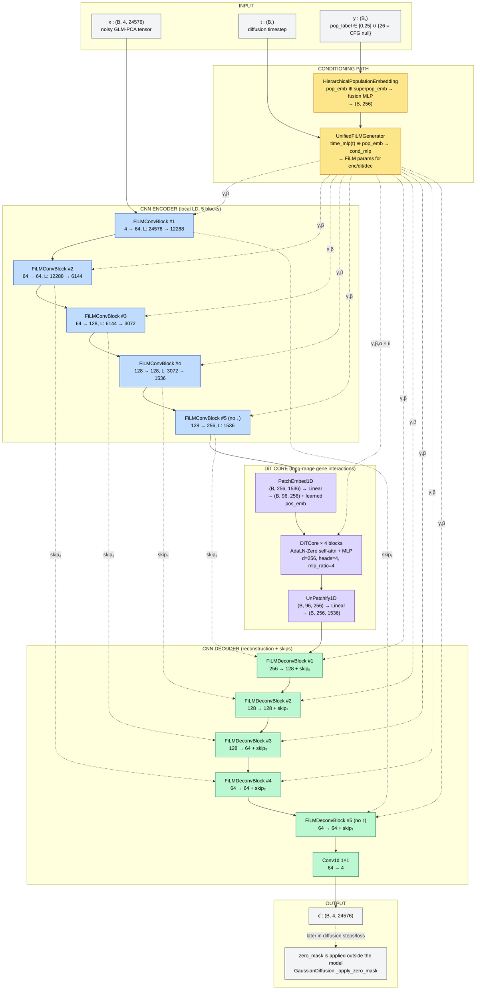
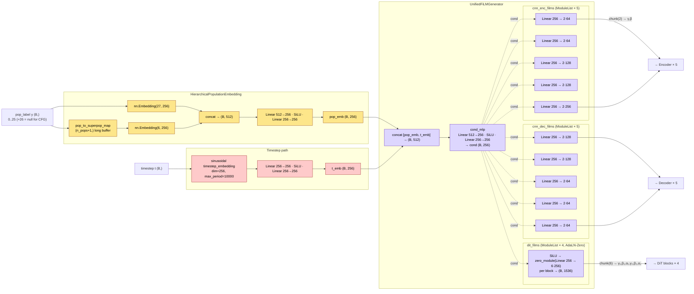
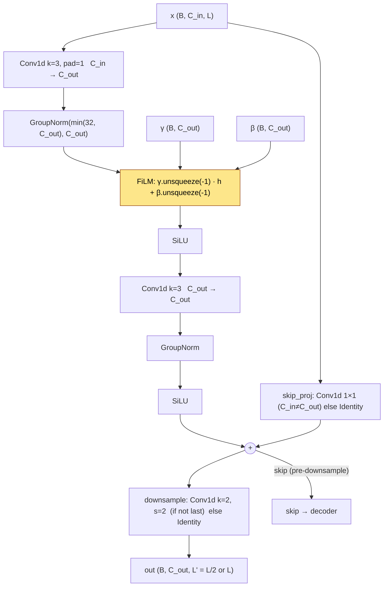
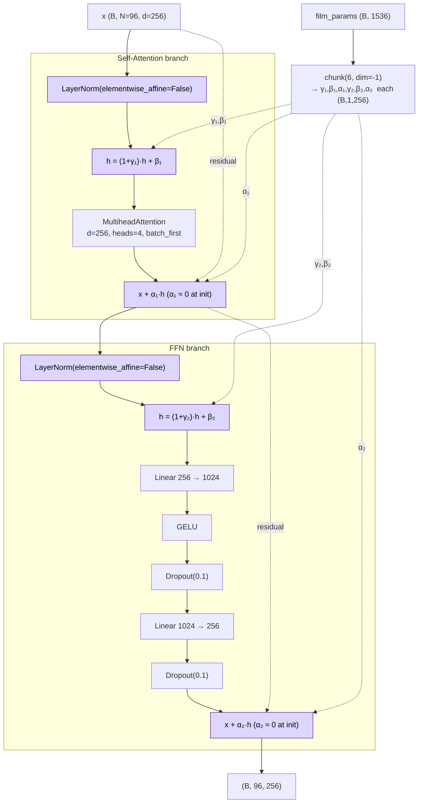
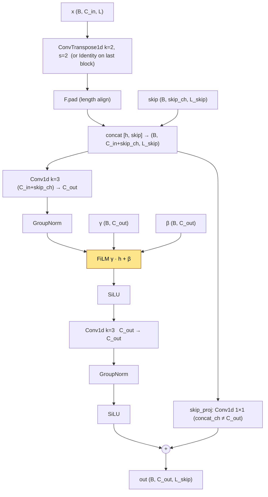
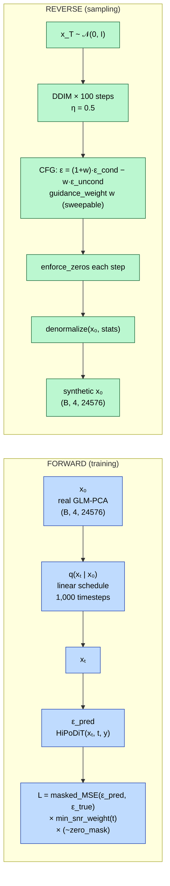
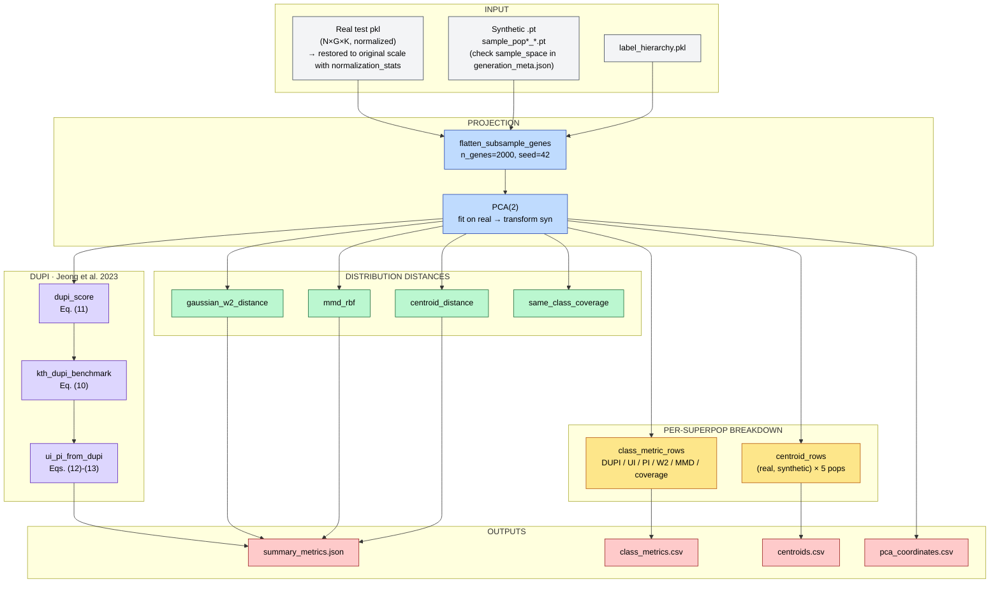
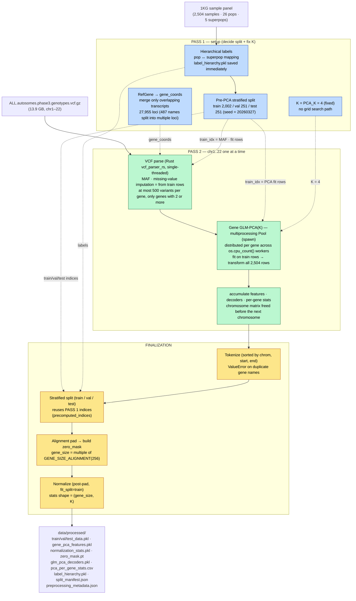

# HiPoDiT

[한국어](README.md) | **English**

**Hi**erarchical **Po**pulation-conditional **Di**ffusion **T**ransformer for synthetic genotype generation.

A diffusion model that generates population-conditional synthetic genotypes from 1000 Genomes Phase 3 data (2,504 samples, 26 populations, 5 superpopulations). The evaluation suite implements the DUPI framework of Jeong et al. (2023, IEEE TIFS) as published, providing quantitative verification of utility and privacy at the same time.

| Item | Value |
| --- | --- |
| Model parameters | **9.33 M** (bf16) |
| Architecture | Hybrid CNN encoder ⊕ DiT core ⊕ CNN decoder + Hierarchical FiLM |
| Diffusion | linear schedule · 1,000 timesteps · DDIM 100-step · CFG |
| Data | 1KG Phase 3 · 2,504 samples · 26 pops · 5 superpops · gene_size 24,576 |
| Evaluation | Fidelity / Structure / Utility / **DUPI** (Privacy + Utility Index) / Robustness |
| Code distribution | `src/evaluation/dupi.py` is stand-alone — can be vendored into other projects |

Documentation:

* The synthesis model itself — this README
* DUPI evaluation module — [`src/evaluation/README.md`](src/evaluation/README.md)
* Citation information for papers — [`CITATION.cff`](CITATION.cff)
* Binomial GLM-PCA + per-factor diffusion experiment — [run commands, formulas, measured results](docs/reports/hipodit_diffusion_experiment_20260915.md)

New research experiments are run with `prepare` and `train --schedule standard|fisher` in `scripts/hipodit_rebuild_check.py`.
`prepare` uses binomial GLM-PCA and a missingness mask, and removes duplicate SNP assignments.
The Poisson path and caches of the existing whole-genome preprocessing are separate, and results of the new experiment do not replace them automatically.

---

> **This repository contains two unrelated projects.**
>
> | Path | Project | README |
> | --- | --- | --- |
> | `/` (this file) | HiPoDiT — synthetic genotype generation (this document) | This file |
> | `korean-medicine-llm/` | Korean medicine LLM/VLM (Text2LLM ver1 → VLM ver2) | [`korean-medicine-llm/README.md`](korean-medicine-llm/README.md) |
>
> Everything below in this README applies **only to HiPoDiT**. `korean-medicine-llm/` has its own virtual environment and its own conventions (uv project, its own CLAUDE.md), so do not apply the installation and run instructions in this document to it as they are.

---

## Why This Model?

### Problem: degraded synthetic genotype quality for minority populations

Existing genotype synthesis models (GeneDiffusion, Genome-AC-GAN) show **severe performance degradation on minority populations**.

```
1000 Genomes Phase 3 — sample-size imbalance across 26 populations

  YRI ████████████████████████████████████████████ 108
  GWD ██████████████████████████████████████████████ 113
  CLM ████████████████████████████████████████ 94
  ...
  MXL ██████████████████████████ 64        ← minority population
  ASW ████████████████████████ 61          ← minority population

  ─────────────────────────────────────────────
  max 113 vs min 61 → ~1.85x difference
  by superpop: AFR 661 vs AMR 347 → ~1.9x difference
```

**Root cause**: an absolute shortage of training data. 61 samples are not enough to learn population-specific allele frequencies (AF), linkage disequilibrium (LD), and haplotype diversity.

**Consequence**: synthetic genotypes generated for minority populations have low AF correlation and distorted LD structure, and cannot be used for downstream analyses (GWAS correction, imputation panels).

### Solution: FiLM-based hierarchical population conditioning

HiPoDiT addresses this problem with three core mechanisms:

#### 1. Hierarchical Population Embedding

```
Existing approach (ASW trained alone):
  ASW 61 samples → pop_emb(ASW) ← gradient signal from only 61 samples
  → unstable, high variance, low-quality generation

Proposed approach (ASW + shared AFR superpopulation):
  AFR 661 samples → superpop_emb(AFR) ← gradient signal from 661 samples → stable base
  ASW 61 samples  → pop_emb(ASW)      ← learns only the ASW-specific residual
  fusion(pop + superpop) → combines stability and specificity

  Result: ASW robustness improves substantially while distinctness from other AFR populations is kept
```

#### 2. CNN-DiT hybrid architecture

| Genetics domain knowledge | How the model reflects it |
|-------------------|----------|
| LD (linkage disequilibrium) is a short-range pattern | **CNN** captures local LD |
| Gene-gene interactions are long-range | **DiT self-attention** captures them |
| Genetic distance between populations is hierarchical | Hierarchical pop + superpop embeddings |
| 99.9% of the genome is shared | Shared backbone; **FiLM** modulates only the 0.1% difference |
| Certain positions are always 0 (padding/common) | `enforce_zeros` + `zero_mask` |

#### 3. FiLM (Feature-wise Linear Modulation)

```
FiLM: output = γ · input + β

γ (scale): adjusts the importance of specific gene regions per population
β (shift): shifts the baseline level of allele frequencies per population

Example:
  AFR → γ_LD↑ (short LD → emphasize high-frequency patterns)
  EUR → γ_LD↓ (long LD → emphasize low-frequency patterns)
```

## Model Architecture

### Overview


* **(a) Overview**: A frozen GLM-PCA encoder `E` reduces the real genotype `G_i` to a per-gene latent `z_0 ∈ ℝ^{K×G}`. Diffusion is trained only in this latent space; at generation time, DDIM recovers `ẑ_0` from `z_T ~ N(0, I)`. The hierarchical embeddings of cohort `c` and superpop `s(c)`, together with timestep `t`, pass through the MLP `h` and enter the denoiser as FiLM parameters `(γ, β, α)`.
* **(b) HiPoDiT-T decoder**: From the denormalized gene latent, logits are built with the frozen GLM-PCA coefficients `α_j, v_j` and the fitted cohort×SNP offset `u_{c,j}`. A per-SNP heterozygosity tilt `τ_j` is added, and `{0, 1, 2}` is sampled independently for each SNP. The tilt preserves the expected dosage `E[G_ij] = 2p_ij` exactly, in closed form. This decoder belongs to the chr17 fixed-panel experiment path (`scripts/hipodit_*.py`, `src/models/genotype_decoder.py`).

### Default config (baseline `configs/default.yaml`)

| Item | Value | Basis |
|------|----|-------------|
| `in_channels (K)` | 4 | `data.num_channels` |
| `gene_size` | 24,576 | `data.gene_size` |
| `base_channels` | 64 | `model.base_channels` |
| `channel_mult` | (1, 1, 2, 2, 4) — **5 blocks** | `model.channel_mult` |
| `n_downsamples` | 4 = `len(channel_mult) - 1` | the last encoder block only expands channels |
| `latent_size` | 24576 / 2⁴ = **1,536** | |
| `latent_channels (4C)` | **256** | `base_channels × channel_mult[-1]` |
| `d_model` | **256** | `model.d_model` |
| `n_dit_blocks` | **4** | `model.n_dit_blocks` |
| `n_heads` | **4** | `model.n_heads` |
| `mlp_ratio` | 4.0 | `model.mlp_ratio` |
| `patch_size` | 16 → `n_tokens = 96` | latent 1,536 / 16 |
| `n_pops (+null)` | 26 (+1 = 27, CFG null) | `model.n_pops` |
| `n_superpops (+null)` | 5 (+1 = 6) | `model.n_superpops` |
| `dropout` | 0.1 | `model.dropout` |
| **Total parameters** | **9,331,588 (~9.33 M)** | bf16 ≈ 18 MB weight |

### Denoiser structure at a glance


* **(a) Denoiser `ε_θ(z_t, t, c)`**: FiLM ResBlock encoder → Patchify → DiT blocks × L → Unpatchify → FiLM ResBlock decoder. Encoder outputs are passed to the decoder as concat skips. The figure is a schematic drawn with fewer blocks; the default configuration has 5 encoder blocks (4 downsamples, latent length G/16). For exact channels and lengths, see the [top-level data flow](#top-level-data-flow-hybridcnnditfilmforward) below.
* **(b) Conditioning**: `c` and `s(c)` are embedded separately, then concatenated and passed through an MLP to form `e_c`. This is concatenated with `e_t`, built from a sinusoid + MLP, and passed through another MLP to obtain `h`. For each ResBlock a Linear layer turns `h` into `(γ, β)`, and for each DiT block into `(γ, β, α)`.
* **(c) FiLM ResBlock**: Conv1d → GroupNorm → `γ·x + β` → SiLU → Conv1d → GroupNorm → SiLU, with a 1×1 conv residual when the channel count changes. The skip is taken just before the stride-2 downsample. A decoder block first upsamples ×2 and then concatenates the skip.
* **(d) DiT block (adaLN-Zero)**: LayerNorm → scale·shift → Multi-Head Self-Attention → `α` scale → residual, followed by a pointwise MLP with the same structure. The Linear layer that produces `α` is initialized to 0, so the DiT starts training from the identity.

### Top-level data flow (`HybridCNNDiTFiLM.forward`)



> **Note**: `HybridCNNDiTFiLM.forward` does not apply the zero mask. The constraint is enforced by `GaussianDiffusion._apply_zero_mask` at every `q_sample`, `p_sample`, and DDIM step and in the loss.

> **Note**: In the encoder, blocks 1–4 perform stride-2 downsampling and the last block (#5) only expands channels. The decoder mirrors this structure: its first 4 blocks upsample 2× with ConvTranspose1d and the last block keeps the length. Because the encoder downsamples 4 times, the latent length is 24576 / 16 = **1,536**, and with patch_size 16 the number of tokens is **96**.

### Conditioning Path (`HierarchicalPopulationEmbedding` + `UnifiedFiLMGenerator`)



### Block internals

#### `FiLMConvBlock` — encoder block (`cnn.py:18-74`)



#### `DiTBlock` — AdaLN-Zero block (`dit.py:94-162`)



`UnifiedFiLMGenerator.dit_films` is wrapped in `zero_module(Linear)` (`conditioning.py:131-139`), so `γ=β=α=0` at the start of training. LayerNorm also uses `elementwise_affine=False`, so by the definition of AdaLN-Zero the DiT starts as the **identity** and gradually learns long-range corrections on top of the CNN features.

#### `FiLMDeconvBlock` — decoder block (`cnn.py:77-142`)



### Role of FiLM by position

| Position | FiLM function | Genetic meaning |
|------|----------|-------------|
| CNN Encoder | scale/shift local filters by pop | AFR: emphasize short-LD high-frequency patterns / EUR: emphasize long-LD low-frequency patterns |
| DiT Blocks | attention + FFN modulation + gate | Population-specific long-range gene interaction patterns |
| CNN Decoder | fine-tune reconstruction by pop | Restore population-specific AF distributions |

### AdaLN-Zero training dynamics

```
Early training:  α ≈ 0 → DiT output is close to 0 → effectively only the CNN is active
                 → the CNN first learns local LD structure stably

Mid training:    α increases gradually → DiT starts contributing long-range corrections
                 → global patterns are added on top of the CNN's local representation

Late training:   α converges → CNN (local) + DiT (global) reach their best combination
                 → population-specific FiLM modulates both paths at the same time
```

### Diffusion Process



| Item | Value | Source |
|---|---|---|
| `max_timesteps` | 1,000 | `diffusion.max_timesteps` |
| `noise_schedule` | linear | `diffusion.noise_schedule` |
| `prediction_target` | ε (epsilon) | `diffusion.prediction_target` |
| `sample_clip` | 6.0 (normalized model space) | `diffusion.sample_clip` |
| `sampling_timesteps` | 100 (DDIM) | `diffusion.sampling_timesteps` |
| `ddim_eta` | 0.5 | `diffusion.ddim_eta` |
| `guidance_type` | classifier-free | `diffusion.guidance_type` |
| `guidance_weight` | 0.0 (unamplified conditional baseline) | `diffusion.guidance_weight` |
| `cfg_dropout_rate` | 0.1 (training-time null sample rate) | `diffusion.cfg_dropout_rate` |

### Parameter count (measured, 9.33 M)

| Module | Parameters | Notes |
|------|-----------|------|
| `pop_embedding` (Hierarchical) | 205,568 (0.21 M) | Embedding(27, 256) + Embedding(6, 256) + fusion MLP |
| `film_gen` (Unified FiLM Generator) | 2,466,944 (2.47 M) | `time_mlp` + `cond_mlp` + per-block linear (enc 5 · dec 5 · dit 4) |
| `encoder` (CNN, 5 blocks) | 632,384 (0.63 M) | stride-2 downsample × 4, the last block only expands channels |
| `patchify` + position embedding | 1,073,408 (1.07 M) | patch_size 16 → 96 tokens, learnable pos_emb |
| `dit` (4 blocks, d=256, h=4) | 3,155,456 (3.16 M) | self-attention + FFN + AdaLN-Zero × 4 |
| `unpatchify` | 1,052,672 (1.05 M) | Linear projection back to (256, 1536) |
| `decoder` (CNN, 5 blocks) | 745,156 (0.75 M) | ConvTranspose1d × 4 + skip connections + final 1×1 conv |
| **Total** | **9,331,588 (~9.33 M)** | bf16 weight ≈ **18 MB** |

---

## Evaluation Metrics

### Overview

Evaluation consists of 5 categories. The core metrics implemented and tested in this repository are the **DUPI framework on the Privacy / Utility side** plus auxiliary distribution distances (Gaussian W2, MMD-RBF, coverage), and all definitions live separately under [`src/evaluation/`](src/evaluation/README.md) (can be vendored into other projects).



### 1. Fidelity

Measures how well the generated data preserves the statistical properties of the original data.

#### 1.1 AF Correlation (Allele Frequency correlation)

```
Definition:
  For each gene g, compute the per-PCA-channel mean of real and syn, then
  compute the Pearson correlation coefficient across all genes.

  AF_real(g) = mean(real[:, :, g])   mean PCA value of each gene
  AF_syn(g)  = mean(syn[:, :, g])

  r = Pearson(AF_real, AF_syn)

Target: r >= 0.95
Interpretation: whether gene-level variant frequencies per population are preserved
```

#### 1.2 Wasserstein Distance (per-channel distribution distance)

```
Definition:
  Wasserstein-1 distance between the 1D distributions of real and syn for PCA component (channel) k

  W_k = W₁(real[:, k, :].flatten(), syn[:, k, :].flatten())

  Final: mean(W_k) for k = 1..K

Target: minimize (at or below W_k of the test set)
Interpretation: whether the overall distribution shape of each PCA component is preserved
```

### 2. Structure (structure preservation)

Measures whether the genetic structure between populations in the real data (clustering, differentiation) is preserved.

#### 2.1 PCA Overlap (Silhouette Score)

```
Method:
  1. Combine real and syn, then run 2D PCA
  2. Compute the Silhouette score with label = {0: real, 1: synthetic}
  3. The closer the score is to 0, the less real and syn can be told apart = ideal

  S = silhouette_score(PCA_2D(concat(real, syn)), labels=[0]*n + [1]*m)

Target: S → 0 (fully mixed)
Interpretation: whether the synthetic data reproduces the distribution of the real data in PCA space
```

#### 2.2 Sliced Wasserstein Distance

```
Method:
  1. Project real and syn with 2D PCA
  2. Project onto L random 1D directions
  3. Compute the 1D Wasserstein distance in each direction → average

  SWD = (1/L) × Σ_l W₁(proj_l(real), proj_l(syn))

Target: within 2x of the test set value
Interpretation: an efficient approximation of a high-dimensional distribution distance
```

### 3. Utility

Measures whether synthetic data can replace real data in downstream analyses.

#### 3.1 Recovery Rate

```
Method:
  1. Train a classifier (LogisticRegression) on real data → accuracy on the real test set = Acc_real
  2. Train the same classifier on synthetic data → accuracy on the real test set = Acc_syn
  3. Recovery Rate = Acc_syn / Acc_real

  RR = Accuracy(clf.fit(X_syn, y_syn).predict(X_test))
     / Accuracy(clf.fit(X_real, y_real).predict(X_test))

Target: RR >= 0.93
Interpretation: training on synthetic data alone reaches at least 93% of the performance obtained with real data
```

#### 3.2 Augmentation Effect

```
Method:
  Train on real + syn mixtures at each mixing ratio → measure accuracy on the real test set

  Experimental setup:
    5% real + 95% syn   → Acc_5
    50% real + 50% syn  → Acc_50
    100% real (baseline) → Acc_base

  Augmentation effect = Acc_mix / Acc_base

Target: improvement over Acc_base with augmentation (especially for minority populations)
Interpretation: directly tests whether synthetic data solves the shortage of training data
```

### 4. Privacy

Measures whether synthetic data exposes the genetic information of individuals in the original data.

#### 4.1 NNAA (Nearest Neighbor Adversarial Accuracy)

```
Definition:
  For each data point, the fraction of cases in which "the nearest neighbor from the same source (real/syn)"
  is closer than "the nearest neighbor from the other source"

  Term₁ = (1/n) Σᵢ I(d(xᵢ, NN_real(xᵢ)) < d(xᵢ, NN_syn(xᵢ)))   [real → real is closer]
  Term₂ = (1/m) Σⱼ I(d(yⱼ, NN_syn(yⱼ)) < d(yⱼ, NN_real(yⱼ)))   [syn → syn is closer]
  NNAA = 0.5 × (Term₁ + Term₂)

Target: NNAA ≈ 0.5
Interpretation:
  NNAA ≈ 0.5 → real/syn indistinguishable = individuals cannot be identified = privacy protected
  NNAA > 0.5 → real closer to real, syn closer to syn = different distributions = privacy protected but utility↓
  NNAA < 0.5 → syn too close to real = memorization risk
```

#### 4.2 DUPI (Data Utility and Privacy Index)

> Jeong, D., Kim, J. H. T., & Im, J. (2023). *"A New Global Measure to Simultaneously Evaluate Data Utility and Privacy Risk"*
> *IEEE Transactions on Information Forensics and Security*, **18**, pp. 715–729.
> DOI: [10.1109/TIFS.2022.3228753](https://doi.org/10.1109/TIFS.2022.3228753)
>
> Implementation: [`src/evaluation/dupi.py`](src/evaluation/dupi.py) · unit tests + reproduction of the paper's values: [`tests/test_dupi.py`](tests/test_dupi.py) (29 tests)

Unlike NNAA, this metric has a **theoretical benchmark (DUPI₀)**, which makes a quantitative verdict possible.

```
Notation:
  X_n = {x₁, ..., xₙ}  original data (n points)
  Y_m = {y₁, ..., yₘ}  synthetic data (m points)
  d^{<k>}_S(c)          distance from point c to its k-th nearest neighbor in set S

Definition:
                    1   n
  DUPI^{<k>}  =   ─── Σ  𝟙( d^{<k>}_{Y_m}(xᵢ)  ≤  d^{<k>}_{X_n\i}(xᵢ) )
                    n  i=1

  "For each original point xᵢ:
     the fraction for which the k-NN in the synthetic data is closer than the k-NN in the original data"
```

```
Theoretical benchmark (Theorem 4):
  When X_n and Y_m are drawn independently from the same distribution:

    k=1:   DUPI₀ = m / (n + m - 1)
    n=m:   DUPI₀ = n / (2n - 1)  ≈  0.5

    general k: DUPI₀ = Σ_{s=k}^{2k-1} C(s-1,k-1)·C(n-1+m-s,m-k) / C(n-1+m,m)
```

```
Interpretation:
  ┌────────────┬──────────────────────────────────────┬─────────────────────────────┐
  │ DUPI value │ Meaning                              │ Diagnosis                   │
  ├────────────┼──────────────────────────────────────┼─────────────────────────────┤
  │ ≈ 1        │ synthetic is too close to original   │ Utility↑ Privacy↓ (leakage) │
  │ ≈ DUPI₀    │ behaves like independent samples     │ ** optimal balance **       │
  │   (≈0.5)   │ from the same distribution           │                             │
  │ ≈ 0        │ synthetic is too far from original   │ Utility↓ Privacy↑ (loss)    │
  └────────────┴──────────────────────────────────────┴─────────────────────────────┘
```

```
UI/PI decomposition (for visualization):

  Rescaling:
    DUPI ≤ DUPI₀:  g = DUPI / (2·DUPI₀)
    DUPI > DUPI₀:  g = (DUPI - DUPI₀) / (2·(1 - DUPI₀)) + 0.5

  Utility Index:  UI = arctan(τ·g) / arctan(τ)          τ=5
  Privacy Index:  PI = arctan(τ - τ·g) / arctan(τ)

  Optimality condition (Theorem 5):
    UI·PI ≤ [arctan(τ/2) / arctan(τ)]²
    equality ⟺ DUPI = DUPI₀

    at τ=5, the optimum is (UI₀, PI₀) ≈ (0.867, 0.867)
```

```
NNAA vs DUPI:

  In common: ideal value ≈ 0.5
  Differences:
    NNAA → bidirectional, symmetric (real↔syn)   | no theoretical benchmark
    DUPI → one-directional (real→syn)            | exact DUPI₀ exists

  → NNAA: for comparison with prior genotype generation papers
  → DUPI: for quantitative verdicts and UI/PI visualization
  → this project uses both
```

#### 4.3 Membership Inference AUC

```
Method:
  An attack model that infers "was this sample used for training?"

  1. Compute the minimum distance from each test point to the synthetic data
  2. Train a binary classifier that separates training data (members)
     from holdout data (non-members)
  3. Measure the AUC

Target: AUC ≈ 0.5 (random-guess level)
Interpretation: AUC > 0.6 → training-data membership can be inferred = privacy risk
```

### 5. Robustness -- key new metric

A metric that tests the core hypothesis behind FiLM-based hierarchical embedding.

#### 5.1 Population Size vs Quality Correlation

```
Hypothesis:
  "Without FiLM, there is a strong positive correlation between population size (n) and generation quality.
   If this correlation weakens after applying FiLM + hierarchical embedding → size-independent quality is achieved."

Method:
  1. Compute the AF correlation (quality) separately for each population
  2. pop_sizes = [61, 64, ..., 113]
  3. qualities = [r_ASW, r_MXL, ..., r_YRI]
  4. r = Pearson(pop_sizes, qualities)

  Robustness = |r|

Target: |r| → 0
Interpretation:
  |r| ≈ 0 → quality independent of population size = FiLM succeeds in protecting minority populations
  |r| > 0.5 → still size-dependent = further improvement needed
```

#### 5.2 Per-Population DUPI Gap

```
Method:
  1. Compute DUPI separately for each population
  2. Measure |DUPI - DUPI₀| (gap) for each population
  3. Compute the correlation between population size and gap

Target: gap-size correlation → 0
Interpretation: a uniform privacy-utility balance across all populations = FiLM robustness confirmed
```

### Metric summary table

| Category | Metric | Formula | Target | Notes |
|----------|--------|---------|--------|------|
| Fidelity | AF Correlation | Pearson(AF_real, AF_syn) | r >= 0.95 | Overall |
| Fidelity | Wasserstein/ch | mean(W₁ per channel) | minimize | Per PCA component |
| Structure | PCA Overlap | Silhouette(real+syn) | S → 0 | 2D PCA |
| Structure | Sliced WD | mean(W₁ per projection) | <= 2x test | L=100 projections |
| Utility | Recovery Rate | Acc_syn / Acc_real | >= 0.93 | LogisticRegression |
| Utility | Augmentation | Acc_mix / Acc_base | > 1.0 | 5%, 50% ratios |
| Privacy | NNAA | 0.5×(T₁+T₂) | ≈ 0.5 | Bidirectional, for comparison |
| Privacy | **DUPI** | (1/n)Σ𝟙(d_syn <= d_real) | **≈ DUPI₀** | Theoretical benchmark, for verdicts |
| Privacy | MIA AUC | Binary clf AUC | ≈ 0.5 | Membership inference |
| **Robustness** | **Size-Quality \|r\|** | \|Pearson(size, quality)\| | **→ 0** | **Core contribution** |
| Robustness | Per-pop DUPI gap | corr(size, \|DUPI-DUPI₀\|) | → 0 | FiLM robustness |

---

## Evaluation Results — measured (`gw_0p5` baseline)

Evaluation of 2,504 synthetic samples from the model trained with guidance weight 0.5 via `scripts/guidance_sweep.py`, against 251 real hold-out samples. Output directory: `outputs/guidance_sweep_best_full/gw_0p5/evaluation_metrics/`.

> **Caution — these numbers come from the previous preprocessing.** As `n_features_before_pca = 16,000 = 2,000 genes × 8 channels` in the table below shows, they were measured on data from the K=8 era. Data rebuilt with the current pipeline (K=4, RefGene locus splitting, train-only MAF in the Rust parser, evaluation in the original scale) needs to be measured again.

### Global metrics (`summary_metrics.json`)

| Metric | Observed | Reference / Target |
|---|---|---|
| n_real / n_synthetic | 251 / 2,504 | 10× augmentation |
| n_features_before_pca | 16,000 | 2,000 genes × 8 channels |
| PCA explained variance | 7.92 % / 2.87 % (PC1 / PC2) | — |
| **DUPI** (k=1) | **0.530** | benchmark `m/(n+m−1)` = 0.909 |
| DUPI abs error | 0.379 | smaller = closer to balance |
| **Privacy Index** (τ=5) | **0.943** | ≈ 0.867 = optimal |
| Utility Index (τ=5) | 0.706 | ≈ 0.867 = optimal |
| U × P | 0.666 | ≤ 0.751 (Theorem 5 bound) |
| Centroid distance | 1.351 | smaller = better |
| Gaussian W2 | 10.93 | smaller = better |
| MMD-RBF (biased) | 0.00136 | smaller = better |

### Per-superpopulation breakdown (`class_metrics.csv`)

| Pop | n_real | n_syn | DUPI | PI | UI | centroid_dist | W2 | MMD |
|---|---|---|---|---|---|---|---|---|
| AFR | 67 | 661 | 0.701 | 0.915 | 0.795 | 1.79 | 8.15 | 0.085 |
| AMR | 34 | 347 | 0.853 | 0.882 | 0.849 | 1.58 | 3.71 | 0.013 |
| EAS | 50 | 504 | 0.260 | **0.977** | 0.451 | 5.04 | 27.4 | 0.730 |
| EUR | 51 | 503 | 0.294 | **0.973** | 0.495 | 3.52 | 13.2 | 0.401 |
| SAS | 49 | 489 | 0.571 | 0.937 | 0.731 | 3.31 | 12.7 | 0.272 |

**PI ≥ 0.88** in every superpop, so no population shows signs of nearest-neighbor memorization. EAS / EUR have very high PI of 0.97+, but their UI also drops below 0.5. This happens because the synthetic samples lie far from the real distribution (centroid drift of 4–5 PC units), and it should be read as *a by-product of utility loss* rather than as *strong privacy*.

### Privacy visualization

`outputs/guidance_sweep_best_full/gw_0p5/privacy_per_superpop.png` visualizes the table above in two panels — (1) a bar chart of DUPI vs the equal-distribution benchmark, (2) a bar chart of the Privacy / Utility Index (including the PI ≥ 0.88 threshold line).

### One-line summary (for the paper)

> Across 251 held-out real and 2,504 synthetic samples in PCA(2) space, DUPI = 0.530 (k = 1) — well below the equal-distribution benchmark 0.909 — yielding a global **privacy_index of 0.943** with no superpopulation falling below 0.88, indicating no nearest-neighbor memorization while preserving moderate utility (UI = 0.706).

---

## Data

```
data/
├── ALL.autosomes.phase3.genotypes.vcf.gz          (13.9 GB, 1KG Phase 3, chr1-22)
├── ALL.autosomes.phase3.genotypes.vcf.gz.tbi      (tabix index)
├── integrated_call_samples_v3.20130502.ALL.panel   (sample→pop→superpop mapping)
└── refGene.txt.gz                                  (RefGene gene coordinates, 8 MB)

~/GeneDiffusion/                                    (optional; the Rust parser uses it first if present)
└── ALL.chr{1..22}.phase3_shapeit2_mvncall_integrated_v5b.20130502.genotypes.vcf.gz (+ .tbi)
```

* At the start of `run_pipeline.py`, `validate_input_files()` checks that the 4 files above exist and stops with `FileNotFoundError` if any of them is missing. If `.tbi` is missing, create it with `tabix -p vcf data/ALL.autosomes.phase3.genotypes.vcf.gz`.
* The per-chromosome VCF path is set by `PER_CHROM_VCF_DIR` / `PER_CHROM_VCF_PATTERN` in `src/preprocessing/config.py`. If the file exists, only that chromosome is read; otherwise the merged VCF is scanned from the beginning (slow).

### Preprocessing pipeline flow (OOM-safe 2-pass)



### Runtime and resources (measured, 2026-09-16, Threadripper PRO 5955WX 16 cores/32 threads · RAM 125 GB)

| Stage | chr1 | chr2 | chr3 | chr4 |
|---|---|---|---|---|
| Whole chromosome (parsing + GLM-PCA) | 10.0 min | 7.5 min | 6.5 min | 5.3 min |
| Number of genes (variant ≥ 2) | 2,576 | 1,666 | 1,427 | 994 |
| Cumulative feature count (genes × K) | 10,163 | 16,741 | 22,406 | 26,355 |

* **Parsing stage** (about 2 min per chromosome): the Rust parser reads while decompressing gzip on a single thread. It uses only 1 core, and disk reads run at about 11 MB/s.
* **GLM-PCA stage** (about 3.5–8 min per chromosome): 32 workers use ~90% of the CPU.
* **Memory**: across chr1–chr4, total system usage stayed around 24 GiB (vmstat `used`, parent plus the 32 workers). Because chromosomes are processed one at a time, this does not grow for later chromosomes (only the accumulated features grow).
* **Log format**: the parser prints `[chr1] 462879 genic variants, 479593 intergenic skipped, 2576 genes with >=2 variants` to stderr, and when GLM-PCA finishes it prints `[1/22] chr1: 2576 genes → PCA done, 10163 total features`. The run takes a long time, so start it with `nohup ... > outputs/preprocess_*.log 2>&1 &` and watch the log.
* **No intermediate saves**: results for the 22 chromosomes accumulate in memory and are saved all at once at the end. If the run dies partway through, it starts over from chr1.

### RefGene gene coordinates (`gene_annotation.load_refgene`)

* Transcripts with the same gene name are merged into one **only when their intervals overlap**.
* Merging a name that is annotated at several distant positions, such as `RNU1-3` or `MIR6859-1`, into `min(txStart)`–`max(txEnd)` creates a fake gene of up to 132 Mb that swallows every variant in between. To prevent this, each non-overlapping group is kept as a separate locus.
* Names with 2 or more loci get an `@chr{N}-{start}` suffix, as in `RNU1@chr1-100`, so that feature keys do not collide.
* With the current `refGene.txt.gz`, the 22 autosomes contain **27,955 loci**, and **487** names are split into multiple loci.

### VCF parser — Rust extension `vcf_parser_rs`

`src/preprocessing/vcf_parser.py` uses the Rust parser if `vcf_parser_rs` can be imported, and the Python/cyvcf2 parser otherwise. Both implementations follow the same rules.

| Step | Rule |
|---|---|
| Target | Biallelic SNPs whose REF and ALT are single bases |
| dosage | `0/0`→0, `0/1`→1, `1/1`→2, missing→NaN |
| MAF filter | Allele frequency computed **from train rows only (2,002 individuals)**, `MAF < 0.01` excluded |
| Missing-value imputation | NaNs in **all 2,504 rows** are filled with the train-row mean (prevents val/test information leakage) |
| Gene mapping | RefGene 0-based start · exclusive end → `start < POS <= end`. Binary search over sorted start positions plus a prefix-max over end positions finds all overlapping genes. Variants outside any gene are skipped as intergenic |
| Per-gene cap | Keeps only the first `MAX_VARIANTS_PER_GENE = 500` variants by position |
| Return value | Only genes with 2 or more variants, as a `float32 (2504, n_variants)` matrix |

* **Installation**: requires the Rust toolchain. `uv pip install -e ./vcf_parser_rs` (maturin build). After editing the Rust source you **must reinstall** for the change to reach the `.so`.
* **Python fallback**: without the Rust extension, cyvcf2 is used. Parsing chr1 takes about 1,070 seconds, much slower than Rust (about 2 minutes). Because of a cyvcf2 issue where region queries on the merged VCF return nothing from chr2 onward, the per-chromosome VCF is opened when it exists.
* For the detailed API, see [`vcf_parser_rs/README.md`](vcf_parser_rs/README.md).

### Checks that stop immediately on failure

To avoid silently producing wrong data, the pipeline stops with an exception in the following cases.

| Condition | Location | Reason |
|---|---|---|
| `HIPODIT_DIM_RED` is not `glm_pca` | `run_pipeline.main` | The training and inference contract assumes a GLM-PCA decoder |
| Input files (VCF, .tbi, panel, refGene) missing | `validate_input_files` | |
| Parser returns 0 genes for a chromosome | `pca.stream_vcf_and_pca` | A "complete" dataset once came out with chr2–22 empty and only chr1 in it |
| Sample order differs between chromosomes | `pca.stream_vcf_and_pca` | If rows get mixed up, every feature is wrong |
| VCF sample order ≠ panel order | `run_pipeline.main` | Guarantees label alignment |
| Duplicate gene names | `run_pipeline.main` | Features from a different locus would be overwritten |

### Preprocessing outputs

| File | Shape / content | Description |
|------|-------|------|
| `train_data.pkl` · `val_data.pkl` · `test_data.pkl` | `(x: N×gene_size×K, y: N)` | Padded → normalized tensors (train 2,002 · val 251 · test 251) |
| `gene_pca_features.pkl` | DataFrame (2504, number of genes × K) | GLM-PCA scores before padding and normalization |
| `normalization_stats.pkl` | {mean, std}: (gene_size, K) fp32 | Fit on train only, used for denormalization |
| `zero_mask.pt` | (gene_size, K) bool | Mask of always-zero positions |
| `glm_pca_decoders.pkl` | dict per gene | loadings · intercept · family(`poi`) · link · penalty · backend · projection |
| `pca_per_gene_stats.csv` | 1 row per gene | gene · chrom · start · end · n_variants · actual_k · explained_total · explained_pc1..K |
| `label_hierarchy.pkl` | dict | pop/superpop mapping (saved right away in PASS 1) |
| `split_manifest.json` | dict | seed · ratios · indices and sample IDs per split · counts per pop |
| `preprocessing_metadata.json` | dict | Dimensionality reduction method, normalization settings, `tensor_layout = N,G,K`, gene order (gene·chrom·start·end) |

When preprocessing finishes, the following is printed at the end of the log. Set `data.num_channels` · `data.gene_size` in `configs/default.yaml` to these values. If they differ, `create_dataloaders` rejects them with `ValueError` before training starts.

```
--- Config values for configs/default.yaml ---
data.num_channels: 4
data.gene_size: <number of genes rounded up to a multiple of 256>
```

---

## Quick Start

```bash
# Set up the environment
uv sync

# Phase 0.5: VCF merge (22 chromosomes in parallel)
python src/preprocessing/merge_data.py --format vcf
python src/preprocessing/merge_data.py --format pkl --maf 0.01

# Phase 1: preprocessing (VCF → Gene GLM-PCA → tokenization)
#   Install the Rust VCF parser (once; requires the Rust toolchain. Run again after editing the source)
uv pip install -e ./vcf_parser_rs
#   Uses all CPU cores · takes tens of minutes or more → run in the background with a log
nohup .venv/bin/python src/preprocessing/run_pipeline.py > outputs/preprocess.log 2>&1 &
#   When it finishes, copy data.num_channels / data.gene_size from the end of the log into configs/default.yaml

# Phase 2: model shape check
python -c "
from src.models import HybridCNNDiTFiLM
from src.utils.config import load_config
import torch

config = load_config('configs/default.yaml')
model = HybridCNNDiTFiLM(config)
x = torch.randn(2, config['data']['num_channels'], config['data']['gene_size'])
t = torch.randint(0, 500, (2,))
y = torch.randint(0, 26, (2,))
out = model(x, t, y)
print(f'Input: {x.shape} → Output: {out.shape}')
print(f'Parameters: {sum(p.numel() for p in model.parameters()):,}')
"

# Phase 3: training (DDP 2-GPU)
#   training.precision: bf16 (default) | fp32 — autocast in both training and validation follows this value
#   training.optimizer: only adamw is supported (any other value raises ValueError)
torchrun --nproc_per_node=2 src/training/trainer.py --config configs/default.yaml

# Phase 3 (single GPU debug)
python src/training/trainer.py --config configs/default.yaml --single_gpu

# Phase 4: inference (population-conditional generation)
python src/inference/generator.py \
    --config configs/default.yaml \
    --model_path outputs/default/best_model.pth \
    --output_dir outputs/default/synthetic_samples

# Phase 5: evaluation (DUPI + distribution distances, PCA(2) space)
#   Both real and synthetic are restored to the original scale with normalization_stats.pkl before comparison
#   --real-space: the --real-path tensor is normalized (default, preprocessing output as is) | original
#   --legacy-synthetic-space: set only for old samples whose generation_meta.json has no sample_space
python scripts/evaluate_synthetic_metrics.py \
    --syn-dir outputs/default/synthetic_samples \
    --out-dir outputs/default/evaluation_metrics \
    --stats-path data/processed/normalization_stats.pkl \
    --dupi-k 1 \
    --tau 5.0

# Phase 6: PCA real vs synthetic visualization
python src/evaluation/pca_compare.py \
    --syn_dir outputs/default/synthetic_samples

# Phase 7: guidance weight sweep (CFG w search)
python scripts/guidance_sweep.py \
    --weights 0.5 1.0 2.0 4.0 7.0 \
    --base-dir outputs/guidance_sweep

# Tests (228 in total, takes a few minutes)
pytest tests/

# Hyperparameter sweep (wandb)
# Write configs/sweep.yaml first, then run
# wandb sweep configs/sweep.yaml --project HiPoDiT
# wandb agent <sweep_id>
```

### Preprocessing dimensionality reduction — Poisson GLM-PCA

`run_pipeline.py` accepts **only GLM-PCA (Townes et al. 2019, Poisson family)**. An sklearn `pca` branch remains in `src/preprocessing/dim_reduction.py`, but running with `HIPODIT_DIM_RED=pca` stops with `ValueError("The production preprocessing pipeline requires glm_pca")`.

| Setting | Value | Location |
|---|---|---|
| backend | `glm_pca` (fixed) | `config.DIM_RED_METHOD`, env `HIPODIT_DIM_RED` |
| family | Poisson (`poi`), fixed; no setting for other families | `glm_pca.DEFAULT_GLM_FAMILY` |
| Number of components K | 4 | `config.PCA_K` |
| Maximum iterations | 100 | `config.GLM_PCA_MAX_ITER`, env `HIPODIT_GLM_MAX_ITER` |
| Acceleration | `glmpca-fast` (PyPI, Rust) — installed by `uv sync` | `pyproject.toml` |
| fit / transform | Fit the decoder on train rows → project all samples with the fixed decoder likelihood | `glm_pca.glm_pca_single_gene` |

* Detailed formulas and implementation: the module docstring of `src/preprocessing/glm_pca.py`
* The **binomial GLM-PCA** of the chr17 fixed-panel experiment is separate, in `src/preprocessing/binomial_glm_pca.py`, and is not mixed with this pipeline.

---

## Project Structure

```
gene-synthesis-project/
├── configs/
│   └── default.yaml                # Canonical config (source of truth)
│
├── src/
│   ├── preprocessing/
│   │   ├── config.py               # Preprocessing constants (paths, PCA_K, VAL_RATIO/TEST_RATIO, MAF, per-gene variant cap)
│   │   ├── vcf_parser.py           # VCF parsing dispatch: Rust (vcf_parser_rs) first, otherwise cyvcf2
│   │   ├── gene_annotation.py      # RefGene → gene loci, merging only overlapping transcripts
│   │   ├── pca.py                  # Sequential per-chromosome streaming + per-gene dimensionality reduction Pool
│   │   ├── dim_reduction.py        # Dimensionality reduction dispatch for a single gene (glm_pca | pca)
│   │   ├── glm_pca.py              # Poisson GLM-PCA (glmpca-fast), fit on train → projection of all samples
│   │   ├── binomial_glm_pca.py     # Binomial GLM-PCA (chr17 fixed-panel experiment only)
│   │   ├── tokenizer.py            # Tokenization, alignment padding, zero_mask, normalization
│   │   ├── labels.py               # Hierarchical labels, split, saving
│   │   ├── merge_data.py           # VCF merge (22 chr in parallel)
│   │   └── run_pipeline.py         # Preprocessing orchestrator (OOM-safe 2-pass)
│   │
│   ├── models/
│   │   ├── hybrid_geno_dit.py      # HybridCNNDiTFiLM (full model)
│   │   ├── diffusion.py            # GaussianDiffusion (DDIM, CFG, zero-mask enforcement)
│   │   ├── noise_schedule.py       # cosine / linear beta schedule
│   │   ├── genotype_decoder.py     # GLM-PCA latent → {0,1,2} decoder (chr17 experiment)
│   │   └── modules/
│   │       ├── base.py             # timestep_embedding, zero_module
│   │       ├── conditioning.py     # HierarchicalPopEmb + UnifiedFiLMGen
│   │       ├── cnn.py              # FiLMConvBlock, CNNEncoder, CNNDecoder
│   │       └── dit.py              # PatchEmbed1D, DiTBlock, DiTCore
│   │
│   ├── training/
│   │   ├── trainer.py              # DDP training loop (precision bf16|fp32, AdamW, cosine warmup LambdaLR)
│   │   └── losses.py               # masked_mse, MMD, Min-SNR
│   │
│   ├── inference/
│   │   └── generator.py            # EMA loading, DDIM generation, denormalization (handles stats padding)
│   │
│   ├── evaluation/                 # ── Evaluation modules ──
│   │   ├── README.md               # Documentation for the DUPI module only (citation, API, paper recon)
│   │   ├── __init__.py             # Public API re-export
│   │   ├── dupi.py                 # DUPI · UI · PI (Eqs. 8/10-13, citable core)
│   │   ├── distribution_metrics.py # Gaussian W2, MMD-RBF, coverage, centroid
│   │   ├── synthetic_pipeline.py   # evaluate() + EvaluationReport dataclass
│   │   ├── _io.py                  # Project-specific IO + caching (project-coupled)
│   │   └── pca_compare.py          # Generates Real vs Syn PCA scatter plots
│   │
│   ├── data/
│   │   ├── dataset.py              # GenotypeDataset (pkl → tensor)
│   │   ├── sampler.py              # PopulationBalancedSampler (sqrt-proportional)
│   │   └── dataloader.py           # DataLoader factory (ValueError if tensor shape ≠ config)
│   │
│   └── utils/
│       ├── config.py               # YAML loading, CLI override, validation
│       ├── ddp.py                  # DDP setup/cleanup
│       ├── ema.py                  # EMA (decay 0.999, configs/default.yaml)
│       └── logger.py               # wandb wrapper (rank 0 only, project=HiPoDiT)
│                                   # (.pth saving and top-k management live in src/training/trainer.py)
│
├── vcf_parser_rs/                     # Rust (PyO3) VCF parser — README is vcf_parser_rs/README.md
│   ├── Cargo.toml · pyproject.toml    # maturin build
│   └── src/
│       ├── lib.rs                     # Python entry point process_one_chromosome_rs
│       ├── gene_index.rs              # Binary search over gene intervals + prefix-max end positions
│       └── vcf_processing.rs          # gzip streaming parse, dosage, train-based MAF · imputation
│
├── scripts/
│   ├── evaluate_synthetic_metrics.py # DUPI + distribution distance CLI (evaluates after restoring the original scale)
│   ├── guidance_sweep.py             # CFG w sweep + automated evaluation
│   ├── plot_pca.py                   # 3-panel Real / Syn / Overlay PCA figure
│   ├── plot_pca_train_fit_test_overlay.py # Projects test·synthetic onto the train-fit PCA
│   ├── plot_train_curves.py          # Training log → loss/val curves
│   ├── export_chr17_csv.py           # chr17 TSV export utility
│   └── hipodit_*.py                  # chr17 fixed-panel experiment (prepare / check / multiseed / privacy)
│
├── tests/                            # pytest tests/ → 228 tests
│   ├── test_dupi.py                  # DUPI invariants + reproduction of the paper's values
│   ├── test_gene_annotation.py       # RefGene locus splitting
│   ├── test_glm_pca_preprocessing.py # GLM-PCA preprocessing contract
│   ├── test_normalization_contract.py · test_evaluation_io_contract.py
│   ├── test_model_diffusion.py · test_model_modulation.py · test_inference_generator_contract.py
│   └── test_hipodit_*.py · test_genotype_decoder.py · test_binomial_glm_pca.py  # chr17 experiment
│
├── data/                              # (not tracked by git)
│   ├── ALL.autosomes.phase3.genotypes.vcf.gz
│   └── processed/                     # Preprocessing outputs
│
├── outputs/                           # (not tracked by git)
│   ├── default/
│   │   ├── best_model.pth
│   │   ├── synthetic_samples/
│   │   └── evaluation_metrics/
│   └── guidance_sweep_best_full/
│       ├── guidance_sweep_summary.csv
│       └── gw_0p5/
│           ├── pca_real_vs_synthetic.png
│           ├── privacy_per_superpop.png
│           ├── synthetic_samples/
│           └── evaluation_metrics/
│               ├── summary_metrics.json
│               ├── class_metrics.csv
│               ├── centroids.csv
│               └── pca_coordinates.csv
│
├── CITATION.cff                       # Citation metadata (recognized automatically by GitHub)
└── docs/                              # reports/ (experiment reports) · superpowers/ (plans · designs)
```

---

## Hardware Requirements

| Resource | Spec | Usage |
|----------|------|-------|
| GPU × 2 | NVIDIA RTX A6000 (48GB) | DDP training (bf16) |
| CPU | More cores make preprocessing faster | Preprocessing GLM-PCA uses `os.cpu_count()` workers (measured 5–10 min per chromosome with 32 threads) |
| RAM | 64GB+ recommended | Preprocessing measured at about 24 GiB (32 workers) + the full dataset in memory during training |
| Storage | 50GB+ | VCF (14GB) + per-chromosome VCFs (optional) + outputs + checkpoints |
| Rust toolchain | stable | Builds `vcf_parser_rs` (without it, cyvcf2 fallback — chr1 parsing takes about 18 min vs about 2 min with Rust) |

**Estimated VRAM usage** (baseline config, 9.33 M params, batch=16, bf16):
```
Model weights (bf16):       9.33 M × 2 B              ≈    18 MB
Gradients (bf16):           9.33 M × 2 B              ≈    18 MB
Optimizer states (AdamW):   9.33 M × 8 B (m + v fp32) ≈    75 MB
EMA weights:                9.33 M × 2 B              ≈    18 MB
Activations (b=16, gene=24576, mixed-prec)            ≈ 4–6 GB
─────────────────────────────────────────────────────────────
Total per GPU                                          ≈ 4–6 GB
```

> Based on bf16 + DDP 2-GPU. Activation cost varies with input length / number of DiT tokens.

---

## Key Design Decisions

| Decision | Rationale |
|------|------|
| bf16 (not fp16) | Native support on Ampere CC 8.6, 8-bit exponent → no GradScaler needed |
| DDP (not FSDP) | 9.33M params fit on a single GPU (48 GB), so DDP is simpler and more efficient |
| linear schedule · 1,000 timesteps | Standard for DiT-style large-scale diffusion; noise in the later timesteps is more balanced than with cosine |
| DDIM 100-step (η = 0.5) | 10× faster than 1,000-step DDPM, and partial stochasticity preserves diversity |
| AdaLN-Zero | α=0 initialization → DiT starts as the identity → stable training |
| K fixed (no grid search) | `run_pipeline.py` fixes K=4 with `optimal_k = PCA_K`. The Marginal Gain Elbow search code and the threshold/decay_ratio constants were removed |
| Split decided before PCA | MAF filtering, missing-value imputation, GLM-PCA fit, and normalization are all computed from train rows only, which prevents val/test leakage |
| RefGene merged only on overlap | Merging distant loci that only share a name creates fake genes of up to 132 Mb |
| Chromosomes sequential, genes parallel | Memory is bounded to one chromosome, and only the mutually independent per-gene GLM-PCA runs are split across the Pool |
| Pool uses `spawn` | `fork`ing a process that already has numpy/BLAS threads running can leave child processes waiting forever on a futex |
| Abnormal data raises immediately | Empty chromosomes, sample order mismatches, and duplicate gene names are not silently ignored ([list of checks](#checks-that-stop-immediately-on-failure)) |
| Pad → normalize order | Normalizing after padding guarantees stats shape = (gene_size, K) |
| Padding in denormalization | Pads automatically (mean=0, std=1) when the stats size < gene_size |
| sqrt-proportional oversampling | A balance between uniform (1:1) and proportional |
| DUPI + NNAA together | DUPI: quantitative verdict, NNAA: comparison with prior papers |

---

## Tests

```bash
pytest tests/                 # All 228 tests (CPU only, a few minutes)
pytest tests/test_dupi.py -v  # DUPI only: 29 tests · a few seconds
```

`test_dupi.py` categories:

* `TestDupiBenchmark` — Eq. (10) closed-form, [0,1] range, invalid-`k` raises
* `TestDupiScore` — bounded range, identical-distribution convergence, far / overlap / too-few-samples extremes
* `TestUiPi` — Eqs. (12)–(13) edge cases, atan-sigmoid symmetry, invalid-input raises
* `TestDistributionMetrics` — W2 / MMD / coverage non-negativity + zero-on-identical
* `TestPaperReproduction` — **reproduces the values printed in the paper exactly**:
    - Wine example (p. 722): DUPI=0.25, DUPI₀=0.5, τ=5 → (UI, PI) = (0.652, 0.954)
    - Optimum: g=0.5 → UI=PI=0.867
    - Theorem 5 upper bound: UI · PI ≤ (arctan(τ/2)/arctan(τ))²
    - S1 simulation: m=n=600, the mean over 30 reps of MVN_5(0, I) is within ±0.02 of the benchmark `m/(2n−1)` (the paper uses n=2000, 1000 reps)
    - Eq. (10) general k: matches exact enumeration of rank interleavings
    - Eq. (11) tie rule `≤`
    - Eq. (8) `kneighbors` self-exclusion identity

---

## Software registration status

| Item | Status |
| --- | --- |
| `LICENSE` | Not added (`CITATION.cff` states MIT — a separate file still needs to be added) |
| `CITATION.cff` | Added (recognized automatically by GitHub; cites Jeong et al. 2023 and this SW together) |
| GitHub release / Zenodo DOI | Not set up (Zenodo integration recommended at release) |
| PyPI | Not published (`src/evaluation/dupi.py` is stand-alone, so it can be published to PyPI separately) |
| Korea Copyright Commission SW registration | Not filed (individual ₩30,000 / corporation ₩70,000 · processing ~30 days) |

---

## References

* Nichol, A. Q., & Dhariwal, P. (2021). Improved Denoising Diffusion Probabilistic Models. *ICML*.
* Peebles, W., & Xie, S. (2023). Scalable Diffusion Models with Transformers (DiT). *ICCV*.
* Perez, E., et al. (2018). FiLM: Visual Reasoning with a General Conditioning Layer. *AAAI*.
* Jeong, D., Kim, J. H. T., & Im, J. (2023). **A New Global Measure to Simultaneously Evaluate Data Utility and Privacy Risk**. *IEEE Transactions on Information Forensics and Security*, **18**, 715–729. doi:[10.1109/TIFS.2022.3228753](https://doi.org/10.1109/TIFS.2022.3228753)
* Hang, T., et al. (2023). Efficient Diffusion Training via Min-SNR Weighting Strategy. *ICCV*.
* Song, J., Meng, C., & Ermon, S. (2020). Denoising Diffusion Implicit Models (DDIM). *ICLR*.
* The 1000 Genomes Project Consortium (2015). A global reference for human genetic variation. *Nature*.

---

## Citation

When citing this repository in academic work, it is recommended to cite (1) this SW and (2) the original DUPI paper *together*. Both entries are defined in the references section of `CITATION.cff`.

```bibtex
@article{Jeong2023DUPI,
  title   = {A New Global Measure to Simultaneously Evaluate Data Utility and Privacy Risk},
  author  = {Jeong, Donghoon and Kim, Joseph H. T. and Im, Jongho},
  journal = {IEEE Transactions on Information Forensics and Security},
  volume  = {18},
  pages   = {715--729},
  year    = {2023},
  doi     = {10.1109/TIFS.2022.3228753}
}

@software{HiPoDiT2026,
  title  = {HiPoDiT: Population-conditional synthetic genotype generation with a DUPI-based privacy/utility evaluator},
  author = {{Gene Synthesis Project Authors}},
  year   = {2026},
  url    = {https://github.com/zongseung/gene-synthesis-project}
}
```

---

## License

This project is for academic research purposes. A standalone `LICENSE` file (MIT) will be added prior to public release; until then, see `CITATION.cff` for the intended licensing terms.
