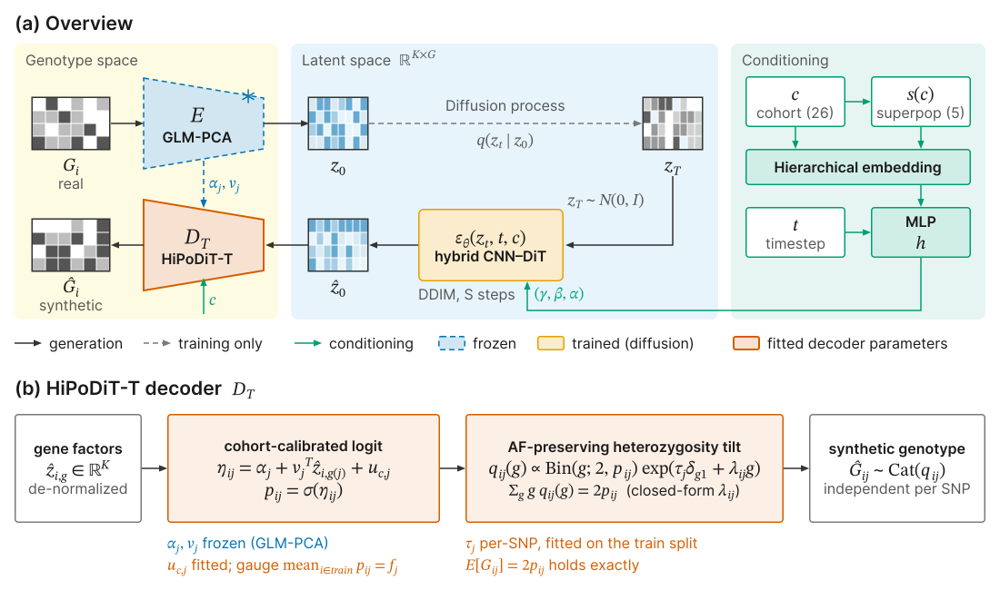
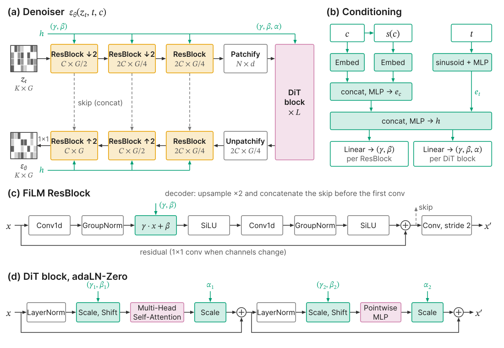
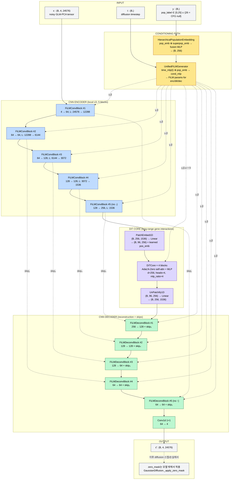
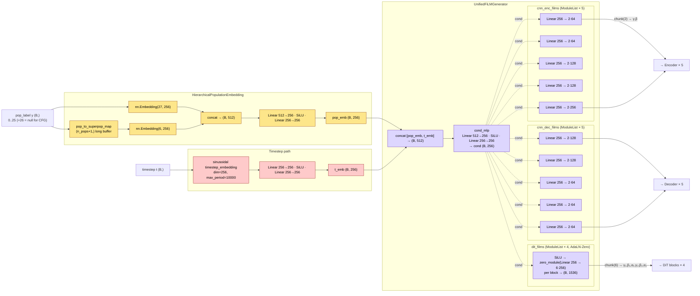
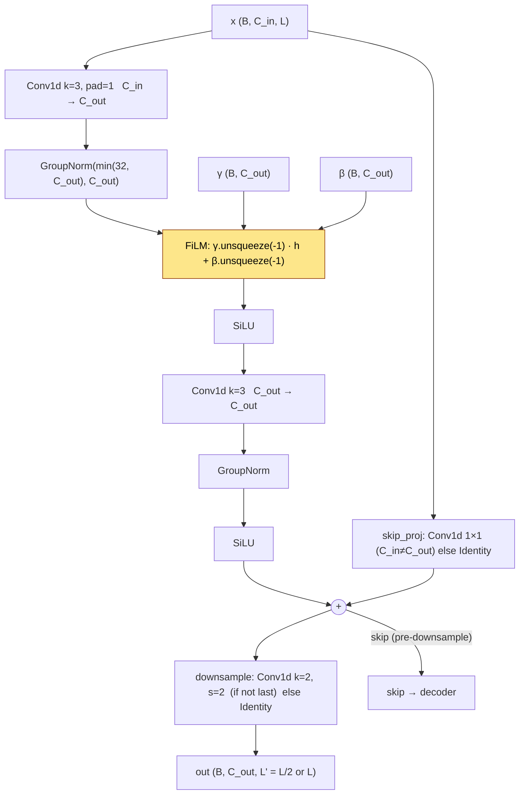
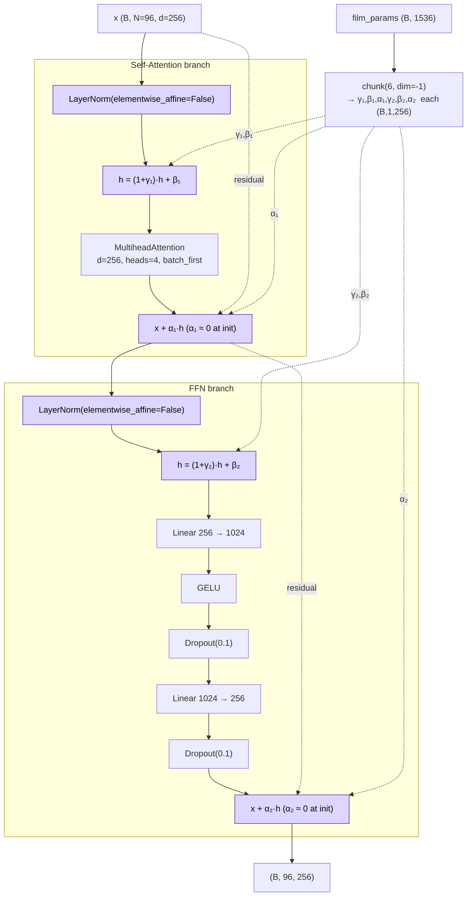
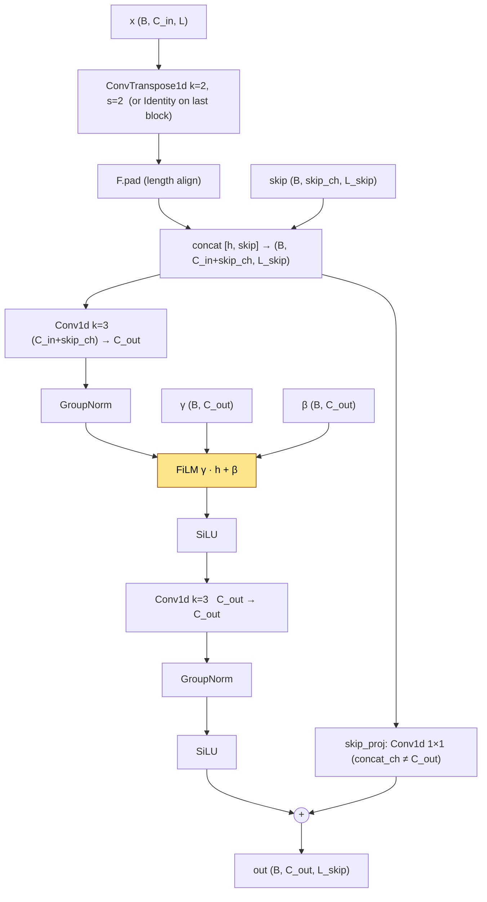
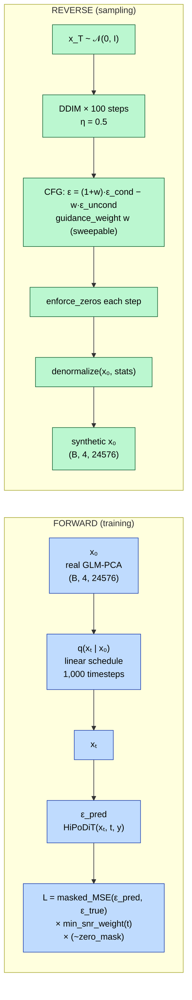
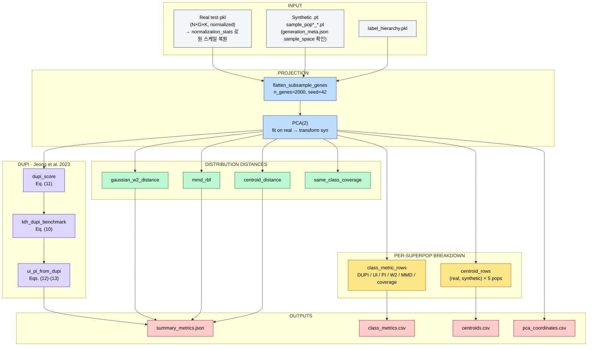
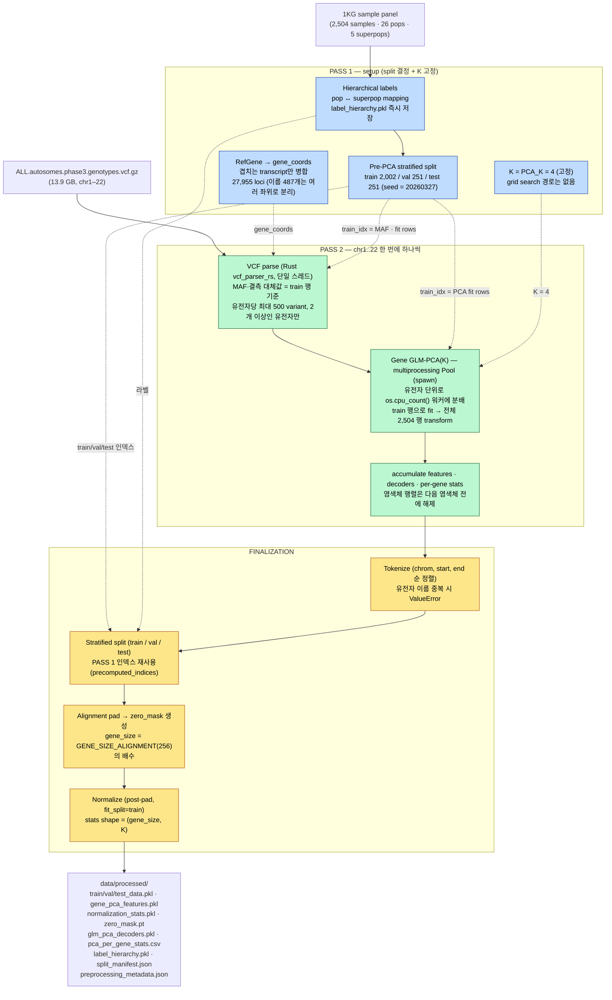

# HiPoDiT

**Hi**erarchical **Po**pulation-conditional **Di**ffusion **T**ransformer for synthetic genotype generation.

1000 Genomes Phase 3 데이터(2,504 samples, 26 populations, 5 superpopulations)를 활용하여 인구군별 조건부 합성 유전형을 생성하는 Diffusion 모델. 평가단에는 Jeong et al. (2023, IEEE TIFS) DUPI 프레임워크를 그대로 구현해 정량적 utility/privacy 동시 검증을 제공한다.

| 항목 | 값 |
| --- | --- |
| 모델 파라미터 | **9.33 M** (bf16) |
| 아키텍처 | Hybrid CNN encoder ⊕ DiT core ⊕ CNN decoder + Hierarchical FiLM |
| Diffusion | linear schedule · 1,000 timesteps · DDIM 100-step · CFG |
| 데이터 | 1KG Phase 3 · 2,504 samples · 26 pops · 5 superpops · gene_size 24,576 |
| 평가 | Fidelity / Structure / Utility / **DUPI** (Privacy + Utility Index) / Robustness |
| 코드 배포 | `src/evaluation/dupi.py` 는 stand-alone — 외부에서 vendoring 가능 |

문서:

* 합성 모델 자체 — 본 README
* DUPI 평가 모듈 — [`src/evaluation/README.md`](src/evaluation/README.md)
* 페이퍼 인용 정보 — [`CITATION.cff`](CITATION.cff)
* 이항 GLM-PCA + 인자별 확산 실험 — [실행 명령·수식·측정 결과](docs/reports/hipodit_diffusion_experiment_20260915.md)

새 연구 실험은 `scripts/hipodit_rebuild_check.py`의 `prepare`와 `train --schedule standard|fisher`로 실행한다.
`prepare`는 이항 GLM-PCA와 결측 마스크를 사용하고 SNP 중복 배치를 제거한다.
기존 전체 유전체 전처리의 Poisson 경로 및 캐시는 별도이며 새 실험 결과로 자동 대체하지 않는다.

---

> **이 저장소에는 서로 무관한 두 프로젝트가 들어 있습니다.**
>
> | 경로 | 프로젝트 | README |
> | --- | --- | --- |
> | `/` (본 파일) | HiPoDiT — 합성 유전형 생성 (본 문서) | 본 파일 |
> | `korean-medicine-llm/` | 한의학 LLM/VLM (Text2LLM ver1 → VLM ver2) | [`korean-medicine-llm/README.md`](korean-medicine-llm/README.md) |
>
> 이하 본 README의 모든 내용은 **HiPoDiT에만** 해당한다. `korean-medicine-llm/`은 별도의 가상환경과 별도의 컨벤션(uv 프로젝트, 자체 CLAUDE.md)을 가지므로 이 문서의 설치/실행 지침을 그대로 적용하지 말 것.

---

## Why This Model?

### 문제: 소수 인구군의 합성 유전형 품질 저하

기존 유전형 합성 모델(GeneDiffusion, Genome-AC-GAN)은 **소수 인구군에서 치명적인 성능 저하**를 보인다.

```
1000 Genomes Phase 3 — 26개 인구군의 샘플 수 불균형

  YRI ████████████████████████████████████████████ 108
  GWD ██████████████████████████████████████████████ 113
  CLM ████████████████████████████████████████ 94
  ...
  MXL ██████████████████████████ 64        ← 소수 인구군
  ASW ████████████████████████ 61          ← 소수 인구군

  ─────────────────────────────────────────────
  최대 113 vs 최소 61 → ~1.85x 차이
  superpop 기준: AFR 661 vs AMR 347 → ~1.9x 차이
```

**근본 원인**: 학습 데이터가 절대적으로 모자란다. 61개 샘플로 인구군 특이적 대립유전자 빈도(AF), 연관 불균형(LD), 하플로타입 다양성을 학습하기에 불충분하다.

**결과**: 소수 인구군에서 생성된 합성 유전형은 AF 상관이 낮고 LD 구조가 왜곡되며 다운스트림 분석(GWAS 보정, 임퓨테이션 패널)에 사용할 수 없다.

### 해결: FiLM 기반 계층적 인구군 조건화

HiPoDiT는 이 문제를 세 가지 메커니즘으로 해결한다:

#### 1. 계층적 인구군 임베딩 (Hierarchical Population Embedding)

```
기존 방식 (ASW 단독 학습):
  ASW 61 samples → pop_emb(ASW) ← 61개 gradient 신호만
  → 불안정, 고분산, 저품질 생성

제안 방식 (ASW + AFR superpopulation 공유):
  AFR 661 samples → superpop_emb(AFR) ← 661개 gradient 신호 → 안정적 기반
  ASW 61 samples  → pop_emb(ASW)      ← ASW 고유 잔차만 학습
  fusion(pop + superpop) → 안정적 + 특이적 조합

  결과: ASW 강건성 대폭 향상, AFR 내 다른 인구군과의 차별성 유지
```

#### 2. CNN-DiT 하이브리드 아키텍처

| 유전학 도메인 지식 | 모델 반영 |
|-------------------|----------|
| LD(연관 불균형)는 근거리 패턴 | **CNN**이 local LD 포착 |
| 유전자 간 상호작용은 장거리 | **DiT self-attention**이 포착 |
| 인구군 간 유전적 거리는 계층적 | 계층적 pop + superpop 임베딩 |
| 유전체의 99.9%는 공통 | 공유 백본, **FiLM**으로 0.1% 차이만 변조 |
| 특정 위치는 항상 0 (패딩/공통) | `enforce_zeros` + `zero_mask` |

#### 3. FiLM (Feature-wise Linear Modulation)

```
FiLM: output = γ · input + β

γ (scale): 인구군별 특정 유전자 영역의 중요도 조절
β (shift): 인구군별 대립유전자 빈도의 기저 수준(baseline) 이동

예시:
  AFR → γ_LD↑ (짧은 LD → 고주파 패턴 강화)
  EUR → γ_LD↓ (긴 LD → 저주파 패턴 강화)
```

## Model Architecture

### 전체 개요



* **(a) Overview**: 실제 유전형 `G_i` 를 동결된 GLM-PCA 인코더 `E` 가 유전자별 잠재 `z_0 ∈ ℝ^{K×G}` 로 줄인다. diffusion 은 이 잠재 공간에서만 학습하고, 생성 시에는 `z_T ~ N(0, I)` 에서 DDIM 으로 `ẑ_0` 를 복원한다. cohort `c` 와 superpop `s(c)` 의 계층 임베딩, timestep `t` 가 MLP `h` 를 거쳐 denoiser 에 FiLM 파라미터 `(γ, β, α)` 로 들어간다.
* **(b) HiPoDiT-T decoder**: 역정규화한 유전자 잠재에서 동결된 GLM-PCA 계수 `α_j, v_j` 와 적합한 cohort×SNP offset `u_{c,j}` 로 logit 을 만들고, SNP별 heterozygosity tilt `τ_j` 를 더해 `{0, 1, 2}` 를 SNP마다 독립으로 샘플링한다. tilt 는 기대 dosage `E[G_ij] = 2p_ij` 를 닫힌 해로 정확히 보존한다. 이 디코더는 chr17 고정 패널 실험(`scripts/hipodit_*.py`, `src/models/genotype_decoder.py`) 경로다.

### Default config (baseline `configs/default.yaml`)

| 항목 | 값 | 근거 |
|------|----|-------------|
| `in_channels (K)` | 4 | `data.num_channels` |
| `gene_size` | 24,576 | `data.gene_size` |
| `base_channels` | 64 | `model.base_channels` |
| `channel_mult` | (1, 1, 2, 2, 4) — **5 blocks** | `model.channel_mult` |
| `n_downsamples` | 4 = `len(channel_mult) - 1` | encoder 마지막 블록은 채널만 확장 |
| `latent_size` | 24576 / 2⁴ = **1,536** | |
| `latent_channels (4C)` | **256** | `base_channels × channel_mult[-1]` |
| `d_model` | **256** | `model.d_model` |
| `n_dit_blocks` | **4** | `model.n_dit_blocks` |
| `n_heads` | **4** | `model.n_heads` |
| `mlp_ratio` | 4.0 | `model.mlp_ratio` |
| `patch_size` | 16 → `n_tokens = 96` | latent 1,536 / 16 |
| `n_pops (+null)` | 26 (+1 = 27, CFG null) | `model.n_pops` |
| `n_superpops (+null)` | 5 (+1 = 6) | `model.n_superpops` |
| `dropout` | 0.1 | `model.dropout` |
| **Total parameters** | **9,331,588 (~9.33 M)** | bf16 ≈ 18 MB weight |

### Denoiser 구조 한눈에 보기



* **(a) Denoiser `ε_θ(z_t, t, c)`**: FiLM ResBlock 인코더 → Patchify → DiT 블록 × L → Unpatchify → FiLM ResBlock 디코더. 인코더 출력을 디코더에 concat skip 으로 넘긴다. 그림은 블록 수를 줄여 그린 개략도이며 기본 설정은 인코더 5블록(다운샘플 4회, latent 길이 G/16)이다. 정확한 채널·길이는 아래 [최상위 데이터 흐름](#최상위-데이터-흐름-hybridcnnditfilmforward)을 따른다.
* **(b) Conditioning**: `c`, `s(c)` 를 각각 임베딩해 concat·MLP 로 `e_c` 를 만들고, sinusoid + MLP 로 만든 `e_t` 와 다시 concat·MLP 해서 `h` 를 얻는다. `h` 는 ResBlock마다 Linear 로 `(γ, β)`, DiT 블록마다 `(γ, β, α)` 가 된다.
* **(c) FiLM ResBlock**: Conv1d → GroupNorm → `γ·x + β` → SiLU → Conv1d → GroupNorm → SiLU, 채널이 바뀌면 1×1 conv residual. skip 은 stride-2 다운샘플 직전에서 뽑는다. 디코더 블록은 먼저 ×2 업샘플하고 skip 을 concat 한다.
* **(d) DiT block (adaLN-Zero)**: LayerNorm → scale·shift → Multi-Head Self-Attention → `α` scale → residual, 이어서 같은 구조의 pointwise MLP. `α` 를 내는 Linear 가 0으로 초기화되어 DiT 는 identity 에서 학습을 시작한다.

### 최상위 데이터 흐름 (`HybridCNNDiTFiLM.forward`)



> **참고**: `HybridCNNDiTFiLM.forward`는 zero-mask를 적용하지 않는다. 제약은 `GaussianDiffusion._apply_zero_mask`가 `q_sample`·`p_sample`·DDIM 각 스텝과 손실에서 강제한다.

> **참고**: 인코더는 블록 1–4가 stride-2 downsample을 수행하고 마지막 블록(#5)은 채널만 확장한다. 디코더는 이 구조를 대칭으로 반전해 앞 4개 블록이 ConvTranspose1d로 2배 upsample하고 마지막 블록은 길이를 유지한다. 인코더가 4번 다운샘플하므로 latent 길이는 24576 / 16 = **1,536**, patch_size 16 으로 토큰 수는 **96** 이다.

### Conditioning Path (`HierarchicalPopulationEmbedding` + `UnifiedFiLMGenerator`)



### 블록 내부 구조

#### `FiLMConvBlock` — 인코더 블록 (`cnn.py:18-74`)



#### `DiTBlock` — AdaLN-Zero 블록 (`dit.py:94-162`)



`UnifiedFiLMGenerator.dit_films`가 `zero_module(Linear)`로 감싸져 있어 (`conditioning.py:131-139`) 학습 초기에 `γ=β=α=0`. LayerNorm도 `elementwise_affine=False`이므로 AdaLN-Zero의 정의에 따라 DiT는 **identity**로 시작하고, CNN 피처 위에서 점진적으로 장거리 보정을 학습한다.

#### `FiLMDeconvBlock` — 디코더 블록 (`cnn.py:77-142`)



### 위치별 FiLM의 역할

| 위치 | FiLM 기능 | 유전학적 의미 |
|------|----------|-------------|
| CNN Encoder | scale/shift local filters by pop | AFR: 짧은 LD 고주파 강화 / EUR: 긴 LD 저주파 강화 |
| DiT Blocks | attention + FFN modulation + gate | 인구군별 장거리 유전자 상호작용 패턴 |
| CNN Decoder | fine-tune reconstruction by pop | 인구군별 AF 분포 복원 |

### AdaLN-Zero 학습 역학

```
학습 초기:  α ≈ 0 → DiT 출력이 0에 가까움 → 사실상 CNN만 동작
           → CNN이 먼저 local LD 구조를 안정적으로 학습

학습 중기:  α가 점진적으로 증가 → DiT가 장거리 보정 기여 시작
           → CNN의 local 표현 위에 global 패턴 추가

학습 후기:  α가 수렴 → CNN(local) + DiT(global) 최적 조합 달성
           → 인구군별 FiLM이 두 경로를 동시에 변조
```

### Diffusion Process



| 항목 | 값 | 출처 |
|---|---|---|
| `max_timesteps` | 1,000 | `diffusion.max_timesteps` |
| `noise_schedule` | linear | `diffusion.noise_schedule` |
| `prediction_target` | ε (epsilon) | `diffusion.prediction_target` |
| `sample_clip` | 6.0 (normalized model space) | `diffusion.sample_clip` |
| `sampling_timesteps` | 100 (DDIM) | `diffusion.sampling_timesteps` |
| `ddim_eta` | 0.5 | `diffusion.ddim_eta` |
| `guidance_type` | classifier-free | `diffusion.guidance_type` |
| `guidance_weight` | 0.0 (unamplified conditional baseline) | `diffusion.guidance_weight` |
| `cfg_dropout_rate` | 0.1 (training-time null sample rate) | `diffusion.cfg_dropout_rate` |

### 파라미터 규모 (실측, 9.33 M)

| 모듈 | 파라미터 수 | 비고 |
|------|-----------|------|
| `pop_embedding` (Hierarchical) | 205,568 (0.21 M) | Embedding(27, 256) + Embedding(6, 256) + fusion MLP |
| `film_gen` (Unified FiLM Generator) | 2,466,944 (2.47 M) | `time_mlp` + `cond_mlp` + per-block linear (enc 5 · dec 5 · dit 4) |
| `encoder` (CNN, 5 blocks) | 632,384 (0.63 M) | stride-2 downsample × 4, 마지막 블록은 채널 확장만 |
| `patchify` + position embedding | 1,073,408 (1.07 M) | patch_size 16 → 96 tokens, learnable pos_emb |
| `dit` (4 blocks, d=256, h=4) | 3,155,456 (3.16 M) | self-attention + FFN + AdaLN-Zero × 4 |
| `unpatchify` | 1,052,672 (1.05 M) | Linear projection back to (256, 1536) |
| `decoder` (CNN, 5 blocks) | 745,156 (0.75 M) | ConvTranspose1d × 4 + skip connections + final 1×1 conv |
| **Total** | **9,331,588 (~9.33 M)** | bf16 weight ≈ **18 MB** |

---

## Evaluation Metrics

### 개요

평가는 5개 카테고리로 구성된다. 본 저장소에서 구현·테스트된 핵심 지표는 **Privacy / Utility 측 DUPI 프레임워크** + 보조 분포 거리 (Gaussian W2, MMD-RBF, coverage) 이며, 모든 정의는 [`src/evaluation/`](src/evaluation/README.md) 하위에 분리되어 있다 (외부 vendoring 가능).



### 1. Fidelity (충실도)

생성된 데이터가 원본의 통계적 특성을 얼마나 잘 보존하는지 측정한다.

#### 1.1 AF Correlation (Allele Frequency 상관)

```
정의:
  유전자 g에 대해 real/syn의 PCA 채널별 평균값을 계산 후
  전체 유전자에 대한 Pearson 상관계수를 구한다.

  AF_real(g) = mean(real[:, :, g])   각 유전자의 평균 PCA 값
  AF_syn(g)  = mean(syn[:, :, g])

  r = Pearson(AF_real, AF_syn)

목표: r >= 0.95
해석: 인구군별 유전자 수준의 변이 빈도가 보존되었는지 판단
```

#### 1.2 Wasserstein Distance (채널별 분포 거리)

```
정의:
  PCA 성분(채널) k에 대해 real과 syn의 1D 분포 간 Wasserstein-1 거리

  W_k = W₁(real[:, k, :].flatten(), syn[:, k, :].flatten())

  최종: mean(W_k) for k = 1..K

목표: 최소화 (test set의 W_k 이하)
해석: 각 PCA 성분의 전체적 분포 형태가 보존되었는지 판단
```

### 2. Structure (구조 보존)

실제 데이터의 인구군 간 유전적 구조(클러스터링, 분화)가 보존되었는지 본다.

#### 2.1 PCA Overlap (Silhouette Score)

```
방법:
  1. real과 syn을 합친 후 2D PCA 수행
  2. label = {0: real, 1: synthetic}으로 Silhouette score 계산
  3. score가 0에 가까울수록 real/syn이 구분 불가 = 이상적

  S = silhouette_score(PCA_2D(concat(real, syn)), labels=[0]*n + [1]*m)

목표: S → 0 (완전히 섞임)
해석: 합성 데이터가 실제 데이터의 PCA 공간 내 분포를 재현하는지 판단
```

#### 2.2 Sliced Wasserstein Distance

```
방법:
  1. real과 syn을 2D PCA로 투영
  2. L개의 랜덤 1D 방향으로 사영(projection)
  3. 각 방향에서 1D Wasserstein 거리 계산 → 평균

  SWD = (1/L) × Σ_l W₁(proj_l(real), proj_l(syn))

목표: test set 대비 2배 이내
해석: 고차원 분포 거리를 효율적으로 근사
```

### 3. Utility (유용성)

합성 데이터가 실제 데이터를 대체하여 다운스트림 분석에 사용될 수 있는지 측정한다.

#### 3.1 Recovery Rate

```
방법:
  1. 실제 데이터로 분류기(LogisticRegression) 학습 → 실제 테스트 정확도 = Acc_real
  2. 합성 데이터로 동일 분류기 학습 → 실제 테스트 정확도 = Acc_syn
  3. Recovery Rate = Acc_syn / Acc_real

  RR = Accuracy(clf.fit(X_syn, y_syn).predict(X_test))
     / Accuracy(clf.fit(X_real, y_real).predict(X_test))

목표: RR >= 0.93
해석: 합성 데이터만으로 학습해도 실제 데이터의 93% 이상 성능 달성
```

#### 3.2 Augmentation Effect (증강 효과)

```
방법:
  혼합 비율별로 real + syn 혼합 학습 → 실제 테스트 정확도 측정

  실험 설정:
    5% real + 95% syn   → Acc_5
    50% real + 50% syn  → Acc_50
    100% real (baseline) → Acc_base

  증강 효과 = Acc_mix / Acc_base

목표: 증강 시 Acc_base 대비 개선 (특히 소수 인구군)
해석: 합성 데이터가 학습 데이터 부족 문제를 해결하는지 직접 검증
```

### 4. Privacy (프라이버시)

합성 데이터가 원본 개인의 유전 정보를 노출하지 않는지 확인한다.

#### 4.1 NNAA (Nearest Neighbor Adversarial Accuracy)

```
정의:
  각 데이터 포인트에 대해 "같은 출처(real/syn)의 가장 가까운 이웃"이
  "다른 출처의 가장 가까운 이웃"보다 가까운 비율

  Term₁ = (1/n) Σᵢ I(d(xᵢ, NN_real(xᵢ)) < d(xᵢ, NN_syn(xᵢ)))   [real → real이 더 가까움]
  Term₂ = (1/m) Σⱼ I(d(yⱼ, NN_syn(yⱼ)) < d(yⱼ, NN_real(yⱼ)))   [syn → syn이 더 가까움]
  NNAA = 0.5 × (Term₁ + Term₂)

목표: NNAA ≈ 0.5
해석:
  NNAA ≈ 0.5 → real/syn 구분 불가 = 개인 식별 불가 = 프라이버시 보호
  NNAA > 0.5 → real끼리/syn끼리 더 가까움 = 다른 분포 = 프라이버시 보호 but 유용성↓
  NNAA < 0.5 → syn이 real에 너무 가까움 = 메모리제이션 위험
```

#### 4.2 DUPI (Data Utility and Privacy Index)

> Jeong, D., Kim, J. H. T., & Im, J. (2023). *"A New Global Measure to Simultaneously Evaluate Data Utility and Privacy Risk"*
> *IEEE Transactions on Information Forensics and Security*, **18**, pp. 715–729.
> DOI: [10.1109/TIFS.2022.3228753](https://doi.org/10.1109/TIFS.2022.3228753)
>
> 구현: [`src/evaluation/dupi.py`](src/evaluation/dupi.py) · 단위 테스트 + 논문 수치 재현: [`tests/test_dupi.py`](tests/test_dupi.py) (29 tests)

NNAA와 달리 **이론적 벤치마크(DUPI₀)**가 존재하여 정량적 판정이 가능한 지표이다.

```
표기:
  X_n = {x₁, ..., xₙ}  원본 데이터 (n개)
  Y_m = {y₁, ..., yₘ}  합성 데이터 (m개)
  d^{<k>}_S(c)          집합 S에서 점 c까지의 k번째 최근접 이웃 거리

정의:
                    1   n
  DUPI^{<k>}  =   ─── Σ  𝟙( d^{<k>}_{Y_m}(xᵢ)  ≤  d^{<k>}_{X_n\i}(xᵢ) )
                    n  i=1

  "각 원본 점 xᵢ에 대해:
     합성 데이터의 k-NN이 원본 데이터의 k-NN보다 더 가까운 비율"
```

```
이론 벤치마크 (Theorem 4):
  X_n과 Y_m이 같은 분포에서 독립 추출된 경우:

    k=1:   DUPI₀ = m / (n + m - 1)
    n=m:   DUPI₀ = n / (2n - 1)  ≈  0.5

    일반 k: DUPI₀ = Σ_{s=k}^{2k-1} C(s-1,k-1)·C(n-1+m-s,m-k) / C(n-1+m,m)
```

```
해석:
  ┌──────────┬──────────────────────────────┬────────────────────────────┐
  │ DUPI 값  │ 의미                          │ 진단                        │
  ├──────────┼──────────────────────────────┼────────────────────────────┤
  │ ≈ 1      │ 합성이 원본에 지나치게 가까움     │ Utility↑ Privacy↓ (leakage) │
  │ ≈ DUPI₀  │ 동일 분포의 독립 샘플처럼 동작    │ ** 최적 균형 **              │
  │   (≈0.5) │                              │                            │
  │ ≈ 0      │ 합성이 원본에서 너무 멀어짐      │ Utility↓ Privacy↑ (손실)    │
  └──────────┴──────────────────────────────┴────────────────────────────┘
```

```
UI/PI 분해 (시각화용):

  리스케일링:
    DUPI ≤ DUPI₀:  g = DUPI / (2·DUPI₀)
    DUPI > DUPI₀:  g = (DUPI - DUPI₀) / (2·(1 - DUPI₀)) + 0.5

  Utility Index:  UI = arctan(τ·g) / arctan(τ)          τ=5
  Privacy Index:  PI = arctan(τ - τ·g) / arctan(τ)

  최적 조건 (Theorem 5):
    UI·PI ≤ [arctan(τ/2) / arctan(τ)]²
    등호 ⟺ DUPI = DUPI₀

    τ=5 일 때 최적 (UI₀, PI₀) ≈ (0.867, 0.867)
```

```
NNAA vs DUPI:

  공통점: 이상적 값 ≈ 0.5
  차이점:
    NNAA → 양방향 대칭 (real↔syn)         | 이론 벤치마크 없음
    DUPI → 단방향 (real→syn)              | 정확한 DUPI₀ 존재

  → NNAA: 기존 유전형 생성 논문과의 비교용
  → DUPI: 정량적 판정 및 UI/PI 시각화용
  → 본 프로젝트에서 병행 사용
```

#### 4.3 Membership Inference AUC

```
방법:
  "이 샘플이 학습에 사용되었는가?"를 추론하는 공격 모델

  1. 각 테스트 포인트의 합성 데이터까지 최소 거리 계산
  2. 학습 데이터(member)와 홀드아웃 데이터(non-member)를 구분하는
     이진 분류기 학습
  3. AUC 측정

목표: AUC ≈ 0.5 (랜덤 추측 수준)
해석: AUC > 0.6 → 학습 데이터 멤버십 추론 가능 = 프라이버시 위험
```

### 5. Robustness (강건성) -- 핵심 신규 지표

FiLM 기반 계층적 임베딩의 핵심 가설을 검증하는 지표다.

#### 5.1 Population Size vs Quality Correlation

```
가설:
  "FiLM 없이는 인구군 크기(n)와 생성 품질 사이에 강한 양의 상관이 존재한다.
   FiLM + 계층적 임베딩 적용 후 이 상관이 약화되면 → 크기 독립적 품질 달성."

방법:
  1. 인구군별 AF 상관(quality)을 개별 계산
  2. pop_sizes = [61, 64, ..., 113]
  3. qualities = [r_ASW, r_MXL, ..., r_YRI]
  4. r = Pearson(pop_sizes, qualities)

  Robustness = |r|

목표: |r| → 0
해석:
  |r| ≈ 0 → 인구군 크기와 무관한 품질 = FiLM이 소수 인구군 보호에 성공
  |r| > 0.5 → 여전히 크기 의존적 = 추가 개선 필요
```

#### 5.2 Per-Population DUPI Gap

```
방법:
  1. 인구군별로 DUPI를 개별 계산
  2. 각 인구군의 |DUPI - DUPI₀| (gap) 측정
  3. 인구군 크기와 gap 간 상관 계산

목표: gap-size correlation → 0
해석: 모든 인구군에서 균일한 프라이버시-유용성 균형 = FiLM 강건성 확인
```

### 지표 요약 테이블

| Category | Metric | Formula | Target | 비고 |
|----------|--------|---------|--------|------|
| Fidelity | AF Correlation | Pearson(AF_real, AF_syn) | r >= 0.95 | 전체 |
| Fidelity | Wasserstein/ch | mean(W₁ per channel) | minimize | PCA 성분별 |
| Structure | PCA Overlap | Silhouette(real+syn) | S → 0 | 2D PCA |
| Structure | Sliced WD | mean(W₁ per projection) | <= 2x test | L=100 projections |
| Utility | Recovery Rate | Acc_syn / Acc_real | >= 0.93 | LogisticRegression |
| Utility | Augmentation | Acc_mix / Acc_base | > 1.0 | 5%, 50% 비율 |
| Privacy | NNAA | 0.5×(T₁+T₂) | ≈ 0.5 | 양방향, 비교용 |
| Privacy | **DUPI** | (1/n)Σ𝟙(d_syn <= d_real) | **≈ DUPI₀** | 이론 벤치마크, 판정용 |
| Privacy | MIA AUC | Binary clf AUC | ≈ 0.5 | 멤버십 추론 |
| **Robustness** | **Size-Quality \|r\|** | \|Pearson(size, quality)\| | **→ 0** | **핵심 contribution** |
| Robustness | Per-pop DUPI gap | corr(size, \|DUPI-DUPI₀\|) | → 0 | FiLM 강건성 |

---

## Evaluation Results — 실측 (`gw_0p5` baseline)

`scripts/guidance_sweep.py` 로 guidance weight 0.5 에서 학습된 모델의 합성 표본 2,504 개 vs 실제 hold-out 251 개 평가. 산출 디렉터리: `outputs/guidance_sweep_best_full/gw_0p5/evaluation_metrics/`.

> **주의 — 이전 전처리 기준 수치다.** 아래 표의 `n_features_before_pca = 16,000 = 2,000 genes × 8 channels` 가 보여 주듯 K=8 시절 데이터로 측정했다. 현재 파이프라인(K=4, RefGene 좌위 분리, Rust 파서 train-only MAF, 원 스케일 평가)으로 다시 만든 데이터에서는 재측정이 필요하다.

### Global metrics (`summary_metrics.json`)

| Metric | Observed | Reference / Target |
|---|---|---|
| n_real / n_synthetic | 251 / 2,504 | 10× augmentation |
| n_features_before_pca | 16,000 | 2,000 genes × 8 channels |
| PCA explained variance | 7.92 % / 2.87 % (PC1 / PC2) | — |
| **DUPI** (k=1) | **0.530** | benchmark `m/(n+m−1)` = 0.909 |
| DUPI abs error | 0.379 | smaller = closer to balance |
| **Privacy Index** (τ=5) | **0.943** | ≈ 0.867 = optimal |
| Utility Index (τ=5) | 0.706 | ≈ 0.867 = optimal |
| U × P | 0.666 | ≤ 0.751 (Theorem 5 bound) |
| Centroid distance | 1.351 | smaller = better |
| Gaussian W2 | 10.93 | smaller = better |
| MMD-RBF (biased) | 0.00136 | smaller = better |

### Per-superpopulation breakdown (`class_metrics.csv`)

| Pop | n_real | n_syn | DUPI | PI | UI | centroid_dist | W2 | MMD |
|---|---|---|---|---|---|---|---|---|
| AFR | 67 | 661 | 0.701 | 0.915 | 0.795 | 1.79 | 8.15 | 0.085 |
| AMR | 34 | 347 | 0.853 | 0.882 | 0.849 | 1.58 | 3.71 | 0.013 |
| EAS | 50 | 504 | 0.260 | **0.977** | 0.451 | 5.04 | 27.4 | 0.730 |
| EUR | 51 | 503 | 0.294 | **0.973** | 0.495 | 3.52 | 13.2 | 0.401 |
| SAS | 49 | 489 | 0.571 | 0.937 | 0.731 | 3.31 | 12.7 | 0.272 |

전 superpop 에서 **PI ≥ 0.88** 이라 어느 인구집단도 nearest-neighbor memorization 흔적 없음. EAS / EUR 은 PI 가 0.97+ 로 매우 높지만 동시에 UI 가 0.5 미만으로 떨어지는데 이는 합성 표본이 real 분포에서 멀리 떨어진 결과 (centroid drift 4–5 PC unit) 이며 *privacy 우수* 라기보다 *utility 손실의 부산물* 로 읽어야 한다.

### Privacy 시각화

`outputs/guidance_sweep_best_full/gw_0p5/privacy_per_superpop.png` 가 두 패널로 위 표를 시각화한다: (1) DUPI vs 동일분포 benchmark 막대그래프, (2) Privacy / Utility Index 막대그래프 (PI ≥ 0.88 임계선 포함).

### 1줄 요약 (논문 기재용)

> Across 251 held-out real and 2,504 synthetic samples in PCA(2) space, DUPI = 0.530 (k = 1) — well below the equal-distribution benchmark 0.909 — yielding a global **privacy_index of 0.943** with no superpopulation falling below 0.88, indicating no nearest-neighbor memorization while preserving moderate utility (UI = 0.706).

---

## Data

```
data/
├── ALL.autosomes.phase3.genotypes.vcf.gz          (13.9 GB, 1KG Phase 3, chr1-22)
├── ALL.autosomes.phase3.genotypes.vcf.gz.tbi      (tabix index)
├── integrated_call_samples_v3.20130502.ALL.panel   (sample→pop→superpop mapping)
└── refGene.txt.gz                                  (RefGene 유전자 좌표, 8 MB)

~/GeneDiffusion/                                    (선택, 있으면 Rust 파서가 우선 사용)
└── ALL.chr{1..22}.phase3_shapeit2_mvncall_integrated_v5b.20130502.genotypes.vcf.gz (+ .tbi)
```

* 위 4개 파일은 `run_pipeline.py` 시작 시 `validate_input_files()` 가 존재를 확인하고, 하나라도 없으면 `FileNotFoundError` 로 멈춘다. `.tbi` 가 없으면 `tabix -p vcf data/ALL.autosomes.phase3.genotypes.vcf.gz` 로 만든다.
* 염색체별 VCF 경로는 `src/preprocessing/config.py` 의 `PER_CHROM_VCF_DIR` / `PER_CHROM_VCF_PATTERN` 이다. 파일이 있으면 해당 염색체만 읽고, 없으면 병합 VCF 를 처음부터 스캔한다(느림).

### 전처리 파이프라인 흐름 (OOM-safe 2-pass)



### 실행 시간 · 자원 (실측, 2026-09-16, Threadripper PRO 5955WX 16코어/32스레드 · RAM 125 GB)

| 구간 | chr1 | chr2 | chr3 | chr4 |
|---|---|---|---|---|
| 염색체 전체 (파싱 + GLM-PCA) | 10.0 분 | 7.5 분 | 6.5 분 | 5.3 분 |
| 유전자 수 (variant ≥ 2) | 2,576 | 1,666 | 1,427 | 994 |
| 누적 feature 수 (유전자 × K) | 10,163 | 16,741 | 22,406 | 26,355 |

* **파싱 구간** (염색체당 약 2분): Rust 파서가 단일 스레드로 gzip 을 풀며 읽는다. 코어 1개만 쓰고 디스크 읽기는 약 11 MB/s.
* **GLM-PCA 구간** (염색체당 약 3.5–8분): 워커 32개가 CPU 를 ~90% 사용한다.
* **메모리**: chr1–chr4 구간에서 시스템 전체 사용량이 약 24 GiB 였다(vmstat `used` 기준, 부모 + 워커 32개). 염색체를 하나씩 처리하므로 뒤 염색체로 갈수록 늘지 않는다(누적 feature 만 증가).
* **로그 형식**: 파서가 stderr 로 `[chr1] 462879 genic variants, 479593 intergenic skipped, 2576 genes with >=2 variants` 를, GLM-PCA 가 끝나면 `[1/22] chr1: 2576 genes → PCA done, 10163 total features` 를 찍는다. 장시간 실행이므로 `nohup ... > outputs/preprocess_*.log 2>&1 &` 로 돌리고 로그를 본다.
* **중간 저장 없음**: 22개 염색체 결과는 메모리에 쌓였다가 마지막에 한 번에 저장된다. 도중에 죽으면 chr1 부터 다시 돈다.

### RefGene 유전자 좌표 (`gene_annotation.load_refgene`)

* 같은 유전자 이름의 transcript 는 **구간이 겹칠 때만** 하나로 합친다.
* `RNU1-3`, `MIR6859-1` 처럼 멀리 떨어진 여러 위치에 주석된 이름을 `min(txStart)`–`max(txEnd)` 로 합치면 최대 132 Mb 짜리 가짜 유전자가 생겨 그 사이 variant 를 모두 삼킨다. 이를 막기 위해 겹치지 않는 묶음은 각각 별도 좌위로 둔다.
* 좌위가 2개 이상인 이름은 `RNU1@chr1-100` 처럼 `@chr{N}-{start}` 를 붙여 feature 키가 겹치지 않게 한다.
* 현재 `refGene.txt.gz` 기준 22개 상염색체에서 **27,955 좌위**, 여러 좌위로 나뉜 이름은 **487개**다.

### VCF 파서 — Rust 확장 `vcf_parser_rs`

`src/preprocessing/vcf_parser.py` 는 `vcf_parser_rs` 를 import 할 수 있으면 Rust 파서를, 아니면 Python/cyvcf2 파서를 쓴다. 두 구현은 같은 규칙을 따른다.

| 단계 | 규칙 |
|---|---|
| 대상 | REF·ALT 가 단일 염기인 biallelic SNP |
| dosage | `0/0`→0, `0/1`→1, `1/1`→2, 결측→NaN |
| MAF 필터 | **train 행(2,002명)만으로** allele frequency 계산, `MAF < 0.01` 제외 |
| 결측 대체 | train 행 평균으로 **전체 2,504행** 의 NaN 을 채움 (val/test 정보 누설 방지) |
| 유전자 매핑 | RefGene 0-based 시작 · exclusive 끝 → `start < POS <= end`. 정렬된 시작점 이분 탐색 + 끝점 prefix-max 로 겹치는 유전자를 모두 찾는다. 유전자 밖이면 intergenic 으로 건너뜀 |
| 유전자당 상한 | 위치 순으로 앞의 `MAX_VARIANTS_PER_GENE = 500` 개만 유지 |
| 반환 | variant 가 2개 이상인 유전자만 `float32 (2504, n_variants)` 행렬로 반환 |

* **설치**: Rust 툴체인이 필요하다. `uv pip install -e ./vcf_parser_rs` (maturin 빌드). Rust 소스를 고치면 **다시 설치해야** `.so` 에 반영된다.
* **Python fallback**: Rust 확장이 없으면 cyvcf2 로 읽는다. chr1 파싱에 약 1,070초 걸려 Rust(약 2분)보다 훨씬 느리다. 병합 VCF 에서 chr2 이후 region query 가 비는 cyvcf2 문제가 있어 염색체별 VCF 가 있으면 그것을 연다.
* 자세한 API 는 [`vcf_parser_rs/README.md`](vcf_parser_rs/README.md).

### 실패 시 즉시 중단하는 검사

조용히 잘못된 데이터를 만들지 않도록 아래 경우에는 예외로 멈춘다.

| 조건 | 위치 | 이유 |
|---|---|---|
| `HIPODIT_DIM_RED` 가 `glm_pca` 가 아님 | `run_pipeline.main` | 학습·추론 계약이 GLM-PCA decoder 를 전제 |
| 입력 파일(VCF, .tbi, panel, refGene) 없음 | `validate_input_files` | |
| 파서가 한 염색체에서 유전자 0개 반환 | `pca.stream_vcf_and_pca` | chr2–22 가 비어 chr1 만 든 "완성" 데이터가 나온 적이 있음 |
| 염색체 간 샘플 순서 불일치 | `pca.stream_vcf_and_pca` | 행이 섞이면 모든 feature 가 틀어짐 |
| VCF 샘플 순서 ≠ panel 순서 | `run_pipeline.main` | 라벨 정렬 보장 |
| 유전자 이름 중복 | `run_pipeline.main` | 다른 좌위의 feature 를 덮어씀 |

### 전처리 산출물

| 파일 | Shape / 내용 | 설명 |
|------|-------|------|
| `train_data.pkl` · `val_data.pkl` · `test_data.pkl` | `(x: N×gene_size×K, y: N)` | 패딩 → 정규화된 텐서 (train 2,002 · val 251 · test 251) |
| `gene_pca_features.pkl` | DataFrame (2504, 유전자 수 × K) | 패딩·정규화 전 GLM-PCA 점수 |
| `normalization_stats.pkl` | {mean, std}: (gene_size, K) fp32 | train 으로만 fit, 역정규화용 |
| `zero_mask.pt` | (gene_size, K) bool | 항상 0인 위치 마스크 |
| `glm_pca_decoders.pkl` | 유전자별 dict | loadings · intercept · family(`poi`) · link · penalty · backend · projection |
| `pca_per_gene_stats.csv` | 유전자당 1행 | gene · chrom · start · end · n_variants · actual_k · explained_total · explained_pc1..K |
| `label_hierarchy.pkl` | dict | pop/superpop 매핑 (PASS 1 에서 바로 저장) |
| `split_manifest.json` | dict | seed · 비율 · split별 인덱스와 샘플 ID · pop별 개수 |
| `preprocessing_metadata.json` | dict | 차원축소 방식, 정규화 설정, `tensor_layout = N,G,K`, 유전자 순서(gene·chrom·start·end) |

전처리가 끝나면 로그 마지막에 아래가 출력된다. `configs/default.yaml` 의 `data.num_channels` · `data.gene_size` 를 이 값으로 맞춰야 한다. 다르면 `create_dataloaders` 가 학습 시작 전에 `ValueError` 로 거부한다.

```
--- Config values for configs/default.yaml ---
data.num_channels: 4
data.gene_size: <유전자 수를 256 배수로 올림한 값>
```

---

## Quick Start

```bash
# 환경 설치
uv sync

# Phase 0.5: VCF 병합 (22 염색체 병렬)
python src/preprocessing/merge_data.py --format vcf
python src/preprocessing/merge_data.py --format pkl --maf 0.01

# Phase 1: 전처리 (VCF → Gene GLM-PCA → 토큰화)
#   Rust VCF 파서 설치 (한 번, Rust 툴체인 필요. 소스 수정 후에도 다시 실행)
uv pip install -e ./vcf_parser_rs
#   전 CPU 코어 사용 · 수십 분 이상 → 백그라운드 + 로그
nohup .venv/bin/python src/preprocessing/run_pipeline.py > outputs/preprocess.log 2>&1 &
#   끝나면 로그 마지막의 data.num_channels / data.gene_size 를 configs/default.yaml 에 반영

# Phase 2: 모델 shape 검증
python -c "
from src.models import HybridCNNDiTFiLM
from src.utils.config import load_config
import torch

config = load_config('configs/default.yaml')
model = HybridCNNDiTFiLM(config)
x = torch.randn(2, config['data']['num_channels'], config['data']['gene_size'])
t = torch.randint(0, 500, (2,))
y = torch.randint(0, 26, (2,))
out = model(x, t, y)
print(f'Input: {x.shape} → Output: {out.shape}')
print(f'Parameters: {sum(p.numel() for p in model.parameters()):,}')
"

# Phase 3: 학습 (DDP 2-GPU)
#   training.precision: bf16(기본) | fp32 — 학습·검증 autocast 둘 다 이 값을 따른다
#   training.optimizer: adamw 만 지원 (다른 값이면 ValueError)
torchrun --nproc_per_node=2 src/training/trainer.py --config configs/default.yaml

# Phase 3 (single GPU debug)
python src/training/trainer.py --config configs/default.yaml --single_gpu

# Phase 4: 추론 (인구군별 조건부 생성)
python src/inference/generator.py \
    --config configs/default.yaml \
    --model_path outputs/default/best_model.pth \
    --output_dir outputs/default/synthetic_samples

# Phase 5: 평가 (DUPI + 분포 거리, PCA(2) 공간)
#   real·synthetic 둘 다 normalization_stats.pkl 로 원 스케일로 되돌린 뒤 비교한다
#   --real-space: --real-path 텐서가 normalized(기본, 전처리 산출물 그대로) | original
#   --legacy-synthetic-space: generation_meta.json 에 sample_space 가 없는 옛 샘플에만 지정
python scripts/evaluate_synthetic_metrics.py \
    --syn-dir outputs/default/synthetic_samples \
    --out-dir outputs/default/evaluation_metrics \
    --stats-path data/processed/normalization_stats.pkl \
    --dupi-k 1 \
    --tau 5.0

# Phase 6: PCA real vs synthetic 시각화
python src/evaluation/pca_compare.py \
    --syn_dir outputs/default/synthetic_samples

# Phase 7: Guidance weight 스윕 (CFG w 탐색)
python scripts/guidance_sweep.py \
    --weights 0.5 1.0 2.0 4.0 7.0 \
    --base-dir outputs/guidance_sweep

# Tests (전체 228개, 수 분 소요)
pytest tests/

# Hyperparameter sweep (wandb)
# configs/sweep.yaml을 작성한 후 실행
# wandb sweep configs/sweep.yaml --project HiPoDiT
# wandb agent <sweep_id>
```

### 전처리 차원축소 — Poisson GLM-PCA

`run_pipeline.py` 는 **GLM-PCA (Townes et al. 2019, Poisson family) 만** 받는다. `src/preprocessing/dim_reduction.py` 에 sklearn `pca` 분기가 남아 있지만, `HIPODIT_DIM_RED=pca` 로 실행하면 `ValueError("The production preprocessing pipeline requires glm_pca")` 로 멈춘다.

| 설정 | 값 | 위치 |
|---|---|---|
| backend | `glm_pca` (고정) | `config.DIM_RED_METHOD`, env `HIPODIT_DIM_RED` |
| family | Poisson (`poi`) 고정, 다른 family 설정 없음 | `glm_pca.DEFAULT_GLM_FAMILY` |
| 성분 수 K | 4 | `config.PCA_K` |
| 최대 반복 | 100 | `config.GLM_PCA_MAX_ITER`, env `HIPODIT_GLM_MAX_ITER` |
| 가속 | `glmpca-fast` (PyPI, Rust) — `uv sync` 로 설치됨 | `pyproject.toml` |
| fit / transform | train 행으로 decoder fit → 전체 샘플을 고정 decoder likelihood 로 projection | `glm_pca.glm_pca_single_gene` |

* 자세한 수식·구현: `src/preprocessing/glm_pca.py` 모듈 docstring
* chr17 고정 패널 실험의 **이항(Binomial) GLM-PCA** 는 `src/preprocessing/binomial_glm_pca.py` 로 별도이며 이 파이프라인과 섞이지 않는다.

---

## Project Structure

```
gene-synthesis-project/
├── configs/
│   └── default.yaml                # Canonical config (source of truth)
│
├── src/
│   ├── preprocessing/
│   │   ├── config.py               # 전처리 상수 (경로, PCA_K, VAL_RATIO/TEST_RATIO, MAF, 유전자당 variant 상한)
│   │   ├── vcf_parser.py           # VCF 파싱 디스패치: Rust(vcf_parser_rs) 우선, 없으면 cyvcf2
│   │   ├── gene_annotation.py      # RefGene → 겹치는 transcript만 병합한 유전자 좌위
│   │   ├── pca.py                  # 염색체 순차 스트리밍 + 유전자별 차원축소 Pool
│   │   ├── dim_reduction.py        # 유전자 1개 차원축소 디스패치 (glm_pca | pca)
│   │   ├── glm_pca.py              # Poisson GLM-PCA (glmpca-fast), train fit → 전체 projection
│   │   ├── binomial_glm_pca.py     # 이항 GLM-PCA (chr17 고정 패널 실험 전용)
│   │   ├── tokenizer.py            # 토큰화, alignment 패딩, zero_mask, 정규화
│   │   ├── labels.py               # 계층적 레이블, split, 저장
│   │   ├── merge_data.py           # VCF 병합 (22 chr 병렬)
│   │   └── run_pipeline.py         # 전처리 오케스트레이터 (OOM-safe 2-pass)
│   │
│   ├── models/
│   │   ├── hybrid_geno_dit.py      # HybridCNNDiTFiLM (전체 모델)
│   │   ├── diffusion.py            # GaussianDiffusion (DDIM, CFG, zero-mask 강제)
│   │   ├── noise_schedule.py       # cosine / linear beta schedule
│   │   ├── genotype_decoder.py     # GLM-PCA latent → {0,1,2} 디코더 (chr17 실험)
│   │   └── modules/
│   │       ├── base.py             # timestep_embedding, zero_module
│   │       ├── conditioning.py     # HierarchicalPopEmb + UnifiedFiLMGen
│   │       ├── cnn.py              # FiLMConvBlock, CNNEncoder, CNNDecoder
│   │       └── dit.py              # PatchEmbed1D, DiTBlock, DiTCore
│   │
│   ├── training/
│   │   ├── trainer.py              # DDP 학습 루프 (precision bf16|fp32, AdamW, cosine warmup LambdaLR)
│   │   └── losses.py               # masked_mse, MMD, Min-SNR
│   │
│   ├── inference/
│   │   └── generator.py            # EMA 로드, DDIM 생성, 역정규화 (stats 패딩 처리)
│   │
│   ├── evaluation/                 # ── 평가 모듈 ──
│   │   ├── README.md               # DUPI 모듈 전용 문서 (citation, API, paper recon)
│   │   ├── __init__.py             # 공개 API re-export
│   │   ├── dupi.py                 # DUPI · UI · PI (Eqs. 8/10-13, citable core)
│   │   ├── distribution_metrics.py # Gaussian W2, MMD-RBF, coverage, centroid
│   │   ├── synthetic_pipeline.py   # evaluate() + EvaluationReport dataclass
│   │   ├── _io.py                  # 프로젝트-특화 IO + 캐싱 (project-coupled)
│   │   └── pca_compare.py          # Real vs Syn PCA scatter plot 생성
│   │
│   ├── data/
│   │   ├── dataset.py              # GenotypeDataset (pkl → tensor)
│   │   ├── sampler.py              # PopulationBalancedSampler (sqrt 비례)
│   │   └── dataloader.py           # DataLoader 팩토리 (텐서 shape ≠ config 이면 ValueError)
│   │
│   └── utils/
│       ├── config.py               # YAML 로드, CLI override, 검증
│       ├── ddp.py                  # DDP setup/cleanup
│       ├── ema.py                  # EMA (decay 0.999, configs/default.yaml)
│       └── logger.py               # wandb 래퍼 (rank 0 only, project=HiPoDiT)
│                                   # (.pth 저장/top-k 관리는 src/training/trainer.py 안에 있다)
│
├── vcf_parser_rs/                     # Rust(PyO3) VCF 파서 — README 는 vcf_parser_rs/README.md
│   ├── Cargo.toml · pyproject.toml    # maturin 빌드
│   └── src/
│       ├── lib.rs                     # Python 진입점 process_one_chromosome_rs
│       ├── gene_index.rs              # 유전자 구간 이분 탐색 + prefix-max 끝점
│       └── vcf_processing.rs          # gzip 스트리밍 파싱, dosage, train 기준 MAF·대체
│
├── scripts/
│   ├── evaluate_synthetic_metrics.py # DUPI + 분포 거리 CLI (원 스케일 복원 후 평가)
│   ├── guidance_sweep.py             # CFG w 스윕 + 평가 자동화
│   ├── plot_pca.py                   # 3-panel Real / Syn / Overlay PCA 그림
│   ├── plot_pca_train_fit_test_overlay.py # train fit PCA 에 test·synthetic 투영
│   ├── plot_train_curves.py          # 학습 로그 → loss/val 곡선
│   ├── export_chr17_csv.py           # chr17 TSV 익스포트 유틸
│   └── hipodit_*.py                  # chr17 고정 패널 실험 (prepare / check / multiseed / privacy)
│
├── tests/                            # pytest tests/ → 228 tests
│   ├── test_dupi.py                  # DUPI invariants + 논문 수치 재현
│   ├── test_gene_annotation.py       # RefGene 좌위 분리
│   ├── test_glm_pca_preprocessing.py # GLM-PCA 전처리 계약
│   ├── test_normalization_contract.py · test_evaluation_io_contract.py
│   ├── test_model_diffusion.py · test_model_modulation.py · test_inference_generator_contract.py
│   └── test_hipodit_*.py · test_genotype_decoder.py · test_binomial_glm_pca.py  # chr17 실험
│
├── data/                              # (git 추적 안 함)
│   ├── ALL.autosomes.phase3.genotypes.vcf.gz
│   └── processed/                     # 전처리 산출물
│
├── outputs/                           # (git 추적 안 함)
│   ├── default/
│   │   ├── best_model.pth
│   │   ├── synthetic_samples/
│   │   └── evaluation_metrics/
│   └── guidance_sweep_best_full/
│       ├── guidance_sweep_summary.csv
│       └── gw_0p5/
│           ├── pca_real_vs_synthetic.png
│           ├── privacy_per_superpop.png
│           ├── synthetic_samples/
│           └── evaluation_metrics/
│               ├── summary_metrics.json
│               ├── class_metrics.csv
│               ├── centroids.csv
│               └── pca_coordinates.csv
│
├── CITATION.cff                       # 인용 메타데이터 (GitHub 자동 인식)
└── docs/                              # reports/ (실험 보고서) · superpowers/ (계획·설계)
```

---

## Hardware Requirements

| Resource | Spec | Usage |
|----------|------|-------|
| GPU × 2 | NVIDIA RTX A6000 (48GB) | DDP 학습 (bf16) |
| CPU | 코어가 많을수록 전처리가 빨라짐 | 전처리 GLM-PCA 가 `os.cpu_count()` 워커 사용 (실측 32스레드에서 염색체당 5–10분) |
| RAM | 64GB+ 권장 | 전처리 실측 약 24 GiB (32 워커) + 학습 시 전체 데이터셋 in-memory |
| Storage | 50GB+ | VCF(14GB) + 염색체별 VCF(선택) + 산출물 + 체크포인트 |
| Rust toolchain | stable | `vcf_parser_rs` 빌드 (없으면 cyvcf2 fallback — chr1 파싱 약 18분 vs Rust 약 2분) |

**VRAM 사용량 추정** (baseline config, 9.33 M params, batch=16, bf16):
```
Model weights (bf16):       9.33 M × 2 B              ≈    18 MB
Gradients (bf16):           9.33 M × 2 B              ≈    18 MB
Optimizer states (AdamW):   9.33 M × 8 B (m + v fp32) ≈    75 MB
EMA weights:                9.33 M × 2 B              ≈    18 MB
Activations (b=16, gene=24576, mixed-prec)            ≈ 4–6 GB
─────────────────────────────────────────────────────────────
Total per GPU                                          ≈ 4–6 GB
```

> bf16 + DDP 2-GPU 기준. Activation 비용은 input length / DiT 토큰 수에 따라 변동.

---

## Key Design Decisions

| 결정 | 근거 |
|------|------|
| bf16 (not fp16) | Ampere CC 8.6 네이티브 지원, exponent 8bit → GradScaler 불필요 |
| DDP (not FSDP) | 9.33M params는 단일 GPU(48 GB) 안에 들어가므로 DDP 가 더 단순·효율적 |
| linear schedule · 1,000 timesteps | DiT 류 large-scale diffusion 의 표준; cosine 보다 후반부 noise 가 균형적 |
| DDIM 100-step (η = 0.5) | 1,000-step DDPM 대비 10× 가속 + 부분 stochasticity 로 다양성 유지 |
| AdaLN-Zero | α=0 초기화 → DiT가 identity로 시작 → 안정적 학습 |
| K 고정 (grid search 없음) | `run_pipeline.py` 가 `optimal_k = PCA_K` 로 K=4 고정. Marginal Gain Elbow 탐색 코드와 threshold/decay_ratio 상수는 삭제됐다 |
| split 을 PCA 전에 결정 | MAF 필터·결측 대체·GLM-PCA fit·정규화를 모두 train 행으로만 계산해 val/test 누설을 막는다 |
| RefGene 은 겹칠 때만 병합 | 이름만 같은 먼 좌위를 합치면 최대 132 Mb 가짜 유전자가 생긴다 |
| 염색체는 순차, 유전자는 병렬 | 메모리는 염색체 1개분으로 묶고, 서로 독립인 유전자별 GLM-PCA 만 Pool 로 나눈다 |
| Pool 은 `spawn` | numpy/BLAS 스레드가 이미 떠 있는 프로세스를 `fork` 하면 자식이 futex 에서 영구 대기할 수 있다 |
| 이상 데이터는 즉시 예외 | 빈 염색체·샘플 순서 불일치·유전자 이름 중복을 조용히 넘기지 않는다 ([검사 목록](#실패-시-즉시-중단하는-검사)) |
| 패딩 → 정규화 순서 | 패딩 후 정규화하여 stats shape = (gene_size, K) 보장 |
| 역정규화 padding 처리 | stats 크기 < gene_size일 때 자동 패딩 (mean=0, std=1) |
| sqrt 비례 오버샘플링 | 균등(1:1)과 비례 사이의 균형 |
| DUPI + NNAA 병행 | DUPI: 정량적 판정, NNAA: 기존 논문 비교 |

---

## Tests

```bash
pytest tests/                 # 전체 228 tests (CPU 전용, 수 분)
pytest tests/test_dupi.py -v  # DUPI 만: 29 tests · < 1 s
```

`test_dupi.py` categories:

* `TestDupiBenchmark` — Eq. (10) closed-form, [0,1] range, invalid-`k` raises
* `TestDupiScore` — bounded range, identical-distribution convergence, far / overlap / too-few-samples extremes
* `TestUiPi` — Eqs. (12)–(13) edge cases, atan-sigmoid symmetry, invalid-input raises
* `TestDistributionMetrics` — W2 / MMD / coverage non-negativity + zero-on-identical
* `TestPaperReproduction` — **논문에 인쇄된 수치를 그대로 재현**:
    - Wine 예시 (p. 722): DUPI=0.25, DUPI₀=0.5, τ=5 → (UI, PI) = (0.652, 0.954)
    - 최적점: g=0.5 → UI=PI=0.867
    - Theorem 5 상한: UI · PI ≤ (arctan(τ/2)/arctan(τ))²
    - S1 시뮬레이션: m=n=600, MVN_5(0, I) 30 reps 평균이 benchmark `m/(2n−1)` ±0.02 이내
    - Eq. (8) `kneighbors` self-exclusion identity

---

## Software registration status

| 항목 | 상태 |
| --- | --- |
| `LICENSE` | 미배치 (`CITATION.cff` 에 MIT 명시 — 별도 파일 추가 필요) |
| `CITATION.cff` | 추가됨 (GitHub 자동 인식, Jeong et al. 2023 + 본 SW 동시 인용) |
| GitHub release / Zenodo DOI | 미설정 (release 시 Zenodo 연동 권장) |
| PyPI | 미배포 (`src/evaluation/dupi.py` 는 stand-alone 이라 분리 PyPI 배포 가능) |
| 한국저작권위원회 SW 등록 | 미신청 (개인 ₩30,000 / 법인 ₩70,000 · 처리 ~30일) |

---

## References

* Nichol, A. Q., & Dhariwal, P. (2021). Improved Denoising Diffusion Probabilistic Models. *ICML*.
* Peebles, W., & Xie, S. (2023). Scalable Diffusion Models with Transformers (DiT). *ICCV*.
* Perez, E., et al. (2018). FiLM: Visual Reasoning with a General Conditioning Layer. *AAAI*.
* Jeong, D., Kim, J. H. T., & Im, J. (2023). **A New Global Measure to Simultaneously Evaluate Data Utility and Privacy Risk**. *IEEE Transactions on Information Forensics and Security*, **18**, 715–729. doi:[10.1109/TIFS.2022.3228753](https://doi.org/10.1109/TIFS.2022.3228753)
* Hang, T., et al. (2023). Efficient Diffusion Training via Min-SNR Weighting Strategy. *ICCV*.
* Song, J., Meng, C., & Ermon, S. (2020). Denoising Diffusion Implicit Models (DDIM). *ICLR*.
* The 1000 Genomes Project Consortium (2015). A global reference for human genetic variation. *Nature*.

---

## Citation

본 저장소를 학술적으로 인용할 때는 (1) 본 SW 와 (2) DUPI 원논문을 *동시* 인용하기를 권장한다. `CITATION.cff` 의 references 항목에 두 entry 가 정의되어 있다.

```bibtex
@article{Jeong2023DUPI,
  title   = {A New Global Measure to Simultaneously Evaluate Data Utility and Privacy Risk},
  author  = {Jeong, Donghoon and Kim, Joseph H. T. and Im, Jongho},
  journal = {IEEE Transactions on Information Forensics and Security},
  volume  = {18},
  pages   = {715--729},
  year    = {2023},
  doi     = {10.1109/TIFS.2022.3228753}
}

@software{HiPoDiT2026,
  title  = {HiPoDiT: Population-conditional synthetic genotype generation with a DUPI-based privacy/utility evaluator},
  author = {{Gene Synthesis Project Authors}},
  year   = {2026},
  url    = {https://github.com/zongseung/gene-synthesis-project}
}
```

---

## License

This project is for academic research purposes. A standalone `LICENSE` file (MIT) will be added prior to public release; until then, see `CITATION.cff` for the intended licensing terms.
