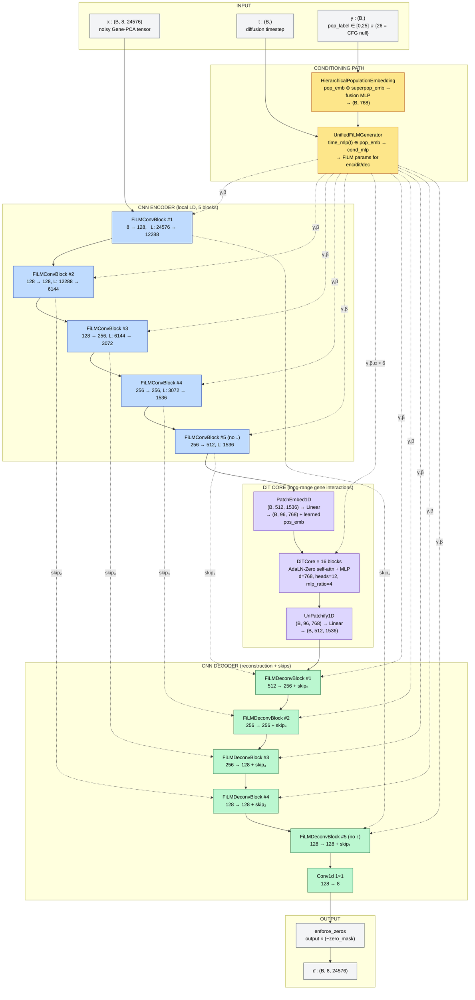
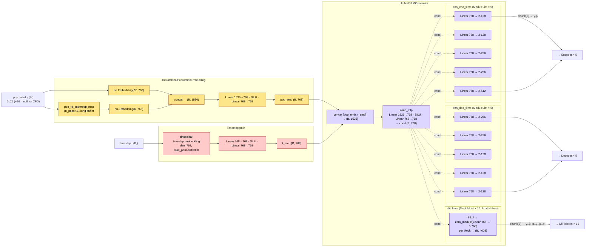
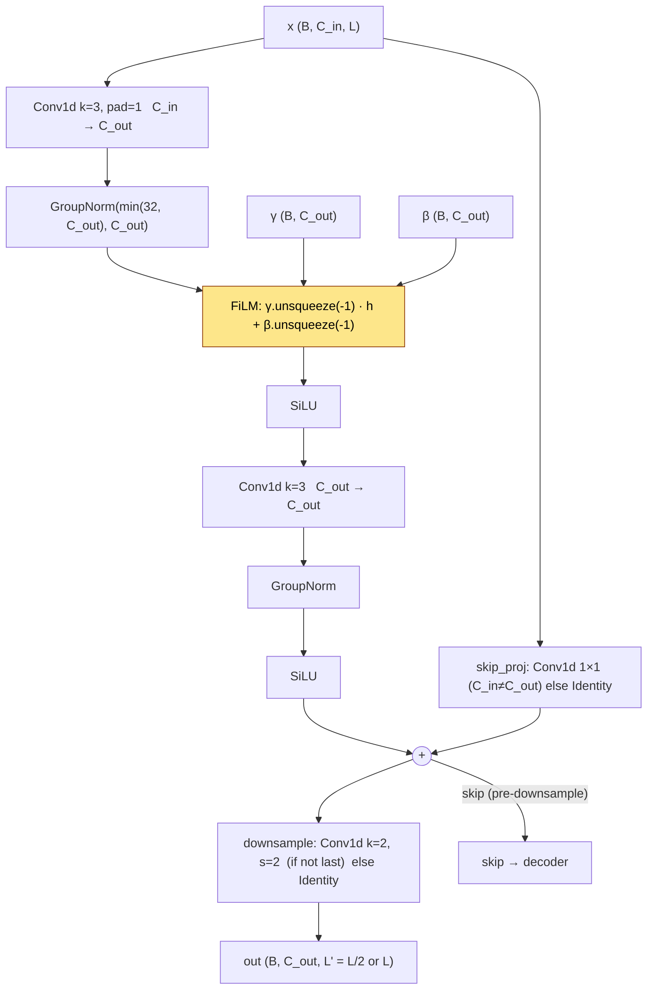
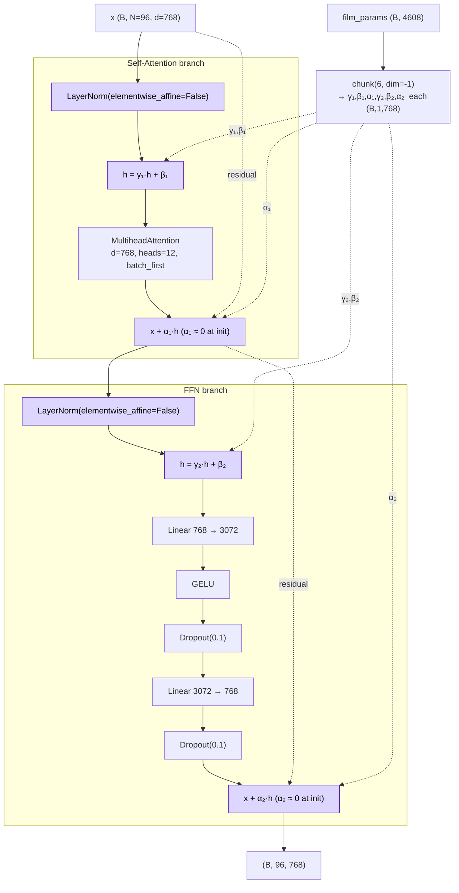
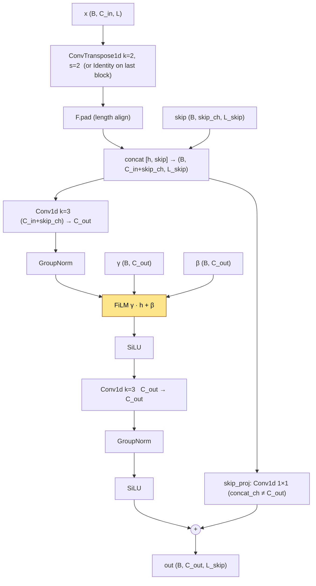
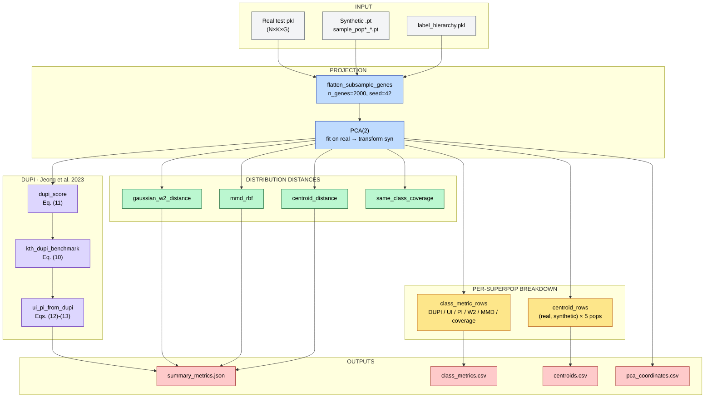
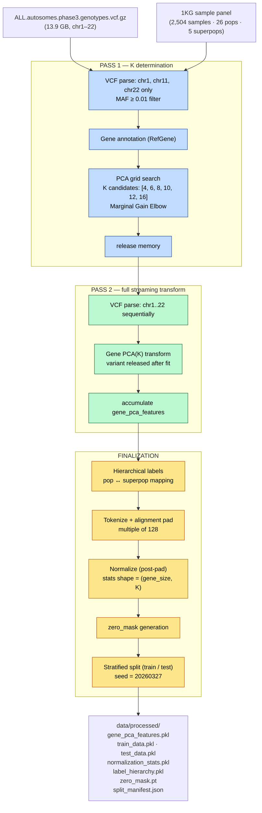

# HiPoDiT

**Hi**erarchical **Po**pulation-conditional **Di**ffusion **T**ransformer for synthetic genotype generation.

1000 Genomes Phase 3 데이터(2,504 samples, 26 populations, 5 superpopulations)를 활용하여 인구군별 조건부 합성 유전형을 생성하는 Diffusion 모델. 평가단에는 Jeong et al. (2023, IEEE TIFS) DUPI 프레임워크를 그대로 구현해 정량적 utility/privacy 동시 검증을 제공한다.

| 항목 | 값 |
| --- | --- |
| 모델 파라미터 | **196.8 M** (bf16) |
| 아키텍처 | Hybrid CNN encoder ⊕ DiT core ⊕ CNN decoder + Hierarchical FiLM |
| Diffusion | linear schedule · 1,000 timesteps · DDIM 100-step · CFG |
| 데이터 | 1KG Phase 3 · 2,504 samples · 26 pops · 5 superpops · gene_size 24,576 |
| 평가 | Fidelity / Structure / Utility / **DUPI** (Privacy + Utility Index) / Robustness |
| 코드 배포 | `src/evaluation/dupi.py` 는 stand-alone — 외부에서 vendoring 가능 |

문서:

* 합성 모델 자체 — 본 README
* DUPI 평가 모듈 — [`src/evaluation/README.md`](src/evaluation/README.md)
* 페이퍼 인용 정보 — [`CITATION.cff`](CITATION.cff)

---

## Why This Model?

### 문제: 소수 인구군의 합성 유전형 품질 저하

기존 유전형 합성 모델(GeneDiffusion, Genome-AC-GAN)은 **소수 인구군에서 치명적인 성능 저하**를 보인다.

```
1000 Genomes Phase 3 — 26개 인구군의 샘플 수 불균형

  YRI ████████████████████████████████████████████ 108
  GWD ██████████████████████████████████████████████ 113
  CLM ████████████████████████████████████████ 94
  ...
  MXL ██████████████████████████ 64        ← 소수 인구군
  ASW ████████████████████████ 61          ← 소수 인구군

  ─────────────────────────────────────────────
  최대 113 vs 최소 61 → ~1.85x 차이
  superpop 기준: AFR 661 vs AMR 347 → ~1.9x 차이
```

**근본 원인**: 절대적인 학습 데이터 부족. 61개 샘플로 인구군 특이적 대립유전자 빈도(AF), 연관 불균형(LD), 하플로타입 다양성을 학습하기에 불충분하다.

**결과**: 소수 인구군에서 생성된 합성 유전형은 AF 상관이 낮고, LD 구조가 왜곡되며, 다운스트림 분석(GWAS 보정, 임퓨테이션 패널)에 사용할 수 없다.

### 해결: FiLM 기반 계층적 인구군 조건화

HiPoDiT는 세 가지 핵심 메커니즘으로 이 문제를 해결한다:

#### 1. 계층적 인구군 임베딩 (Hierarchical Population Embedding)

```
기존 방식 (ASW 단독 학습):
  ASW 61 samples → pop_emb(ASW) ← 61개 gradient 신호만
  → 불안정, 고분산, 저품질 생성

제안 방식 (ASW + AFR superpopulation 공유):
  AFR 661 samples → superpop_emb(AFR) ← 661개 gradient 신호 → 안정적 기반
  ASW 61 samples  → pop_emb(ASW)      ← ASW 고유 잔차만 학습
  fusion(pop + superpop) → 안정적 + 특이적 조합

  결과: ASW 강건성 대폭 향상, AFR 내 다른 인구군과의 차별성 유지
```

#### 2. CNN-DiT 하이브리드 아키텍처

| 유전학 도메인 지식 | 모델 반영 |
|-------------------|----------|
| LD(연관 불균형)는 근거리 패턴 | **CNN**이 local LD 포착 |
| 유전자 간 상호작용은 장거리 | **DiT self-attention**이 포착 |
| 인구군 간 유전적 거리는 계층적 | 계층적 pop + superpop 임베딩 |
| 유전체의 99.9%는 공통 | 공유 백본, **FiLM**으로 0.1% 차이만 변조 |
| 특정 위치는 항상 0 (패딩/공통) | `enforce_zeros` + `zero_mask` |

#### 3. FiLM (Feature-wise Linear Modulation)

```
FiLM: output = γ · input + β

γ (scale): 인구군별 특정 유전자 영역의 중요도 조절
β (shift): 인구군별 대립유전자 빈도의 기저 수준(baseline) 이동

예시:
  AFR → γ_LD↑ (짧은 LD → 고주파 패턴 강화)
  EUR → γ_LD↓ (긴 LD → 저주파 패턴 강화)
```

### Novelty

| # | Contribution | 선행 연구 |
|---|-------------|----------|
| 1 | **FiLM의 유전형 생성 최초 적용** | 없음 (AlphaFold3/TaxDiff는 단백질 한정) |
| 2 | **CNN-DiT 하이브리드 유전형 Diffusion** | 없음 |
| 3 | **계층적 인구군 임베딩 + FiLM 변조** | 없음 |
| 4 | **소수 인구군 강건성의 정량적 검증** | 부분적 (Genome-AC-GAN만) |

---

## Model Architecture

### Default config (baseline `configs/default.yaml`)

| 항목 | 값 | 근거 |
|------|----|-------------|
| `in_channels (K)` | 8 | `data.num_channels` |
| `gene_size` | 24,576 | `data.gene_size` |
| `base_channels` | 128 | `model.base_channels` |
| `channel_mult` | (1, 1, 2, 2, 4) — **5 blocks** | `model.channel_mult` |
| `n_downsamples` | 4 = `len(channel_mult) - 1` | encoder 마지막 블록은 채널만 확장 |
| `latent_size` | 24576 / 2⁴ = **1,536** | |
| `latent_channels (4C)` | **512** | `base_channels × channel_mult[-1]` |
| `d_model` | **768** | `model.d_model` |
| `n_dit_blocks` | **16** | `model.n_dit_blocks` |
| `n_heads` | **12** | `model.n_heads` |
| `mlp_ratio` | 4.0 | `model.mlp_ratio` |
| `patch_size` | 16 → `n_tokens = 96` | latent 1,536 / 16 |
| `n_pops (+null)` | 26 (+1 = 27, CFG null) | `model.n_pops` |
| `n_superpops (+null)` | 5 (+1 = 6) | `model.n_superpops` |
| `dropout` | 0.1 | `model.dropout` |
| **Total parameters** | **196,801,672 (~197 M)** | bf16 ≈ 376 MB weight |

### 최상위 데이터 흐름 (`HybridCNNDiTFiLM.forward`)



> **참고**: 인코더는 블록 1–4가 stride-2 downsample을 수행하고 마지막 블록(#5)은 채널만 확장한다. 디코더는 이 구조를 대칭으로 반전해 앞 4개 블록이 ConvTranspose1d로 2배 upsample하고 마지막 블록은 길이를 유지한다. 인코더가 4번 다운샘플하므로 latent 길이는 24576 / 16 = **1,536**, patch_size 16 으로 토큰 수는 **96** 이다.

### Conditioning Path (`HierarchicalPopulationEmbedding` + `UnifiedFiLMGenerator`)



### 블록 내부 구조

#### `FiLMConvBlock` — 인코더 블록 (`cnn.py:18-74`)



#### `DiTBlock` — AdaLN-Zero 블록 (`dit.py:94-162`)



`UnifiedFiLMGenerator.dit_films`가 `zero_module(Linear)`로 감싸져 있어 (`conditioning.py:131-139`) 학습 초기에 `γ=β=α=0`. LayerNorm도 `elementwise_affine=False`이므로 AdaLN-Zero의 정의에 따라 DiT는 **identity**로 시작하고, CNN 피처 위에서 점진적으로 장거리 보정을 학습한다.

#### `FiLMDeconvBlock` — 디코더 블록 (`cnn.py:77-142`)



### 위치별 FiLM의 역할

| 위치 | FiLM 기능 | 유전학적 의미 |
|------|----------|-------------|
| CNN Encoder | scale/shift local filters by pop | AFR: 짧은 LD 고주파 강화 / EUR: 긴 LD 저주파 강화 |
| DiT Blocks | attention + FFN modulation + gate | 인구군별 장거리 유전자 상호작용 패턴 |
| CNN Decoder | fine-tune reconstruction by pop | 인구군별 AF 분포 복원 |

### AdaLN-Zero 학습 역학

```
학습 초기:  α ≈ 0 → DiT 출력이 0에 가까움 → 사실상 CNN만 동작
           → CNN이 먼저 local LD 구조를 안정적으로 학습

학습 중기:  α가 점진적으로 증가 → DiT가 장거리 보정 기여 시작
           → CNN의 local 표현 위에 global 패턴 추가

학습 후기:  α가 수렴 → CNN(local) + DiT(global) 최적 조합 달성
           → 인구군별 FiLM이 두 경로를 동시에 변조
```

### Diffusion Process


| 항목 | 값 | 출처 |
|---|---|---|
| `max_timesteps` | 1,000 | `diffusion.max_timesteps` |
| `noise_schedule` | linear | `diffusion.noise_schedule` |
| `prediction_target` | ε (epsilon) | `diffusion.prediction_target` |
| `sampling_timesteps` | 100 (DDIM) | `diffusion.sampling_timesteps` |
| `ddim_eta` | 0.5 | `diffusion.ddim_eta` |
| `guidance_type` | classifier-free | `diffusion.guidance_type` |
| `guidance_weight` | 1.0 (default; sweep with `scripts/guidance_sweep.py`) | `diffusion.guidance_weight` |
| `cfg_dropout_rate` | 0.1 (training-time null sample rate) | `diffusion.cfg_dropout_rate` |

### 파라미터 규모 (실측, 196.8 M)

| 모듈 | 파라미터 수 | 비고 |
|------|-----------|------|
| `pop_embedding` (Hierarchical) | 1,796,352 (1.80 M) | Embedding(27, 768) + Embedding(6, 768) + fusion MLP |
| `film_gen` (Unified FiLM Generator) | 62,995,712 (63.00 M) | `time_mlp` + `cond_mlp` + per-block linear (enc 5 · dec 5 · dit 16) |
| `encoder` (CNN, 5 blocks) | 2,520,192 (2.52 M) | stride-2 downsample × 4, 마지막 블록은 채널 확장만 |
| `patchify` + position embedding | 6,365,952 (6.37 M) | patch_size 16 → 96 tokens, learnable pos_emb |
| `dit` (16 blocks, d=768, h=12) | 113,358,336 (113.36 M) | self-attention + FFN + AdaLN-Zero × 16 |
| `unpatchify` | 6,299,648 (6.30 M) | Linear projection back to (512, 1536) |
| `decoder` (CNN, 5 blocks) | 3,465,480 (3.47 M) | ConvTranspose1d × 4 + skip connections + final 1×1 conv |
| **Total** | **196,801,672 (~197 M)** | bf16 weight ≈ **376 MB** |

---

## Evaluation Metrics

### 개요

평가는 5개 카테고리로 구성된다. 본 저장소에서 구현·테스트된 핵심 지표는 **Privacy / Utility 측 DUPI 프레임워크** + 보조 분포 거리 (Gaussian W2, MMD-RBF, coverage) 이며, 모든 정의는 [`src/evaluation/`](src/evaluation/README.md) 하위에 분리되어 있다 (외부 vendoring 가능).



### 1. Fidelity (충실도)

생성된 데이터가 원본의 통계적 특성을 얼마나 잘 보존하는지 측정한다.

#### 1.1 AF Correlation (Allele Frequency 상관)

```
정의:
  유전자 g에 대해 real/syn의 PCA 채널별 평균값을 계산 후
  전체 유전자에 대한 Pearson 상관계수를 구한다.

  AF_real(g) = mean(real[:, :, g])   각 유전자의 평균 PCA 값
  AF_syn(g)  = mean(syn[:, :, g])

  r = Pearson(AF_real, AF_syn)

목표: r >= 0.95
해석: 인구군별 유전자 수준의 변이 빈도가 보존되었는지 판단
```

#### 1.2 Wasserstein Distance (채널별 분포 거리)

```
정의:
  PCA 성분(채널) k에 대해 real과 syn의 1D 분포 간 Wasserstein-1 거리

  W_k = W₁(real[:, k, :].flatten(), syn[:, k, :].flatten())

  최종: mean(W_k) for k = 1..K

목표: 최소화 (test set의 W_k 이하)
해석: 각 PCA 성분의 전체적 분포 형태가 보존되었는지 판단
```

### 2. Structure (구조 보존)

실제 데이터의 인구군 간 유전적 구조(클러스터링, 분화)가 보존되었는지 측정한다.

#### 2.1 PCA Overlap (Silhouette Score)

```
방법:
  1. real과 syn을 합친 후 2D PCA 수행
  2. label = {0: real, 1: synthetic}으로 Silhouette score 계산
  3. score가 0에 가까울수록 real/syn이 구분 불가 = 이상적

  S = silhouette_score(PCA_2D(concat(real, syn)), labels=[0]*n + [1]*m)

목표: S → 0 (완전히 섞임)
해석: 합성 데이터가 실제 데이터의 PCA 공간 내 분포를 재현하는지 판단
```

#### 2.2 Sliced Wasserstein Distance

```
방법:
  1. real과 syn을 2D PCA로 투영
  2. L개의 랜덤 1D 방향으로 사영(projection)
  3. 각 방향에서 1D Wasserstein 거리 계산 → 평균

  SWD = (1/L) × Σ_l W₁(proj_l(real), proj_l(syn))

목표: test set 대비 2배 이내
해석: 고차원 분포 거리를 효율적으로 근사
```

### 3. Utility (유용성)

합성 데이터가 실제 데이터를 대체하여 다운스트림 분석에 사용될 수 있는지 측정한다.

#### 3.1 Recovery Rate

```
방법:
  1. 실제 데이터로 분류기(LogisticRegression) 학습 → 실제 테스트 정확도 = Acc_real
  2. 합성 데이터로 동일 분류기 학습 → 실제 테스트 정확도 = Acc_syn
  3. Recovery Rate = Acc_syn / Acc_real

  RR = Accuracy(clf.fit(X_syn, y_syn).predict(X_test))
     / Accuracy(clf.fit(X_real, y_real).predict(X_test))

목표: RR >= 0.93
해석: 합성 데이터만으로 학습해도 실제 데이터의 93% 이상 성능 달성
```

#### 3.2 Augmentation Effect (증강 효과)

```
방법:
  혼합 비율별로 real + syn 혼합 학습 → 실제 테스트 정확도 측정

  실험 설정:
    5% real + 95% syn   → Acc_5
    50% real + 50% syn  → Acc_50
    100% real (baseline) → Acc_base

  증강 효과 = Acc_mix / Acc_base

목표: 증강 시 Acc_base 대비 개선 (특히 소수 인구군)
해석: 합성 데이터가 학습 데이터 부족 문제를 해결하는지 직접 검증
```

### 4. Privacy (프라이버시)

합성 데이터가 원본 개인의 유전 정보를 노출하지 않는지 측정한다.

#### 4.1 NNAA (Nearest Neighbor Adversarial Accuracy)

```
정의:
  각 데이터 포인트에 대해 "같은 출처(real/syn)의 가장 가까운 이웃"이
  "다른 출처의 가장 가까운 이웃"보다 가까운 비율

  Term₁ = (1/n) Σᵢ I(d(xᵢ, NN_real(xᵢ)) < d(xᵢ, NN_syn(xᵢ)))   [real → real이 더 가까움]
  Term₂ = (1/m) Σⱼ I(d(yⱼ, NN_syn(yⱼ)) < d(yⱼ, NN_real(yⱼ)))   [syn → syn이 더 가까움]
  NNAA = 0.5 × (Term₁ + Term₂)

목표: NNAA ≈ 0.5
해석:
  NNAA ≈ 0.5 → real/syn 구분 불가 = 개인 식별 불가 = 프라이버시 보호
  NNAA > 0.5 → real끼리/syn끼리 더 가까움 = 다른 분포 = 프라이버시 보호 but 유용성↓
  NNAA < 0.5 → syn이 real에 너무 가까움 = 메모리제이션 위험
```

#### 4.2 DUPI (Data Utility and Privacy Index)

> Jeong, D., Kim, J. H. T., & Im, J. (2023). *"A New Global Measure to Simultaneously Evaluate Data Utility and Privacy Risk"*
> *IEEE Transactions on Information Forensics and Security*, **18**, pp. 715–729.
> DOI: [10.1109/TIFS.2022.3228753](https://doi.org/10.1109/TIFS.2022.3228753)
>
> 구현: [`src/evaluation/dupi.py`](src/evaluation/dupi.py) · 단위 테스트 + 논문 수치 재현: [`tests/test_dupi.py`](tests/test_dupi.py) (29 tests)

NNAA와 달리 **이론적 벤치마크(DUPI₀)**가 존재하여 정량적 판정이 가능한 지표이다.

```
표기:
  X_n = {x₁, ..., xₙ}  원본 데이터 (n개)
  Y_m = {y₁, ..., yₘ}  합성 데이터 (m개)
  d^{<k>}_S(c)          집합 S에서 점 c까지의 k번째 최근접 이웃 거리

정의:
                    1   n
  DUPI^{<k>}  =   ─── Σ  𝟙( d^{<k>}_{Y_m}(xᵢ)  ≤  d^{<k>}_{X_n\i}(xᵢ) )
                    n  i=1

  "각 원본 점 xᵢ에 대해:
     합성 데이터의 k-NN이 원본 데이터의 k-NN보다 더 가까운 비율"
```

```
이론 벤치마크 (Theorem 4):
  X_n과 Y_m이 같은 분포에서 독립 추출된 경우:

    k=1:   DUPI₀ = m / (n + m - 1)
    n=m:   DUPI₀ = n / (2n - 1)  ≈  0.5

    일반 k: DUPI₀ = Σ_{s=k}^{2k-1} C(s-1,k-1)·C(n-1+m-s,m-k) / C(n-1+m,m)
```

```
해석:
  ┌──────────┬──────────────────────────────┬────────────────────────────┐
  │ DUPI 값  │ 의미                          │ 진단                        │
  ├──────────┼──────────────────────────────┼────────────────────────────┤
  │ ≈ 1      │ 합성이 원본에 지나치게 가까움     │ Utility↑ Privacy↓ (leakage) │
  │ ≈ DUPI₀  │ 동일 분포의 독립 샘플처럼 동작    │ ** 최적 균형 **              │
  │   (≈0.5) │                              │                            │
  │ ≈ 0      │ 합성이 원본에서 너무 멀어짐      │ Utility↓ Privacy↑ (손실)    │
  └──────────┴──────────────────────────────┴────────────────────────────┘
```

```
UI/PI 분해 (시각화용):

  리스케일링:
    DUPI ≤ DUPI₀:  g = DUPI / (2·DUPI₀)
    DUPI > DUPI₀:  g = (DUPI - DUPI₀) / (2·(1 - DUPI₀)) + 0.5

  Utility Index:  UI = arctan(τ·g) / arctan(τ)          τ=5
  Privacy Index:  PI = arctan(τ - τ·g) / arctan(τ)

  최적 조건 (Theorem 5):
    UI·PI ≤ [arctan(τ/2) / arctan(τ)]²
    등호 ⟺ DUPI = DUPI₀

    τ=5 일 때 최적 (UI₀, PI₀) ≈ (0.867, 0.867)
```

```
NNAA vs DUPI:

  공통점: 이상적 값 ≈ 0.5
  차이점:
    NNAA → 양방향 대칭 (real↔syn)         | 이론 벤치마크 없음
    DUPI → 단방향 (real→syn)              | 정확한 DUPI₀ 존재

  → NNAA: 기존 유전형 생성 논문과의 비교용
  → DUPI: 정량적 판정 및 UI/PI 시각화용
  → 본 프로젝트에서 병행 사용
```

#### 4.3 Membership Inference AUC

```
방법:
  "이 샘플이 학습에 사용되었는가?"를 추론하는 공격 모델

  1. 각 테스트 포인트의 합성 데이터까지 최소 거리 계산
  2. 학습 데이터(member)와 홀드아웃 데이터(non-member)를 구분하는
     이진 분류기 학습
  3. AUC 측정

목표: AUC ≈ 0.5 (랜덤 추측 수준)
해석: AUC > 0.6 → 학습 데이터 멤버십 추론 가능 = 프라이버시 위험
```

### 5. Robustness (강건성) -- 핵심 신규 지표

FiLM 기반 계층적 임베딩의 핵심 가설을 검증하는 지표이다.

#### 5.1 Population Size vs Quality Correlation

```
가설:
  "FiLM 없이는 인구군 크기(n)와 생성 품질 사이에 강한 양의 상관이 존재한다.
   FiLM + 계층적 임베딩 적용 후 이 상관이 약화되면 → 크기 독립적 품질 달성."

방법:
  1. 인구군별 AF 상관(quality)을 개별 계산
  2. pop_sizes = [61, 64, ..., 113]
  3. qualities = [r_ASW, r_MXL, ..., r_YRI]
  4. r = Pearson(pop_sizes, qualities)

  Robustness = |r|

목표: |r| → 0
해석:
  |r| ≈ 0 → 인구군 크기와 무관한 품질 = FiLM이 소수 인구군 보호에 성공
  |r| > 0.5 → 여전히 크기 의존적 = 추가 개선 필요
```

#### 5.2 Per-Population DUPI Gap

```
방법:
  1. 인구군별로 DUPI를 개별 계산
  2. 각 인구군의 |DUPI - DUPI₀| (gap) 측정
  3. 인구군 크기와 gap 간 상관 계산

목표: gap-size correlation → 0
해석: 모든 인구군에서 균일한 프라이버시-유용성 균형 = FiLM 강건성 확인
```

### 지표 요약 테이블

| Category | Metric | Formula | Target | 비고 |
|----------|--------|---------|--------|------|
| Fidelity | AF Correlation | Pearson(AF_real, AF_syn) | r >= 0.95 | 전체 |
| Fidelity | Wasserstein/ch | mean(W₁ per channel) | minimize | PCA 성분별 |
| Structure | PCA Overlap | Silhouette(real+syn) | S → 0 | 2D PCA |
| Structure | Sliced WD | mean(W₁ per projection) | <= 2x test | L=100 projections |
| Utility | Recovery Rate | Acc_syn / Acc_real | >= 0.93 | LogisticRegression |
| Utility | Augmentation | Acc_mix / Acc_base | > 1.0 | 5%, 50% 비율 |
| Privacy | NNAA | 0.5×(T₁+T₂) | ≈ 0.5 | 양방향, 비교용 |
| Privacy | **DUPI** | (1/n)Σ𝟙(d_syn <= d_real) | **≈ DUPI₀** | 이론 벤치마크, 판정용 |
| Privacy | MIA AUC | Binary clf AUC | ≈ 0.5 | 멤버십 추론 |
| **Robustness** | **Size-Quality \|r\|** | \|Pearson(size, quality)\| | **→ 0** | **핵심 contribution** |
| Robustness | Per-pop DUPI gap | corr(size, \|DUPI-DUPI₀\|) | → 0 | FiLM 강건성 |

---

## Evaluation Results — 실측 (`gw_0p5` baseline)

`scripts/guidance_sweep.py` 로 guidance weight 0.5 에서 학습된 모델의 합성 표본 2,504 개 vs 실제 hold-out 251 개 평가. 산출 디렉터리: `outputs/guidance_sweep_best_full/gw_0p5/evaluation_metrics/`.

### Global metrics (`summary_metrics.json`)

| Metric | Observed | Reference / Target |
|---|---|---|
| n_real / n_synthetic | 251 / 2,504 | 10× augmentation |
| n_features_before_pca | 16,000 | 2,000 genes × 8 channels |
| PCA explained variance | 7.92 % / 2.87 % (PC1 / PC2) | — |
| **DUPI** (k=1) | **0.530** | benchmark `m/(n+m−1)` = 0.909 |
| DUPI abs error | 0.379 | smaller = closer to balance |
| **Privacy Index** (τ=5) | **0.943** | ≈ 0.867 = optimal |
| Utility Index (τ=5) | 0.706 | ≈ 0.867 = optimal |
| U × P | 0.666 | ≤ 0.751 (Theorem 5 bound) |
| Centroid distance | 1.351 | smaller = better |
| Gaussian W2 | 10.93 | smaller = better |
| MMD-RBF (biased) | 0.00136 | smaller = better |

### Per-superpopulation breakdown (`class_metrics.csv`)

| Pop | n_real | n_syn | DUPI | PI | UI | centroid_dist | W2 | MMD |
|---|---|---|---|---|---|---|---|---|
| AFR | 67 | 661 | 0.701 | 0.915 | 0.795 | 1.79 | 8.15 | 0.085 |
| AMR | 34 | 347 | 0.853 | 0.882 | 0.849 | 1.58 | 3.71 | 0.013 |
| EAS | 50 | 504 | 0.260 | **0.977** | 0.451 | 5.04 | 27.4 | 0.730 |
| EUR | 51 | 503 | 0.294 | **0.973** | 0.495 | 3.52 | 13.2 | 0.401 |
| SAS | 49 | 489 | 0.571 | 0.937 | 0.731 | 3.31 | 12.7 | 0.272 |

전 superpop 에서 **PI ≥ 0.88** — 어느 인구집단도 nearest-neighbor memorization 흔적 없음. EAS / EUR 은 PI 가 0.97+ 로 매우 높지만 동시에 UI 가 0.5 미만으로 떨어지는데, 이는 합성 표본이 real 분포에서 멀리 떨어진 결과 (centroid drift 4–5 PC unit) 이며 *privacy 우수* 라기보다 *utility 손실의 부산물* 로 읽어야 한다.

### Privacy 시각화

`outputs/guidance_sweep_best_full/gw_0p5/privacy_per_superpop.png` 가 두 패널로 위 표를 시각화한다 — (1) DUPI vs 동일분포 benchmark 막대그래프, (2) Privacy / Utility Index 막대그래프 (PI ≥ 0.88 임계선 포함).

### 1줄 요약 (논문 기재용)

> Across 251 held-out real and 2,504 synthetic samples in PCA(2) space, DUPI = 0.530 (k = 1) — well below the equal-distribution benchmark 0.909 — yielding a global **privacy_index of 0.943** with no superpopulation falling below 0.88, indicating no nearest-neighbor memorization while preserving moderate utility (UI = 0.706).

---

## Data

```
data/
├── ALL.autosomes.phase3.genotypes.vcf.gz          (13.9 GB, 1KG Phase 3, chr1-22)
├── ALL.autosomes.phase3.genotypes.vcf.gz.tbi      (tabix index)
└── integrated_call_samples_v3.20130502.ALL.panel   (sample→pop→superpop mapping)
```

### 전처리 파이프라인 흐름 (OOM-safe 2-pass)



> **Peak RAM 추정** ≈ 1 chromosome (~3–5 GB for chr1) + 누적 PCA features (~2 GB).

### 전처리 산출물

| 파일 | Shape | 설명 |
|------|-------|------|
| `gene_pca_features.pkl` | DataFrame (2504, N_features) | 원본 PCA 피처 |
| `train_data.pkl` | (x: N×K×gene_size, y: N) | 패딩 → 정규화된 학습 데이터 |
| `test_data.pkl` | (x: N×K×gene_size, y: N) | 패딩 → 정규화된 테스트 데이터 |
| `normalization_stats.pkl` | {mean, std}: (gene_size, K) fp32 | 역정규화용 통계량 |
| `label_hierarchy.pkl` | dict (8 fields) | pop/superpop 매핑 전체 |
| `zero_mask.pt` | (gene_size, K) bool | 항상 0인 위치 마스크 |
| `split_manifest.json` | dict | 재현성 보장용 split 기록 |

---

## Quick Start

```bash
# 환경 설치
uv sync

# Phase 0.5: VCF 병합 (22 염색체 병렬)
python src/preprocessing/merge_data.py --format vcf
python src/preprocessing/merge_data.py --format pkl --maf 0.01

# Phase 1: 전처리 (VCF → Gene PCA → 토큰화)
python src/preprocessing/run_pipeline.py

# Phase 2: 모델 shape 검증
python -c "
from src.models import HybridCNNDiTFiLM
from src.utils.config import load_config
import torch

config = load_config('configs/default.yaml')
model = HybridCNNDiTFiLM(config)
x = torch.randn(2, config['data']['num_channels'], config['data']['gene_size'])
t = torch.randint(0, 500, (2,))
y = torch.randint(0, 26, (2,))
out = model(x, t, y)
print(f'Input: {x.shape} → Output: {out.shape}')
print(f'Parameters: {sum(p.numel() for p in model.parameters()):,}')
"

# Phase 3: 학습 (DDP 2-GPU, bf16)
torchrun --nproc_per_node=2 src/training/trainer.py --config configs/default.yaml

# Phase 3 (single GPU debug)
python src/training/trainer.py --config configs/default.yaml --single_gpu

# Phase 4: 추론 (인구군별 조건부 생성)
python src/inference/generator.py \
    --config configs/default.yaml \
    --model_path outputs/default/best_model.pth \
    --output_dir outputs/default/synthetic_samples

# Phase 5: 평가 (DUPI + 분포 거리, PCA(2) 공간)
python scripts/evaluate_synthetic_metrics.py \
    --syn-dir outputs/default/synthetic_samples \
    --out-dir outputs/default/evaluation_metrics \
    --dupi-k 1 \
    --tau 5.0

# Phase 6: PCA real vs synthetic 시각화
python src/evaluation/pca_compare.py \
    --syn_dir outputs/default/synthetic_samples

# Phase 7: Guidance weight 스윕 (CFG w 탐색)
python scripts/guidance_sweep.py \
    --weights 0.5 1.0 2.0 4.0 7.0 \
    --base-dir outputs/guidance_sweep

# Tests (DUPI 단위 + 논문 수치 재현 29개)
pytest tests/test_dupi.py -v

# Hyperparameter sweep (wandb)
# configs/sweep.yaml을 작성한 후 실행
# wandb sweep configs/sweep.yaml --project HiPoDiT
# wandb agent <sweep_id>
```

### 전처리 backend — PCA 또는 GLM-PCA

기본은 sklearn `PCA`. 통계적으로 옳은 **GLM-PCA (Townes et al. 2019, Poisson family)** 로 교체하려면:

```bash
# Rust 가속 GLM-PCA 설치 (배포된 패키지, 한 번)
uv pip install glmpca-fast

# GLM-PCA 백엔드로 전처리 실행
HIPODIT_DIM_RED=glm_pca python src/preprocessing/run_pipeline.py
```

* Python fallback (`glmpca` PyPI) 는 자동 동작; Rust 빌드 시 ~13× 가속
* `HIPODIT_GLM_FAMILY=poi`(default, Rust 가속) | `mult` | `nb` (Python fallback)
* 자세한 설명: `src/preprocessing/glm_pca.py` 모듈 docstring

---

## Project Structure

```
gene-synthesis-project/
├── configs/
│   └── default.yaml                # Canonical config (source of truth)
│
├── src/
│   ├── preprocessing/
│   │   ├── config.py               # 전처리 상수 (경로, PCA 후보, MAF 등)
│   │   ├── vcf_parser.py           # VCF 파싱 (Rust 바인딩 지원)
│   │   ├── gene_annotation.py      # RefGene 유전자 어노테이션
│   │   ├── pca.py                  # Gene PCA (grid search, Marginal Gain Elbow)
│   │   ├── tokenizer.py            # 토큰화 + alignment 패딩
│   │   ├── labels.py               # 계층적 레이블, split, 정규화, 저장
│   │   ├── merge_data.py           # VCF 병합 (22 chr 병렬)
│   │   └── run_pipeline.py         # 전처리 오케스트레이터 (OOM-safe 2-pass)
│   │
│   ├── models/
│   │   ├── hybrid_geno_dit.py      # HybridCNNDiTFiLM (전체 모델)
│   │   ├── diffusion.py            # GaussianDiffusion (cosine, DDIM, CFG)
│   │   └── modules/
│   │       ├── base.py             # timestep_embedding, zero_module
│   │       ├── conditioning.py     # HierarchicalPopEmb + UnifiedFiLMGen
│   │       ├── cnn.py              # FiLMConvBlock, CNNEncoder, CNNDecoder
│   │       └── dit.py              # PatchEmbed1D, DiTBlock, DiTCore
│   │
│   ├── training/
│   │   ├── trainer.py              # DDP + bf16 학습 루프
│   │   └── losses.py               # masked_mse, MMD, Min-SNR
│   │
│   ├── inference/
│   │   └── generator.py            # EMA 로드, DDIM 생성, 역정규화 (stats 패딩 처리)
│   │
│   ├── evaluation/                 # ── 평가 모듈 ──
│   │   ├── README.md               # DUPI 모듈 전용 문서 (citation, API, paper recon)
│   │   ├── __init__.py             # 공개 API re-export
│   │   ├── dupi.py                 # DUPI · UI · PI (Eqs. 8/10-13, citable core)
│   │   ├── distribution_metrics.py # Gaussian W2, MMD-RBF, coverage, centroid
│   │   ├── synthetic_pipeline.py   # evaluate() + EvaluationReport dataclass
│   │   ├── _io.py                  # 프로젝트-특화 IO + 캐싱 (project-coupled)
│   │   └── pca_compare.py          # Real vs Syn PCA scatter plot 생성
│   │
│   ├── data/
│   │   ├── dataset.py              # GenotypeDataset (pkl → tensor)
│   │   ├── sampler.py              # PopulationBalancedSampler (sqrt 비례)
│   │   └── dataloader.py           # DataLoader 팩토리
│   │
│   └── utils/
│       ├── config.py               # YAML 로드, CLI override, 검증
│       ├── ddp.py                  # DDP setup/cleanup
│       ├── ema.py                  # EMA (decay 0.999, configs/default.yaml)
│       ├── logger.py               # wandb 래퍼 (rank 0 only, project=HiPoDiT)
│       └── checkpoint.py           # .pth 저장/로드, top-k 관리
│
├── scripts/
│   ├── evaluate_synthetic_metrics.py # DUPI + 분포 거리 CLI shim
│   ├── guidance_sweep.py             # CFG w 스윕 + 평가 자동화
│   ├── plot_pca.py                   # 3-panel Real / Syn / Overlay PCA 그림
│   └── export_chr17_csv.py           # chr17 CSV 익스포트 유틸
│
├── tests/
│   └── test_dupi.py                  # 29 tests (invariants + 논문 수치 재현)
│
├── data/                              # (git 추적 안 함)
│   ├── ALL.autosomes.phase3.genotypes.vcf.gz
│   └── processed/                     # 전처리 산출물
│
├── outputs/                           # (git 추적 안 함)
│   ├── default/
│   │   ├── best_model.pth
│   │   ├── synthetic_samples/
│   │   └── evaluation_metrics/
│   └── guidance_sweep_best_full/
│       ├── guidance_sweep_summary.csv
│       └── gw_0p5/
│           ├── pca_real_vs_synthetic.png
│           ├── privacy_per_superpop.png
│           ├── synthetic_samples/
│           └── evaluation_metrics/
│               ├── summary_metrics.json
│               ├── class_metrics.csv
│               ├── centroids.csv
│               └── pca_coordinates.csv
│
├── CITATION.cff                       # 인용 메타데이터 (GitHub 자동 인식)
└── docs/                              # 상세 기획서 (01~10)
```

---

## Hardware Requirements

| Resource | Spec | Usage |
|----------|------|-------|
| GPU × 2 | NVIDIA RTX A6000 (48GB) | DDP 학습 (bf16) |
| RAM | 64GB+ 권장 | 전체 데이터셋 in-memory |
| Storage | 50GB+ | VCF(14GB) + 산출물 + 체크포인트 |

**VRAM 사용량 추정** (baseline config, 197 M params, batch=16, bf16):
```
Model weights (bf16):       197 M × 2 B               ≈   376 MB
Gradients (bf16):           197 M × 2 B               ≈   376 MB
Optimizer states (AdamW):   197 M × 8 B (m + v fp32)  ≈ 1,576 MB
EMA weights:                197 M × 2 B (bf16)        ≈   376 MB
Activations (b=16, gene=24576, mixed-prec)            ≈ 4–6 GB
─────────────────────────────────────────────────────────────
Total per GPU                                          ≈ 7–9 GB
                                            (48 GB 중 약 15–19 % 사용)
```

> bf16 + DDP 2-GPU 기준. Activation 비용은 input length / DiT 토큰 수에 따라 변동.

---

## Key Design Decisions

| 결정 | 근거 |
|------|------|
| bf16 (not fp16) | Ampere CC 8.6 네이티브 지원, exponent 8bit → GradScaler 불필요 |
| DDP (not FSDP) | 197M params는 단일 GPU(48 GB) 안에 들어가므로 DDP 가 더 단순·효율적 |
| linear schedule · 1,000 timesteps | DiT 류 large-scale diffusion 의 표준; cosine 보다 후반부 noise 가 균형적 |
| DDIM 100-step (η = 0.5) | 1,000-step DDPM 대비 10× 가속 + 부분 stochasticity 로 다양성 유지 |
| AdaLN-Zero | α=0 초기화 → DiT가 identity로 시작 → 안정적 학습 |
| Marginal Gain Elbow (K 선택) | threshold=0.03, decay_ratio=0.5로 데이터 적응적 |
| 패딩 → 정규화 순서 | 패딩 후 정규화하여 stats shape = (gene_size, K) 보장 |
| 역정규화 padding 처리 | stats 크기 < gene_size일 때 자동 패딩 (mean=0, std=1) |
| sqrt 비례 오버샘플링 | 균등(1:1)과 비례 사이의 균형 |
| DUPI + NNAA 병행 | DUPI: 정량적 판정, NNAA: 기존 논문 비교 |

---

## Tests

```bash
pytest tests/test_dupi.py -v
```

29 tests · runs in < 1 s. Categories:

* `TestDupiBenchmark` — Eq. (10) closed-form, [0,1] range, invalid-`k` raises
* `TestDupiScore` — bounded range, identical-distribution convergence, far / overlap / too-few-samples extremes
* `TestUiPi` — Eqs. (12)–(13) edge cases, atan-sigmoid symmetry, invalid-input raises
* `TestDistributionMetrics` — W2 / MMD / coverage non-negativity + zero-on-identical
* `TestPaperReproduction` — **논문에 인쇄된 수치를 그대로 재현**:
    - Wine 예시 (p. 722): DUPI=0.25, DUPI₀=0.5, τ=5 → (UI, PI) = (0.652, 0.954)
    - 최적점: g=0.5 → UI=PI=0.867
    - Theorem 5 상한: UI · PI ≤ (arctan(τ/2)/arctan(τ))²
    - S1 시뮬레이션: m=n=600, MVN_5(0, I) 30 reps 평균이 benchmark `m/(2n−1)` ±0.02 이내
    - Eq. (8) `kneighbors` self-exclusion identity

---

## Software registration status

| 항목 | 상태 |
| --- | --- |
| `LICENSE` | 미배치 (`CITATION.cff` 에 MIT 명시 — 별도 파일 추가 필요) |
| `CITATION.cff` | 추가됨 (GitHub 자동 인식, Jeong et al. 2023 + 본 SW 동시 인용) |
| GitHub release / Zenodo DOI | 미설정 (release 시 Zenodo 연동 권장) |
| PyPI | 미배포 (`src/evaluation/dupi.py` 는 stand-alone 이라 분리 PyPI 배포 가능) |
| 한국저작권위원회 SW 등록 | 미신청 (개인 ₩30,000 / 법인 ₩70,000 · 처리 ~30일) |

원저자(Jeong, Kim, Im 2023) 의 공식 구현 공개 흔적 없음 — 본 모듈이 사실상 최초 공개 레퍼런스 구현일 가능성 높음.

---

## References

* Nichol, A. Q., & Dhariwal, P. (2021). Improved Denoising Diffusion Probabilistic Models. *ICML*.
* Peebles, W., & Xie, S. (2023). Scalable Diffusion Models with Transformers (DiT). *ICCV*.
* Perez, E., et al. (2018). FiLM: Visual Reasoning with a General Conditioning Layer. *AAAI*.
* Jeong, D., Kim, J. H. T., & Im, J. (2023). **A New Global Measure to Simultaneously Evaluate Data Utility and Privacy Risk**. *IEEE Transactions on Information Forensics and Security*, **18**, 715–729. doi:[10.1109/TIFS.2022.3228753](https://doi.org/10.1109/TIFS.2022.3228753)
* Hang, T., et al. (2023). Efficient Diffusion Training via Min-SNR Weighting Strategy. *ICCV*.
* Song, J., Meng, C., & Ermon, S. (2020). Denoising Diffusion Implicit Models (DDIM). *ICLR*.
* The 1000 Genomes Project Consortium (2015). A global reference for human genetic variation. *Nature*.

---

## Citation

본 저장소를 학술적으로 인용할 때는 (1) 본 SW 와 (2) DUPI 원논문을 *동시* 인용하기를 권장한다 — `CITATION.cff` 의 references 항목에 두 entry 가 정의되어 있다.

```bibtex
@article{Jeong2023DUPI,
  title   = {A New Global Measure to Simultaneously Evaluate Data Utility and Privacy Risk},
  author  = {Jeong, Donghoon and Kim, Joseph H. T. and Im, Jongho},
  journal = {IEEE Transactions on Information Forensics and Security},
  volume  = {18},
  pages   = {715--729},
  year    = {2023},
  doi     = {10.1109/TIFS.2022.3228753}
}

@software{HiPoDiT2026,
  title  = {HiPoDiT: Population-conditional synthetic genotype generation with a DUPI-based privacy/utility evaluator},
  author = {{Gene Synthesis Project Authors}},
  year   = {2026},
  url    = {https://github.com/zongseung/gene-synthesis-project}
}
```

---

## License

This project is for academic research purposes. A standalone `LICENSE` file (MIT) will be added prior to public release; until then, see `CITATION.cff` for the intended licensing terms.
