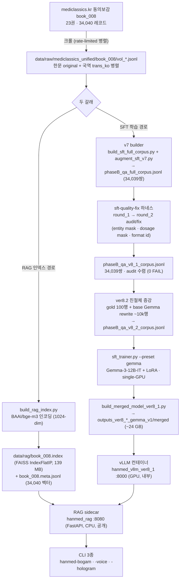
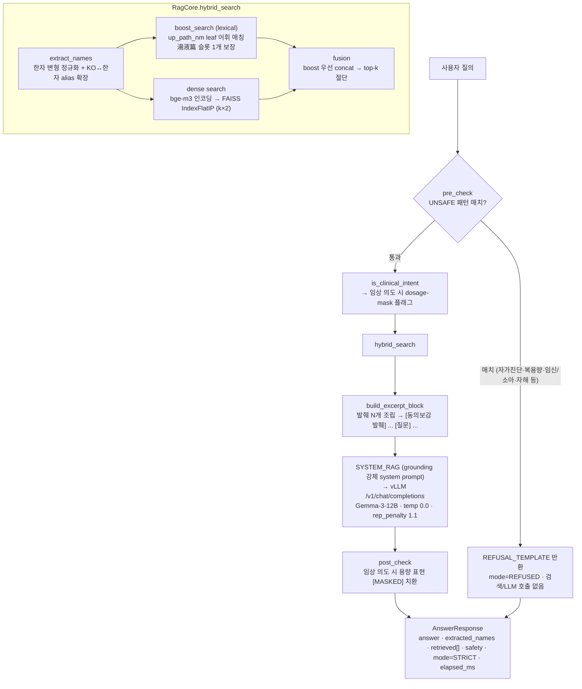
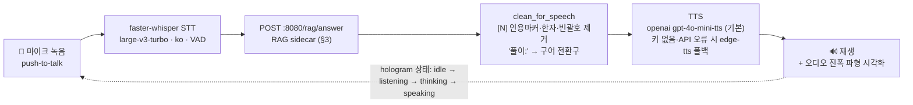

<p align="center">
  
</p>

<h1 align="center">HanMed-LLM</h1>

<p align="center">
  <em>동의보감 고전 해제 도우미 · Gemma-3-12B-IT 기반 LoRA SFT + RAG 검색증강 + vLLM 서빙 + 음성 자비스</em>
</p>

---

> **ver1 (Text2LLM, Gemma-3-12B-IT 기반) — 아카이브.** 현재 운영 라인은 VARCO-VISION 기반 멀티모달 후속 세대 **ver2 (HanMed-VLM)**: [`../README.md`](../README.md). 본 문서는 재현성 확보와, 아래 ver0→ver8.2 전환 이력을 보존하기 위해 유지한다.

---

『동의보감(東醫寶鑑)』 원문을 검색·근거로 삼아 편명·처방·본초·병증에 대한 **서지/해제 질문**에 답하는 RAG 기반 어시스턴트다. 답변은 반드시 검색된 원문 발췌에 근거하며, 발췌에 없는 약명·처방명은 생성하지 않는다. **임상 진단·처방 권고 용도가 아니다.**

---

## 0. 현재 상태 & 버전 히스토리

> **운영 중 (서빙):** **ver8.1** — Gemma-3-12B-IT + ver8.1 LoRA(merged) + RAG sidecar.
> `experiments/dongui_bogam/docker/compose.ver8_1.yml` 로 기동, served model `hanmed-ver8_1`.
>
> **진행 중 라운드:** **ver8.2** — 친절체(친절한 설명 톤) SFT 라운드. 어댑터·merged 가중치는 디스크에 존재하나
> `friendly_tone_eval.json` 결과 `overall: FAIL` (friendly_explanation 0.71 < 목표 0.80) — 아직 반복 중.

프로젝트는 **26권 다권 CPT → 단권 SFT → 단권 RAG** 로 좁혀져 왔다. 현재 운영 시스템은 동의보감(book_008) 단권 RAG 이며, 26권 통합 코퍼스는 ver4 시기 산출물로 저장소에 보존돼 있다.

| 버전 | Paradigm | Base | 데이터 | 상태 |
|---|---|---|---|---|
| v0.1 (ver4 P-A+) | CPT (LoRA r=32) | Bllossom-8B | 26권 mix, 20.4M tok cap | 과거 |
| Phase A' (ver4 §08) | CPT 단권 | Bllossom-8B | book_008, 5M tok cap | 과거 비교군 |
| ver5 v3.1 | Fresh SFT (TRL) | Bllossom-8B | `phaseB_qa_diverse_v3_1` (21,475쌍) | 과거 운영 |
| ver6 | SFT, **base 교체** | **Gemma-3-12B-IT** | `phaseB_qa_v6_corpus` (~18,690행) | 환각·반복 수정 라운드 |
| v7 | SFT | Gemma-3-12B-IT | `phaseB_qa_v7_corpus` (17,733행) | 매핑 방향 gap 잔존 |
| ver8 | 데이터 전면 재구축 (설계) | Gemma-3-12B-IT | 76,788행 목표 | **설계 문서만** (v8 builder 미구현) |
| **ver8.1** | SFT + **RAG 배포** | Gemma-3-12B-IT | `phaseB_qa_v8_1_corpus` (34,039행, audit 수렴) | **서빙 중** |
| **ver8.2** | 친절체 SFT 라운드 | Gemma-3-12B-IT | `phaseB_qa_v8_2_corpus` (train 30,181 / val 5,327) | 진행 중 (eval 미통과) |

전환 근거:

- **ver4 → ver5**: CPT 한계 3중 확증(질문 표현 fragility / safety refusal 0% / 재실행 비결정성) — [`docs/ver5/01_experimental_evidence.md`](docs/ver5/01_experimental_evidence.md)
- **ver5 → ver6**: SFT 환각(F1)·반복(F3) 공동 원인 + base 모델 교체 (Bllossom-8B → Gemma-3-12B-IT) — [`docs/ver6/00_halluc_repetition_fix_plan.md`](docs/ver6/00_halluc_repetition_fix_plan.md)
- **v7 → ver8**: v7 코퍼스가 사실상 단방향 사전(name→body) — 역방향 임상 추론 신호 ~0–1% — [`docs/ver8/02_v7_gap_analysis.md`](docs/ver8/02_v7_gap_analysis.md)
- **ver8 → ver8.1**: v8 builder 미구현 상태에서, v7 builder 산출물에 `sft-quality-fix` 하네스 2라운드 audit/fix 적용 → 수렴 → 학습·RAG 배포 — [`docs/ver8.1/04_round_2_log_and_convergence.md`](docs/ver8.1/04_round_2_log_and_convergence.md)
- **ver8.1 → ver8.2**: ver8.1 LoRA 가 base Gemma 의 친절한 표현력을 한문 직역체로 좁힘(distribution narrowing) → 친절체 재학습 라운드 — [`docs/ver8.2/00_friendly_tone_plan.md`](docs/ver8.2/00_friendly_tone_plan.md)

## 1. 현재 시스템 개요

| 구분 | ver8.1 (서빙 중) | ver8.2 (진행 중) |
|---|---|---|
| Base | [`google/gemma-3-12b-it`](https://huggingface.co/google/gemma-3-12b-it) (로컬 `models/gemma-3-12b-it`, 262,144 vocab, ~23 GB / 5 shards) | 동일 |
| Adapter | LoRA r=16, α=32 · 7 proj (q/k/v/o/gate/up/down, embed 제외) | LoRA r=32, α=64 · 7 proj |
| Objective | TRL SFT (completion-only loss, `--preset gemma`) | 동일 |
| 학습 데이터 | `phaseB_qa_v8_1_corpus.jsonl` (34,039쌍, train 28,933 / val 5,106) | `phaseB_qa_v8_2_corpus.jsonl` (train 30,181 / val 5,327) |
| Epochs / LR | 3 / 1e-4 | 2 / 2e-5 |
| Precision | bf16 | bf16 |
| Context | 8,192 (base) / 4,096 (서빙) | 동일 |
| Merged 가중치 | `experiments/dongui_bogam/outputs_ver8_1_gemma_v1/merged/` (~24 GB) | `experiments/dongui_bogam/outputs_ver8_2_gemma_v1/{adapter,merged,merged_text}/` |
| 서빙 모델명 | `hanmed-ver8_1` | (ver8.2 수렴 시 re-merge 예정) |
| 서빙 방식 | RAG sidecar (FastAPI :8080) + vLLM 컨테이너 (:8000) | 동일 — vLLM 만 swap, RAG sidecar 유지 |

핵심은 **base 모델이 답을 "아는" 것이 아니라, RAG 가 동의보감 원문 발췌를 찾아 LLM 에 컨텍스트로 넣고 LLM 은 그 발췌만으로 답하게 강제**하는 구조다. LoRA SFT 는 답변의 형식·톤(편명 요약 / 처방 구조 / 친절체)을 학습할 뿐, 사실 자체는 검색 발췌에서 온다.

## 2. 아키텍처 & 작동 흐름

### 2.1 전체 파이프라인 (build → serve)



### 2.2 RAG 요청 흐름 (`POST /rag/answer`)

검색·안전·생성을 한 번의 요청 안에서 처리한다. 사용자는 LLM 에 직접 닿지 않고 항상 sidecar 를 거친다.



### 2.3 단계별 역할

| 단계 | 코드 | 입력 | 출력 | 핵심 역할 |
|---|---|---|---|---|
| 수집 | `src/data/crawler/mediclassics_orchestrator.py` | book_id | `data/raw/mediclassics_unified/book_008/vol_*.jsonl` | 권별 병렬 크롤, content_seq resume |
| SFT 코퍼스 빌드 | `scripts/sft/build_sft_full_corpus.py` + `scripts/sft/augment_sft_v7.py` | raw jsonl | `phaseB_qa_full_corpus.jsonl` | book_008 → Q/A 쌍 (v7 builder) |
| 품질 audit/fix | `sft-quality-fix` 하네스 (`docs/ver8.1/`) | full_corpus | `phaseB_qa_v8_1_corpus.jsonl` | 10차원 감사 + 행 단위 수정, 2라운드 수렴 |
| 친절체 증강 | ver8.2 rewrite 파이프라인 (`docs/ver8.2/`) | v8_1 corpus | `phaseB_qa_v8_2_corpus.jsonl` | gold 100행 + base Gemma rewrite 혼합 |
| 학습 | `experiments/dongui_bogam/src/training/sft_trainer.py` | v8_x corpus | LoRA adapter | TRL SFT, `--preset gemma`, single-GPU |
| 병합 | `experiments/dongui_bogam/scripts/build_merged_model_ver8_1.py` | adapter | merged HF model | `peft.merge_and_unload` |
| RAG 인덱스 | `scripts/rag/build_rag_index.py` | book_008 raw jsonl | `data/rag/book_008.{index,meta.jsonl}` | bge-m3 인코딩 → FAISS IndexFlatIP |
| 서빙 (LLM) | `experiments/dongui_bogam/docker/compose.ver8_1.yml` (`hanmed_vllm_ver8_1`) | merged model | OpenAI 호환 API (:8000, 내부) | vLLM, bf16, max_num_seqs 8 |
| 서빙 (RAG) | `experiments/dongui_bogam/rag_service/` (`hanmed_rag`) | FAISS index + meta | `POST /rag/answer` (:8080, 공개) | 검색 + safety + LLM 호출 오케스트레이션 |
| 클라이언트 | `experiments/dongui_bogam/bogam_cli/` | stdin / 마이크 | 텍스트·음성 응답 | 텍스트 REPL + 음성 자비스 (§4) |

## 3. RAG 서비스

`experiments/dongui_bogam/rag_service/` — FastAPI CPU sidecar. GPU vLLM 컨테이너 앞단에 붙어 검색·안전·생성을 묶는다.

### 3.1 인덱스

| 항목 | 값 |
|---|---|
| 빌드 스크립트 | `scripts/rag/build_rag_index.py` |
| 입력 | `data/raw/mediclassics_unified/book_008/vol_01~23.jsonl` (34,040 레코드) |
| 청킹 | **없음** — 레코드 1개(원문 1 content_seq) = 벡터 1개 |
| 임베딩 텍스트 | `up_path_nm` + `trans_ko` + `original`(국역과 다를 때만) 연결 |
| 인코더 | `BAAI/bge-m3` (1024-dim, 다국어, 한자+한국어 강함), `normalize_embeddings=True` |
| 인덱스 | FAISS `IndexFlatIP` — 정규화 벡터 내적 = 코사인. 34,040 벡터는 flat 으로도 충분히 빠름 |
| 산출 | `data/rag/book_008.index` (139 MB) · `book_008.meta.jsonl` (15 MB, 34,040행) |

### 3.2 엔드포인트

| 메서드 | 경로 | 설명 |
|---|---|---|
| `GET` | `/health` | `{"rag": "ok", "vllm": <status>}` — vLLM 업스트림 health 동시 확인 |
| `GET` | `/rag/retrieve?query=&k=5&boost_k=2` | 검색만 (LLM 호출 없음) — 디버그용 |
| `POST` | `/rag/answer` | 메인 파이프라인. req `{query, k=5, boost_k=2}` → resp `{answer, extracted_names, retrieved[], safety, mode, elapsed_ms, prompt_tokens}` |

### 3.3 검색 로직 (`rag_core.py`)

1. **한자 정규화 + 이름 추출** — `蔘→參` 등 변형 한자 통일, 정규식으로 처방/본초명 후보 추출, KO↔한자 alias 양방향 확장(`사물탕↔四物湯`, `인삼↔人參` 등 소규모 하드코딩 표).
2. **boost (lexical)** — 34,040 meta 레코드의 `up_path_nm` leaf 를 어휘 매칭. `湯液篇`(본초) 항목은 슬롯 1개 보장. body 30자 미만 레코드는 제외.
3. **dense** — 원 질의를 bge-m3 로 인코딩 → FAISS 에서 `k×2` 후보 검색, boost 중복 제거.
4. **fusion** — boost 결과를 `sim=1.0` 으로 앞에 놓고 dense 를 FAISS 순위대로 이어붙여 top-k 절단. **학습형 reranker 없음** — boost 우선 concat 이 전부.
5. **프롬프트 조립** — 발췌를 `[N] {경로} ({level})\n{국역}` 형식으로 합쳐 `SYSTEM_RAG` + 발췌 + 질문 → vLLM `/v1/chat/completions`.

### 3.4 안전 계층 (`src/hanmed_cli/safety.py`)

| 계층 | 동작 |
|---|---|
| `pre_check` | UNSAFE 정규식(자가진단·복용량·임신/소아 복용·자해·구체 질환 치료 등) 매치 → 검색·LLM 호출 없이 즉시 거절, `mode=REFUSED` |
| `is_clinical_intent` | 약한 임상 의도 정규식 — 거절하진 않고 `post_check` 의 용량 마스킹 플래그만 세움 |
| `post_check` | 임상 의도 플래그 시 용량 단위(돈/푼/냥/g…)·"각 N단위"·복용 동작 표현을 `[MASKED]` 로 치환 |

### 3.5 주요 설정 (`rag_service/settings.py`, env override 가능)

| 키 | 기본값 | 키 | 기본값 |
|---|---|---|---|
| `vllm_url` | `http://hanmed_vllm_ver8_1:8000` | `top_k` | `5` |
| `vllm_model` | `hanmed-ver8_1` | `boost_k` | `2` |
| `encoder_name` | `BAAI/bge-m3` (CPU) | `min_body_len` | `30` |
| `faiss_index_path` | `/rag_data/book_008.index` | `max_tokens` | `400` |
| `faiss_meta_path` | `/rag_data/book_008.meta.jsonl` | `temperature` | `0.0` (greedy) |
| `vllm_timeout_s` | `60.0` | `repetition_penalty` | `1.1` |

> **연결 구조**: RAG sidecar 는 로컬 GPU 를 쓰지 않는다. bge-m3 임베딩만 컨테이너 내 CPU 에서 돌리고, 생성은 별도 GPU vLLM 컨테이너(`hanmed_vllm_ver8_1:8000`, 도커 브리지 네트워크 내부 — 호스트 미노출)로 httpx POST 한다.

## 4. 음성 자비스 (voice JARVIS)

`experiments/dongui_bogam/bogam_cli/` — 텍스트 RAG REPL 에 STT·TTS 를 붙인 음성 인터페이스. 두뇌(RAG sidecar)는 그대로 두고 양 끝만 음성으로 바꾼다. 상세: [`experiments/dongui_bogam/README.md`](experiments/dongui_bogam/README.md).

### 4.1 파이프라인



### 4.2 Entry point 3종 (`experiments/dongui_bogam/pyproject.toml`)

| Entry point | 모듈 | 설명 |
|---|---|---|
| `hanmed-bogam` | `bogam_cli.chat:main` | 텍스트 RAG REPL — Rich 기반, `POST /rag/answer` 클라이언트. `--show-retrieved` 로 발췌 표 |
| `hanmed-bogam-voice` | `bogam_cli.voice:main` | 터미널 음성 REPL — 거북이 ANSI 마스코트 + 사운드웨이브. `--device` 기본 `cuda`(서버) |
| `hanmed-bogam-hologram` | `bogam_cli.hologram_app:main` | pywebview 홀로그램 GUI — 프레임리스·항상 위 창, 클릭하여 대화. `--device` 기본 `cpu`(맥) |

세 entry point 모두 동일한 `/rag/answer` 두뇌를 공유한다 (`voice.py`/`hologram_app.py` 가 `chat.py` 의 클라이언트를 재사용).

### 4.3 홀로그램 GUI

pywebview 데스크톱 앱 (`bogam_cli/hologram/index.html`). 프레임리스·`on_top` 창에 사이안 글로우/스캔라인 비주얼과 거북이 마스코트가 **idle/listening/thinking/speaking** 상태별로 애니메이션된다. 홀로그램을 클릭하면 녹음 시작, 다시 클릭하면 종료 → 처리 → 답변. 재생 중 오디오 진폭이 파형으로 시각화된다. macOS 세그폴트 회피를 위해 무거운 네이티브 라이브러리는 lazy import.

### 4.4 SSH 터널 (off-server 실행)

GUI/음성 CLI 를 RAG 서버와 다른 머신(맥)에서 띄울 때는 서버의 8080 포트로 **SSH 로컬 포워딩**을 열어 둔다:

```bash
# 맥에서 — 서버 8080 → 맥 localhost:8080
ssh -L 8080:localhost:8080 <user>@<서버>
# 터널을 띄운 채로
hanmed-bogam-hologram --device cpu
```

`--endpoint` 기본값이 `http://localhost:8080` 이라 터널을 통해 sidecar 에 닿는다. 터널이 없으면 창에 `⚠ RAG 서버 연결 안 됨 — SSH 터널(8080) 확인` 경고가 뜬다.

### 4.5 설치

음성 기능은 `voice` optional-dependency extra (라이브 녹음·재생은 PortAudio 필요 — 맥 권장):

```bash
uv pip install -e "experiments/dongui_bogam[voice]"
```

`voice` extra: `faster-whisper`, `edge-tts`, `openai`, `pywebview`, `sounddevice`, `soundfile`.

## 5. 데이터 스펙

### 5.1 코퍼스 — 동의보감 (book_008)

| 항목 | 값 |
|---|---|
| Source | KIOM mediclassics.kr 한의학고전DB |
| 원문 | 23권 · **34,040 레코드** (한문 `original` + 국역 `trans_ko` 병렬), 5편(내경·외형·잡병·탕액·침구) |
| ver8.1 SFT 코퍼스 | `phaseB_qa_v8_1_corpus.jsonl` — 34,039쌍, raw 커버리지 99.997% (누락 1건 = `vol_18/seq_984` 빈 부적 레코드) |
| ver8.2 SFT 코퍼스 | `phaseB_qa_v8_2_corpus.jsonl` — train 30,181 / val 5,327 (ver8.1 + 친절체 증강분) |
| RAG 인덱스 | `data/rag/book_008.{index,meta.jsonl}` — 34,040 벡터 |

> 26권 통합 코퍼스(ver4 시기, `data/raw/mediclassics_unified/` 의 나머지 book)는 저장소에 보존돼 있으나 현 운영 시스템(ver8.x)은 동의보감 단권만 사용한다.

### 5.2 ver8.1 코퍼스 분포 & audit 결과

q_format 분포: 병증 17,085 / 편명 11,078 / 본문 5,319 / 서문 465 / 총목 92.

`sft-quality-fix` 하네스 2라운드 후 audit (0 FAIL):

| 차원 | 결과 |
|---|---|
| literal_quote | pass (0.9933) |
| entity_whitelist | pass (deny_hits 0) |
| dosage_leak | warn (22행 / 0.06% — 전부 고전 인용 내부) |
| disclaimer / format_diversity / near_duplicate / length / atomic_fact | pass |

### 5.3 Factsheet

`data/facts/core_factsheet.yaml` — 26권 수기 검증 fact sheet (저자·왕대·연도·장르·주요 처방). book_008 동의보감 항목은 저자 허준(許浚)·선조 명·1610 편찬·1613 간행·5편 구성 등 검증값 보유.

### 5.4 데이터 포맷

**raw** (`mediclassics_unified/book_008/vol_*.jsonl`):
```json
{"book_id": 8, "volume_id": 1, "content_seq": 138,
 "content_level": "ZZ", "up_path_nm": "內景篇卷之一 > 東醫寶鑑序",
 "original": "乾鑿度云 …", "trans_ko": "《건착도》에 …"}
```

**SFT 쌍** (`phaseB_qa_v8_1_corpus.jsonl`): `id, category, subcat, up_path_nm, question, assistant, messages` + `q_format`/`a_format` enum.

**RAG meta** (`book_008.meta.jsonl`, 벡터 1개당 1행): `id, volume_id, content_seq, content_level, up_path_nm, trans_ko, original`.

## 6. 학습 프로토콜

| 하이퍼파라미터 | ver8.1 | ver8.2 |
|---|---|---|
| Trainer | `sft_trainer.py --preset gemma` (TRL SFTTrainer, completion-only loss) | 동일 |
| Base | `models/gemma-3-12b-it` | 동일 |
| LoRA | r=16, α=32 · q/k/v/o/gate/up/down (embed/lm_head 제외) | r=32, α=64 · 동일 target |
| Epochs / LR | 3 / 1e-4 | 2 / 2e-5 |
| `response_template` | `<start_of_turn>model\n` | 동일 |
| max_seq_len | 4,096 | 4,096 |
| GPU | **single-GPU** (DDP 첫 step hang 으로 단일 GPU 폴백) | 동일 |
| Precision | bf16 | bf16 |
| 산출 | `outputs_ver8_1_gemma_v1/{adapter,merged}` | `outputs_ver8_2_gemma_v1/{adapter,merged,merged_text}` |

> ver8.2 의 `friendly_tone_eval.json` 은 현재 `overall: FAIL` (friendly_explanation 0.71 < 목표 0.80, body_preservation FAIL; disclaimer·hanja·safety 회귀는 PASS). 친절체 라운드는 아직 반복 중이며, 서빙은 ver8.1 이 담당한다.

## 7. 서빙 배포

### 7.1 서빙 스택 (`experiments/dongui_bogam/docker/compose.ver8_1.yml`)

도커 브리지 네트워크 위에 컨테이너 2개:

| 서비스 | 역할 | 포트 | 디바이스 |
|---|---|---|---|
| `hanmed_rag` | FastAPI RAG sidecar (검색 + safety + LLM 호출) | **8080 공개** | CPU (bge-m3 임베딩) |
| `hanmed_vllm_ver8_1` | vLLM — Gemma-3-12B + ver8.1 LoRA(merged) 서빙 | 8000 내부 (호스트 미노출) | GPU 0 |

vLLM 옵션: `--served-model-name=hanmed-ver8_1 --dtype=bfloat16 --max-model-len=4096 --max-num-seqs=8 --gpu-memory-utilization=0.85`. `hanmed_rag` 는 `depends_on: hanmed_vllm_ver8_1 (service_healthy)` 로 vLLM health 를 기다린다.

### 7.2 배포 절차

```bash
# (korean-medicine-llm/ver1/ 에서 실행 — 스크립트 내부 경로는 자기 위치 기준(__file__)으로 계산되므로
#  cwd 와 무관하게 정상 동작. venv 는 이 디렉토리에 없고 상위 korean-medicine-llm/.venv 를 공유한다)

# 1. adapter → merged 모델 (학습 완료 후, 기본 입출력 = outputs_ver8_1_gemma_v1/{adapter,merged})
PYTHONHASHSEED=0 ../.venv/bin/python experiments/dongui_bogam/scripts/build_merged_model_ver8_1.py

# 2. RAG 인덱스 빌드 (최초 1회 — data/rag/book_008.{index,meta.jsonl} 생성; 이미 산출돼 있음)
CUDA_VISIBLE_DEVICES=0 ../.venv/bin/python scripts/rag/build_rag_index.py

# 3. 서빙 스택 기동 (vLLM + RAG sidecar)
cd experiments/dongui_bogam/docker
docker compose -f compose.ver8_1.yml up -d --build

# 4. 헬스 확인 & 샘플 질의
curl -sf http://localhost:8080/health
curl -s http://localhost:8080/rag/answer \
  -H 'Content-Type: application/json' \
  -d '{"query":"동의보감 혈문의 사물탕은 어떤 처방인가?","k":5}' | jq -r '.answer'
```

스모크 테스트 절차: [`experiments/dongui_bogam/docker/SMOKE_TEST_ver8_1.md`](experiments/dongui_bogam/docker/SMOKE_TEST_ver8_1.md).

> 이 디렉토리(`korean-medicine-llm/ver1/`) 바로 아래 `docker/` 의 compose 파일들(`docker-compose.{yml,merged,phaseA*,gemma,ver5_v3_1}.yml`)은 ver5 이하 레거시 서빙 경로다. 현 운영 스택은 `experiments/dongui_bogam/docker/compose.ver8_1.yml`.

## 8. CLI 사용

```bash
# bogam_cli 설치 (RAG 연동 — 현 운영 CLI)
uv pip install -e experiments/dongui_bogam              # 텍스트만
uv pip install -e "experiments/dongui_bogam[voice]"     # 음성 자비스 포함

# 텍스트 RAG REPL (RAG sidecar :8080 기동 전제)
hanmed-bogam
hanmed-bogam -q "사물탕의 구성원리는?"          # 1회 질의
hanmed-bogam --show-retrieved                   # 발췌 표 표시

# 음성 자비스 (§4)
hanmed-bogam-voice --device cuda                # 터미널 음성 REPL (서버)
hanmed-bogam-hologram --device cpu              # 홀로그램 GUI (맥, SSH 터널 필요)
```

REPL 슬래시 명령: `/help /retrieved /reset /exit`.

> 이 디렉토리(`korean-medicine-llm/ver1/`) 바로 아래 `src/hanmed_cli/` 의 `hanmed` CLI 는 RAG 없이 vLLM 에 직접 붙는 ver4/ver5 시기 레거시 REPL 이다 (설치는 상위 `korean-medicine-llm/pyproject.toml` 을 통해서만 가능 — 이 CLI 는 자체 `pyproject.toml` 을 갖지 않는다). 현 RAG 시스템 클라이언트는 `bogam_cli`.

## 9. 리소스 요구사항

### 9.1 학습 (one-time)

| 항목 | 요구 |
|---|---|
| GPU | NVIDIA A6000 48 GB **1장** (DDP 미사용 — 첫 step hang 으로 single-GPU 폴백) |
| 모델 | Gemma-3-12B-IT bf16 + LoRA + optimizer + activation checkpointing |
| 디스크 | base ~23 GB + merged ~24 GB + 체크포인트 |

### 9.2 서빙

| 항목 | 요구 |
|---|---|
| GPU | **1장** — Gemma-3-12B-IT merged(~24 GB) bf16, `gpu-memory-utilization 0.85` |
| 권장 | A6000 48 GB / A100 40 GB |
| RAG sidecar | **CPU only** — bge-m3 임베딩(~2 GB) + FAISS index(139 MB) |
| Docker + nvidia-container-toolkit | 필수 |

### 9.3 클라이언트 (CLI)

| 항목 | 요구 |
|---|---|
| Python | ≥ 3.10 |
| 기본 의존성 | `httpx>=0.27 rich>=13` |
| `voice` extra | `faster-whisper edge-tts openai pywebview sounddevice soundfile` (라이브 녹음·재생은 PortAudio — 맥 권장) |
| 네트워크 | RAG sidecar(`--endpoint`, 기본 `:8080`) 도달 가능 (off-server 시 SSH 터널) |

## 10. 재현성

| 항목 | 보장 방식 |
|---|---|
| PYTHONHASHSEED | 데이터 스크립트 `PYTHONHASHSEED=0` prefix 필수 |
| 데이터 무결성 | `phaseB_qa_v8_1_corpus.stats.json` 에 SHA256·행수·raw 커버리지 기록 |
| audit trail | `sft-quality-fix` 하네스 round_1/round_2 supervisor 보고서 + `final_report.md` |
| 학습 config | `outputs_ver8_*/train_manifest.json` 에 base·데이터·HP 전체 기록 |
| RAG 결정성 | 생성 `temperature=0.0` (greedy), FAISS `IndexFlatIP` 는 exact (근사 없음) |

## 11. 디렉토리 구조

```
korean-medicine-llm/ver1/           # 본 문서 위치 (ver2 는 상위 korean-medicine-llm/)
├── README.md                       # 이 파일
├── ../pyproject.toml                # 레거시 hanmed CLI 엔트리 (ver4/5) — 상위 korean-medicine-llm/ 에 위치, venv 도 거기(.venv) 공유
│
├── docs/
│   ├── 01_overview ~ 09_roadmap/    # 주제별 원자 문서 (r0)
│   ├── ver2/, ver3/, ver4/         # 초기 라운드 (역사)
│   ├── ver5/                       # Bllossom SFT 전환 (과거 운영)
│   ├── ver6/                       # Gemma-3-12B base 교체
│   │   ├── 00_halluc_repetition_fix_plan.md
│   │   └── appendix_bllossom_fallback.md
│   ├── ver8/                       # 데이터 전면 재구축 (설계)
│   │   ├── 00_data_construction_plan.md
│   │   ├── 01_raw_data_schema.md
│   │   └── 02_v7_gap_analysis.md
│   ├── ver8.1/                     # ★ audit/fix 라운드 → 현 서빙 코퍼스
│   │   ├── README.md
│   │   ├── 00_data_construction_plan.md
│   │   ├── 01_round_1_audit_and_fix_log.md
│   │   ├── 02_round_2_backlog.md
│   │   ├── 03_v8_builder_revision_targets.md
│   │   └── 04_round_2_log_and_convergence.md   # 수렴 보고서
│   └── ver8.2/                     # ★ 친절체 SFT 라운드 (진행 중)
│       └── 00_friendly_tone_plan.md
│
├── src/
│   ├── data/
│   │   ├── crawler/mediclassics_orchestrator.py
│   │   ├── builder/{extract_corpora,preprocess,tokenizer_extend}.py
│   │   └── synth/expand_facts.py
│   ├── training/{cpt_trainer,sft_trainer}.py    # 레거시 (ver4/5)
│   ├── hanmed_cli/                 # 레거시 CLI (vLLM 직결, RAG 없음)
│   └── utils/seed.py
│
├── scripts/
│   ├── sft/build_sft_full_corpus.py / augment_sft_v7.py   # v7 builder (현 코퍼스 기반)
│   ├── rag/build_rag_index.py      # ★ FAISS 인덱스 빌드
│   ├── rag/probe_ver8_1_rag*.py    # RAG 오프라인 평가 하네스 (v4 + info)
│   ├── model/build_merged_model.py
│   ├── corpus/                     # 크롤 후처리 (splits/factsheet/분류)
│   ├── eval/                       # audit/verify/probe 스크립트
│   └── deploy/                     # phaseA 배포 셸 스크립트 (레거시)
│
├── data/
│   ├── raw/mediclassics_unified/   # 26권 크롤 결과 (book_008 = 동의보감)
│   ├── sft/                        # SFT 코퍼스 (phaseB_qa_v8_1/v8_2_corpus.jsonl 등)
│   ├── rag/                        # ★ book_008.index (FAISS) + book_008.meta.jsonl
│   ├── facts/core_factsheet.yaml
│   └── stats/, tokenizer/
│
├── experiments/
│   └── dongui_bogam/               # ★ 현 운영 시스템 (book_008 단권 RAG)
│       ├── README.md
│       ├── pyproject.toml          # bogam_cli entry points 3종
│       ├── bogam_cli/              # ★ 텍스트 REPL + 음성 자비스 + 홀로그램
│       │   ├── chat.py voice.py hologram_app.py stt.py tts.py
│       │   └── hologram/index.html + turtle_*.png
│       ├── rag_service/            # ★ FastAPI RAG sidecar
│       │   ├── main.py rag_core.py settings.py requirements.txt
│       ├── docker/
│       │   ├── compose.ver8_1.yml  # ★ 현 서빙 스택 (vLLM + RAG)
│       │   ├── Dockerfile.vllm Dockerfile.rag SMOKE_TEST_ver8_1.md
│       ├── src/training/sft_trainer.py
│       ├── scripts/build_merged_model_ver8_1.py
│       ├── data/sft/               # phaseB_qa_v8_1/v8_2_corpus.jsonl + stats
│       ├── docs/voice_jarvis_plan.md, voice_jarvis_visual_plan.md
│       ├── eval/                   # friendly_tone_qaset.yaml, info_mode_prompts.yaml ...
│       ├── outputs_ver8_1_gemma_v1/  # ★ 서빙 어댑터 + merged
│       ├── outputs_ver8_2_gemma_v1/  # 친절체 라운드 어댑터 + merged + eval
│       └── outputs_ver{5,6,7}_*, outputs_ver8_1_*_{failed,aborted}/  # 비활성
│
├── docker/                         # 레거시 compose (ver5 이하)
└── models/gemma-3-12b-it/          # ver6+ base (~23 GB, 5 shards, gitignored)
```

## 12. 라이선스

| 구성 | 라이선스 | 조건 |
|---|---|---|
| mediclassics 데이터 | KIOM 비상업 무료 이용 | 출처 표기 = "한의학고전DB (mediclassics.kr)". 상업 이용은 `kiombook@kiom.re.kr` 서면 문의 |
| Gemma-3-12B-IT base | Gemma Terms of Use | Google Gemma 라이선스 준수 |
| BAAI/bge-m3 인코더 | MIT | — |
| HanMed adapter | 연구용 (기본) | 가공물 공개는 KIOM 사전 승인 |
| 본 저장소 코드 | TBD | 연구·교육 목적 |

## 13. 면책

이 시스템은 **동의보감 고전 문헌 해제 도우미**이며 임상 진단·처방·의료 조언 도구가 아니다. 답변은 검색된 원문 발췌의 해제 보조일 뿐 의학적 판단의 근거가 될 수 없다. `pre_check`/`post_check` 안전 계층은 자가진단·복용량 질의를 거절·마스킹하지만 완전하지 않다. 자격 있는 한의사·의사와 상담하라.

## 14. 문서 인덱스

### 현재 (ver8.x RAG)
- ver8 데이터 재구축 설계: [`docs/ver8/00_data_construction_plan.md`](docs/ver8/00_data_construction_plan.md) · raw 스키마 [`01_raw_data_schema.md`](docs/ver8/01_raw_data_schema.md) · v7 gap [`02_v7_gap_analysis.md`](docs/ver8/02_v7_gap_analysis.md)
- ver8.1 audit/fix 라운드: [`docs/ver8.1/README.md`](docs/ver8.1/README.md) · 수렴 보고서 [`04_round_2_log_and_convergence.md`](docs/ver8.1/04_round_2_log_and_convergence.md)
- ver8.2 친절체 라운드: [`docs/ver8.2/00_friendly_tone_plan.md`](docs/ver8.2/00_friendly_tone_plan.md)
- 단권 실험·음성 자비스 상세: [`experiments/dongui_bogam/README.md`](experiments/dongui_bogam/README.md)
- 음성 자비스 기획: [`experiments/dongui_bogam/docs/voice_jarvis_plan.md`](experiments/dongui_bogam/docs/voice_jarvis_plan.md) · 비주얼 [`voice_jarvis_visual_plan.md`](experiments/dongui_bogam/docs/voice_jarvis_visual_plan.md)

### 전환 근거 (역사)
- ver5 (Bllossom SFT): [`docs/ver5/README.md`](docs/ver5/README.md) · CPT 한계 실증 [`01_experimental_evidence.md`](docs/ver5/01_experimental_evidence.md)
- ver6 (Gemma base 교체): [`docs/ver6/00_halluc_repetition_fix_plan.md`](docs/ver6/00_halluc_repetition_fix_plan.md) · Bllossom fallback [`appendix_bllossom_fallback.md`](docs/ver6/appendix_bllossom_fallback.md)
- ver4 P-A+ CPT: [`docs/ver4/README.md`](docs/ver4/README.md) · CPT 방법론 노트 [`docs/research_hanmed_cpt_methodology_20260421.md`](docs/research_hanmed_cpt_methodology_20260421.md)

### CLI & 시각 아이덴티티
- 거북 mascot / Claude Code 스타일: [`docs/10_cli_visual_identity/`](docs/10_cli_visual_identity/)
